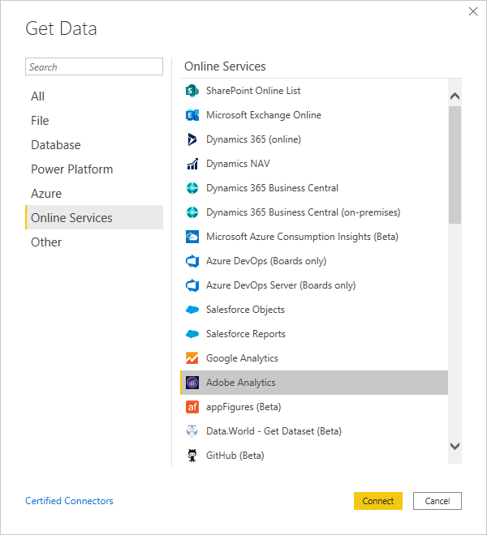
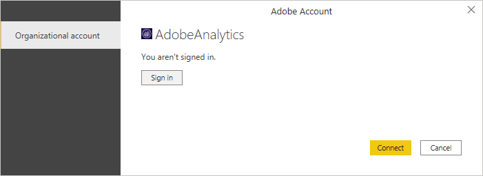
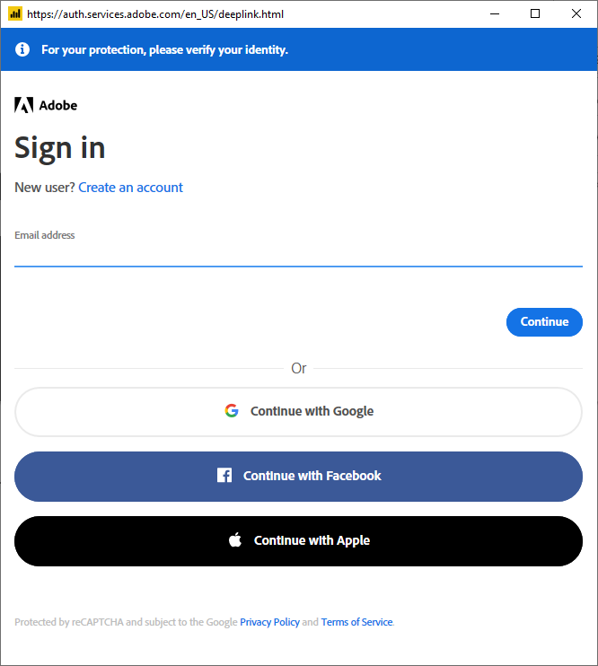
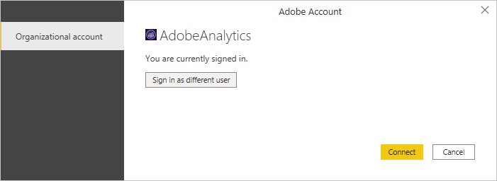
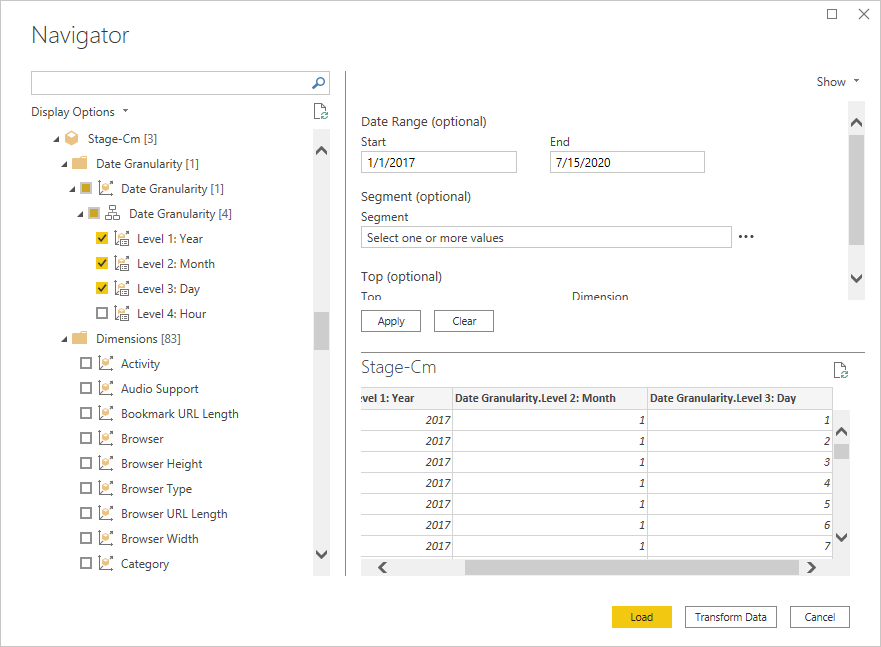

# Adobe Analytics
 
## Summary
 
Release State: General Availability

Products: Power BI Desktop

Authentication Types Supported: Organizational account

Function Reference Documentation: [AdobeAnalytics.Cubes](https://docs.microsoft.com/powerquery-m/adobeanalytics-cubes)

## Prerequisites
Before you can sign in to Adobe Analytics, you must have an Adobe Analytics account (username/password).

 
## Capabilities Supported
* Import

## Connect to Adobe Analytics data

To connect to Adobe Analytics data:

1. Select **Get Data** from the **Home** ribbon in Power BI Desktop. Select **Online Services** from the categories on the left, select **Adobe Analytics**, and then select **Connect**.

   

2. If this is the first time you're getting data through the Adobe Analytics connector, a third party notice will be displayed. Select **Don't warn me again with this connector** if you don't want this message to be displayed again, and then select **Continue**.

3. To sign in to your Adobe Analytics account, select **Sign in**.

   

4. In the Adobe Analytics window that appears, provide your credentials to sign in to your Adobe Analytics account. You can either supply a username (which is usually an email address), or select **Continue with Google** or **Continue with Facebook**.

   

   If you entered an email address, select **Continue**.

5. Enter your Adobe Analytics password and select **Continue**.

   

6. Once you have successfully signed in, select **Connect**.

   

Once the connection is established, you can preview and select multiple dimensions and measures within the **Navigator** dialog to create a single tabular output. You can also provide any necessary input parameters required for the selected items.

You can **Load** the selected table, which brings the entire table into Power BI Desktop, or you can select **Transform Data** to edit the query, which opens Power Query Editor. You can then filter and refine the set of data you want to use, and then load that refined set of data into Power BI Desktop.

## Next steps

[Adobe Analytics support](https://helpx.adobe.com/support/analytics.html)