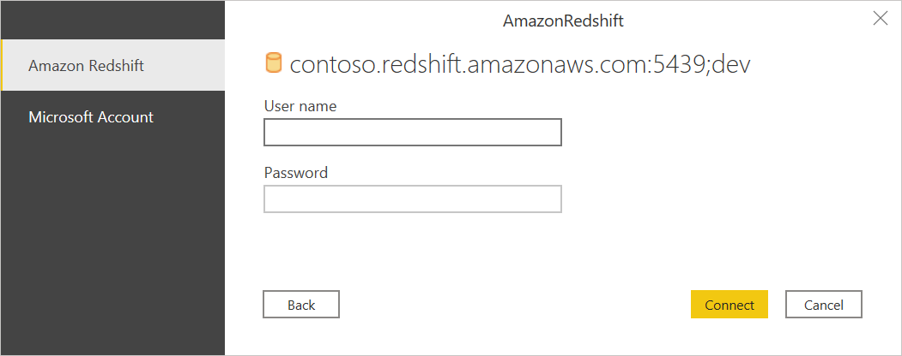
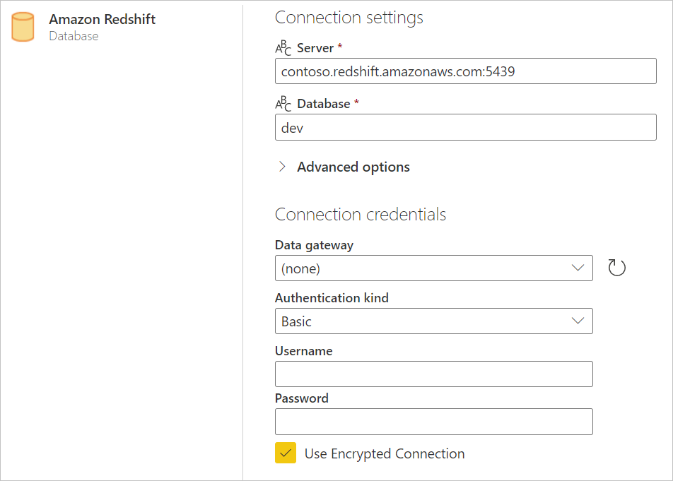

# Amazon Redshift

## Summary

| Item | Description |
| ---- | ----------- |
| Release State | General Availability |
| Products | Power BI (Datasets) Power BI (Dataflows) Power Apps (Dataflows) Dynamics 365 Customer Insights |
| Authentication Types Supported | Amazon Redshift Basic Microsoft account Organizational account |
| | |

>[!Note]
>Some capabilities may be present in one product but not others due to deployment schedules and host-specific capabilities.

## Prerequisites

* An [Amazon Web Services (AWS) account](https://aws.amazon.com/)

## Capabilities supported

* Import
* DirectQuery (Power BI Desktop only)
* Advanced options
  * Roles
  * Batch size

## Connect to Amazon Redshift data from Power Query Desktop

To connect to Amazon Redshift data:

1. Select the **Amazon Redshift** option in the **Get Data** selection.

2. In **Server**, enter the server name where your data is located. As part of the Server field, you can also specify a port in the following format: *ServerURL:Port*. In **Database**, enter the name of the Amazon Redshift database you want to access. In this example, `contoso.redshift.amazonaws.com:5439` is the server name and port number, `dev` is the database name, and **Data Connectivity mode** is set to **Import**.

   

    You can also choose some optional advanced options for your connection. More information: [Connect using advanced options](#connect-using-advanced-options)

    Select either the **Import** or **DirectQuery** data connectivity mode.

    After you have finished filling in and selecting all the options you need, select **OK**.

3. If this is the first time you're connecting to this database, enter your credentials in the **User name** and **Password** boxes of the Amazon Redshift authentication type. Then select **Connect**.

    

   More information: [Authentication with a data source](../connectorauthentication.md)

4. Once you successfully connect, a **Navigator** window appears and displays the data available on the server. Choose one or more of the elements you want to import.

   

5. Once you've selected the elements you want, then either select **Load** to load the data or **Transform Data** to continue transforming the data in Power Query Editor.

## Connect to Amazon Redshift data from Power Query Online

To connect to Amazon Redshift data:

1. Select the **Amazon Redshift** option in the **Power Query - Choose data source** page.

2. In **Server**, enter the server name where your data is located. As part of the Server field, you can also specify a port in the following format: *ServerURL:Port*. In **Database**, enter the name of the Amazon Redshift database you want to access. In this example, `contoso.redshift.amazonaws.com:5439` is the server name and port number, and `dev` is the database name.

   

    You can also choose some optional advanced options for your connection. More information: [Connect using advanced options](#connect-using-advanced-options)

3. If needed, select the on-premises data gateway in **Data gateway**.

4. Select the type of authentication you want to use in **Authentication kind**, and then enter your credentials.

5. Select or clear **Use Encrypted Connection** depending on whether you want to use an encrypted connection or not.

6. Select **Next** to continue.

7. In **Navigator**, select the data you require, and then select **Transform data**. This selection opens the Power Query Editor so that you can filter and refine the set of data you want to use.

## Connect using advanced options

Power Query provides a set of advanced options that you can add to your query if needed.

The following table describes all of the advanced options you can set in Power Query.

| Advanced option | Description |
| --------------- | ----------- |
| Role | Provides an Amazon Resource Name (ARN), which uniquely identifies AWS resources. |
| Batch size | Specifies the maximum number of rows to retrieve at a time from the server when fetching data. A small number translates into more calls to the server when retrieving a large dataset. A large number of rows may improve performance, but could cause high memory usage. The default value is 100 rows. |
| SQL Statement | For information, go to [Import data from a database using native database query](../native-database-query.md). |
| | |

## Enable Azure AD Single Sign-On (SSO) for Amazon Redshift

We support Azure AD SSO through both Power BI Service (cloud) and also through the on-premises data gateway. For more information about enabling Azure AD SSO for all connectors, go to [Overview of single sign-on (SSO) for on-premises data gateways in Power BI](/power-bi/connect-data/service-gateway-sso-overview).

### Azure AD Single Sign-On (SSO) through Power BI service

To configure a new connection in Power BI service:

1. In Power BI service, select **Admin portal** from the settings list.

   

2. Enable the **Redshift SSO** option.

   

### Azure AD Single Sign-On (SSO) for Amazon Redshift with an on-premises data gateway

Before you can enable Azure AD SSO for Amazon Redshift, you must first enable Azure AD SSO for all data sources that support Azure AD SSO with an on-premises data gateway:

1. In Power BI service, select **Admin portal** from the settings list.

   

2. Under **Tenant settings**, enable **Azure AD Single-Sign On (SSO) for Gateway**.

   

Once you've enabled Azure AD SSO for all data sources, then enable Azure AD SSO for Amazon Redshift:

3. Also enable the **Redshift SSO** option.

   

4. Select **Manage gateways** from the settings list.

   

5. Select a gateway, and then select **Choose Data Source**.

6. Under the **Data Source Settings** tab, enter a value in **Role**. The Role parameter is required when using AAD and needs to be specified in **Advanced Settings**.

   Also select **Use SSO via Azure AD for DirectQuery queries**.

   
