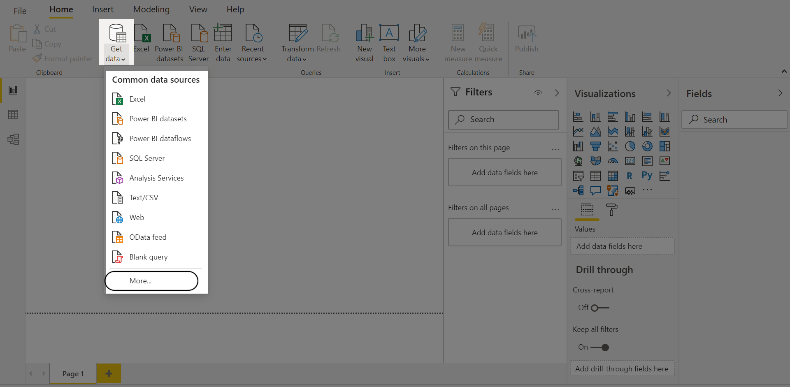
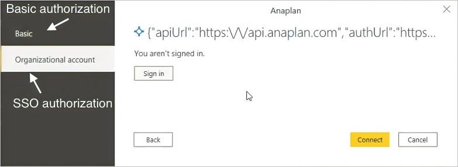
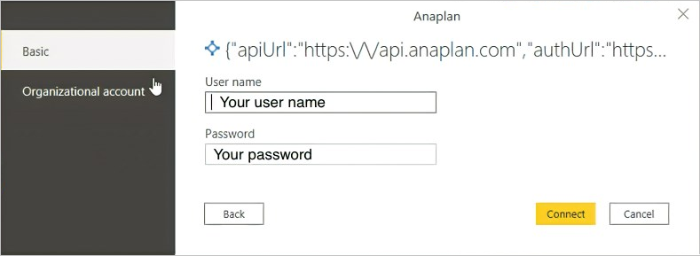
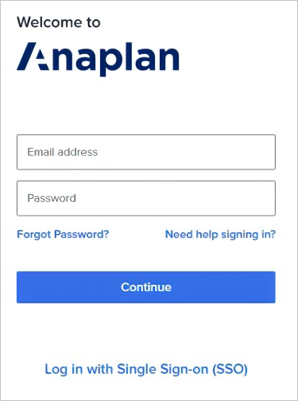
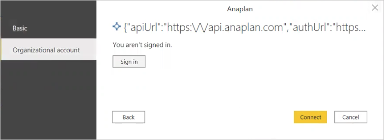
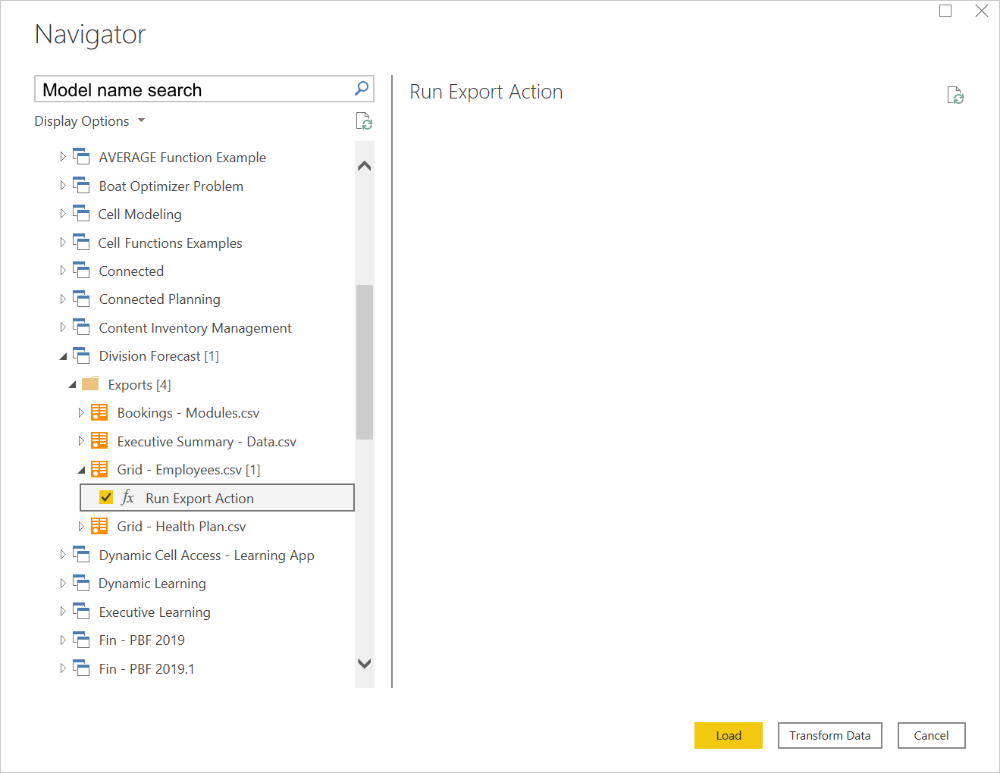
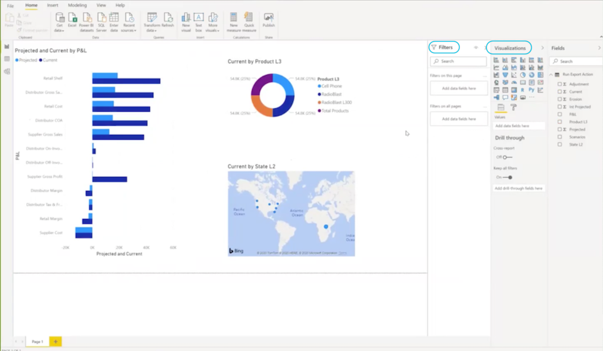
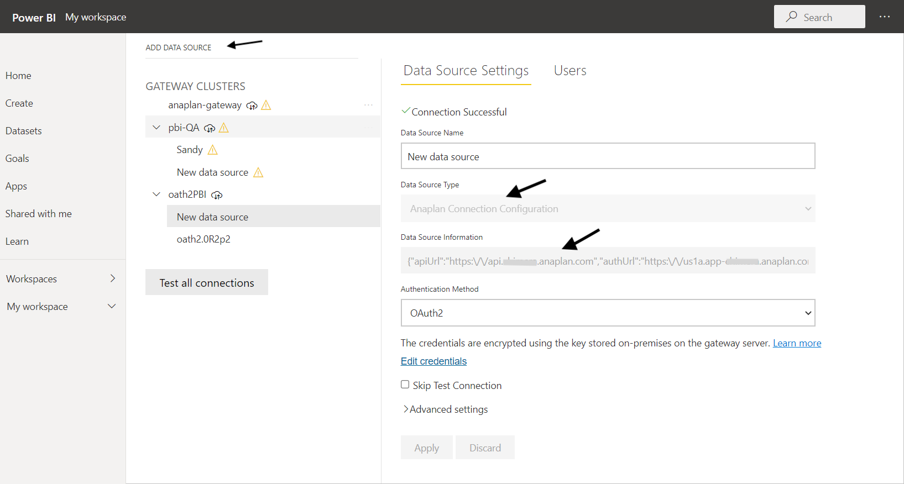
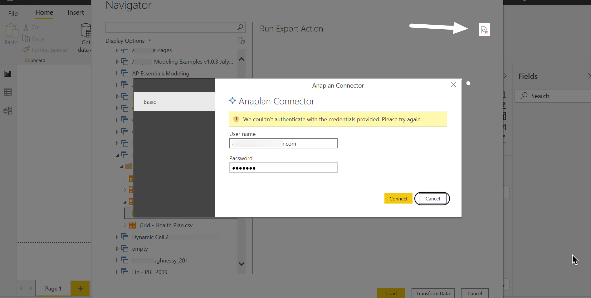

# Anaplan

>[!Note]
>The following connector article is provided by Anaplan, the owner of this connector and a member of the Microsoft Power Query Connector Certification Program. If you have questions regarding the content of this article or have changes you would like to see made to this article, visit the Anaplan website and use the support channels there.

## Summary

| Item | Description |
| ---- | ----------- |
| Release State | General Availability |
| Products | Power BI (Datasets) Power BI (Dataflows)|
| Authentication Types Supported | Basic Organizational account |

## Prerequisites

There are [system requirements](https://www.microsoft.com/download/details.aspx?id=58494) to verify before you install Microsoft Power BI Desktop.

## Capabilities supported

The Anaplan Connector enables access to your Anaplan model exports. It also:

* Runs using Anaplan public data integration APIs.
* Loads export actions saved in your Anaplan models, directly into Power BI.
* Displays Anaplan models (those models not archived) in your default tenant.
* Creates datasets in Power BI Desktop and exports or refreshes them to the Power BI service (cloud).

## Connect to Anaplan from Power BI Desktop

### Get data

To access your saved export from Power BI desktop:

1. Select **Get data** from the ribbon menu, which displays the **Common data sources** menu.

   

2. Select **More** from the menu.

3. In **Get Data**, enter **Anaplan** into the search field, which displays the **Anaplan Connector**.

4. Select **Anaplan Connector**.

5. Select **Connect**.

### Configure the connector

Configure the connector once you've downloaded it. This step allows you to connect using Anaplan APIs.

The connector uses either basic authentication (user ID, password) or the Anaplan-configured IDP for logging into Anaplan. To use the second method, you must be designated as an Anaplan Single-Sign On (SSO) user in your Anaplan model. You can set your own configuration.

The following image shows the **Anaplan Connection Configuration** dialog.

1. Enter the API and authentication (auth) URLs.

   1. If you choose Basic auth, enter the following URLs, and then select **OK**.

      **Anaplan API URL**: `https://api.anaplan.com`

      **Anaplan Auth URL**: `https://auth.anaplan.com`

   2. If you prefer the Anaplan configured IDP for logging into Anaplan, enter the following URLs, and then select **OK**.

      **Anaplan API URL**: `https://api.anaplan.com`

      **Anaplan Auth URL**: `https://us1a.app.anaplan.com`

   3. Select **OK**.

2. From the next **Anaplan** dialog, choose either **Basic** or **Organizational account** (which triggers Anaplan-configured IDP).

   

### Authenticate

You've chosen either basic authentication or Anaplan-configured IDP.

1. If you chose **Basic** authentication, from the **Anaplan** dialog:

    1. Enter your **User name** and **Password**.
    2. Select **Connect**.
    3. Proceed to the next step, **Get data**.

       

2. If you chose **Organizational account** (Anaplan-configured IDP), from the **Anaplan** dialog:

   1. Select **Sign in**.
   2. From **Welcome to Anaplan**, select **Log in with Single Sign-on (SSO)**.

      

   3. On your company's SSO dialog, enter your user name and password.

   4. Select **Sign In**.

      >[!Note]
      > Your company's Anaplan-configured IDP service generates this dialog. A common ID management service is Okta.

      

   5. Select **Connect** on the next **Anaplan** dialog.

      

### Run a Power BI export action

The Anaplan connector for Power BI uses exports to download data from your Anaplan model. Make sure you have an export action set. The navigator step is where you load and run these exports.

When you run an export action:

* Only exports that output .csv and .txt files are supported.
* If you don't see the export action in the Power BI connector, check your model role and the export actions in your model.

To run an export action, use the **Navigator** dialog to locate your export.

1. Search your Anaplan models to find and set your export.

   * Select the white chevron, which expands to a drop-down list.
   * You can also locate for your model name using the search field.

2. Check the box next to **ƒx Run Export Action** to select your export.

   * When you select **ƒx Run Export Action**, this selection doesn't trigger the export run. Instead this selection downloads the last version of the exported Anaplan data for preview.
   * A preview displays in the right panel. If the Anaplan export is set to **Admins only**, model users might see a blank preview, but the export will run as normal.
   * You'll see the preview the next time you set an integration with the same export.
   <!--   * See About Default Import and Export files. -->

3. Select **Load**, which starts the export. The **Load** dialog displays.

Your data then loads.

### Manage your data

Once your data loads into Power BI Desktop, you can perform data visualizations.

[How to make the most of data visualization](https://powerbi.microsoft.com/data-visualization) helps you to select **Columns**, apply **Filters**, perform **Visualizations**, and **Publish**.

### Publish a report to Power BI service

The publish step sends the report from Power BI Desktop to Power BI service.

More information: [Create reports in Power BI](/power-bi/create-reports). You need a report to begin.

To publish a report to Power BI service, select **Publish** from the Power BI Desktop report dialog.

The report is now in Power BI service. Sign in to Power BI service to see the report.

### Schedule a refresh (Power BI service)

Once you've created a dataset in Power BI service, you can schedule a data refresh.

First, create a report in the Power BI Desktop. More information: [Create reports in Power BI](/power-bi/create-reports).

To refresh your dataset:

1. Select **Add Data Source** (top left of dialog).

2. Select from the **Data Source Type** and **Data Source Information** dropdowns.

3. Select **Apply**.

This image displays an example dataset entitled **New data source**.

From the **Anaplan** dialog:

1. Select  **OAuth2** from the **Authentication method** dropdown menu.
2. Select **Sign in**.

   

Once you've created a scheduled refresh in Power BI service:

* If your scheduled refresh frequency is more than 15 days, you must reenter your sign-in credentials before the end of the 15th day. If you don't, you need to authenticate anew.
* We recommend a refresh frequency that's less than every 15 days.
* Apart from data refreshes, you need to reenter your sign-in credentials every 90 days.

## Limits, considerations, and troubleshooting

You may get error messages. Here are some common scenarios and steps for resolution.

If you do get an error message, select the refresh icon. This refresh resolves the error in most cases.

### Credential error in the Navigator

`We couldn't authenticate with the credentials provided, please try again.`

To resolve such an error:

1. Select **Refresh** (top right).

   

2. Select **File**.
3. Select **Options and settings**.
4. Select **Data source settings**.
5. Select the permission **Anaplan Connector** from the list.
6. Select **Clear Permissions**.
7. Select **Delete**.

These steps remove expired Anaplan API tokens. You must reauthenticate to proceed.

### Credential error in the Power Query editor

You might experience a credential error in the [Power Query editor](../power-query-ui) when you reopen a Power BI report or when you edit a prior data set.

To resolve this error, select either **Close & Apply** or **Refresh Preview**.

Your data then refreshes.

### Integration list, display error

Solution: If you don't see your complete list of integrations after you switch your **Workspace**, you can:

* Select the refresh button next to **Integrations**.
* Refresh your browser.

You can also:

1. Select **Recent sources**.

   

2. Select **More**.

3. Right-click on the connection.

4. Select **Remove from list**.

   

5. Connect to the export again. Your data then refreshes.

   

### Power Query expression error

`Expression.Error: The key didn't match any rows in the table.`

Select **Refresh Preview**.

The first [1,000 rows](https://community.powerbi.com/t5/Desktop/Limit-of-1000-value-reached/td-p/368850) of data then displays.

More information: [Power Query M expression functions](/powerquery-m/expression-functions)

### Large file download error

If you go beyond the 5 gigabytes (GB) size limit, you'll get the following error.

`Anaplan connector supports file downloads up to 5 GB in size.`

Return to your Anaplan model, decrease the size of your file, and try again.
