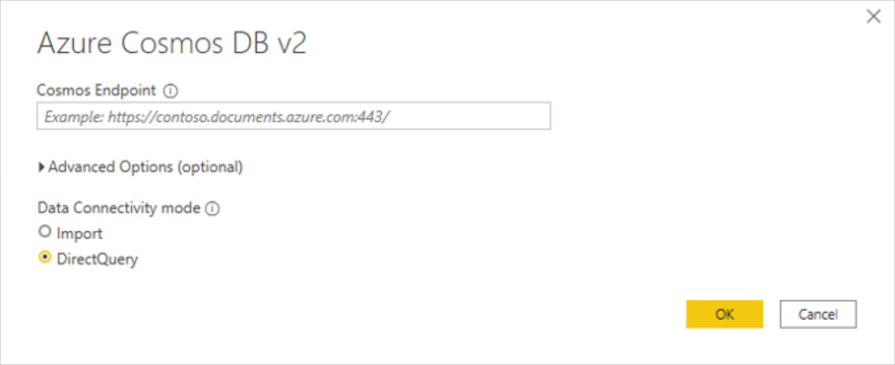

# Azure Cosmos DB v2 (Beta)

## Summary

| Item | Description |
| ---- | ----------- |
| Release State | General Availability |
| Products | Power BI (Datasets) |
| Authentication Types Supported | Feed Key |
| | |

## Prerequisites

* An [Azure Cosmos DB](https://azure.microsoft.com/services/cosmos-db/#overview) account

## Capabilities supported

* Import
* DirectQuery

## Connect to Azure Cosmos DB

To connect to Azure Cosmos DB data:

1. Launch Power BI Desktop.

2. In the **Home** tab, select **Get Data**.

3. In the search box, enter **Cosmos DB v2**.

4. Select **Azure Cosmos DB v2**, and then select **Connect**.

    

5. On the **Azure Cosmos DB v2** connection page, for **Cosmos Endpoint**, enter the URI of the Azure Cosmos DB account that you want to use. For **Data Connectivity mode**, choose a mode that's appropriate for your use case, following these general guidelines:

   * For smaller datasets, choose **Import**. When using import mode, Power BI works with Cosmos DB to import the contents of the entire dataset for use in your visualizations.

   * The **DirectQuery** mode will enable query pushdown, including aggregations to the Cosmos DB container **when a filter on partition key is specified**. The DirectQuery mode will be helpful in scenarios where Cosmos DB Container data is large and it is not feasible to import it all to Power BI cache in the Import mode. It will also be helpful in user scenarios where real-time reporting with the latest Cosmos DB data is a requirement. While you create or interact with a visualization, Microsoft Power BI works with Cosmos DB to dynamically query the underlying data source so that you're always viewing current data. More information: [Use DirectQuery in Power BI Desktop](/power-bi/connect-data/desktop-use-directquery)

   
6. Select **OK**.

7. At the prompt to configure data source authentication, enter the Account Key. Then select **Connect**. Your data catalog, databases, and tables appear in the **Navigator** dialog box. In the **Display Options** pane, select the check box for the dataset that you want to use.

    

8. The most optimal way to specify partition key filter (so that aggregate queries can be pushed down to Cosmos DB) is to use **Dynamic filtering with Parameters**. To use Dynamic filtering with Parameters, you would create a dataset with unique partition key values, create a Parameter, add it as filter on main dataset, bind it to the unique Partition key datset and use it as a Slicer for the main dataset. Please follow the below steps a through e to enable Dynamic filtering with Parameters.

   **a. Create a dataset with unique partition key values**:

      Click **Transform Data** instead of clicking "Load" on the previous Navigator tab to bring up the Power Query Editor. Right click on the Queries dataset and click Reference to create new dataset. 

   

   Rename the new Partition Key dataset, right click on the Cosmos DB Partition Key column, click **Remove Other Columns** and then click **Remove Duplicates**. 

   

   **b. Create a Parameter for dynamic filtering**:

   Click on **Manage Parameters** in Power Query editor -> **New Parameter** -> Rename to reflect the filter parameter and input a valid value as **Current Value**. Click on **Close & Apply** on top left corner of Power Query editor.

   

   **c. Apply parameterised filter on main table**:

   Click on dropdown icon of Partition Key column -> **Text Filters** -> **Equals** -> **Change Filter type from Text to Parameter** -> Choose the parameter that was created in the above step b. 

   

   **d. Create Partition Key values Slicer with Parameter binding**:

   Click on the **Model** tab -> Click on the Partition Key field -> Properties -> Advanced -> **Bind to parameter** -> Choose the parameter that was created in the above step b.

   

   Click on "Report" tab and add a Slicer for the Partition Key values

   

   **e. Add visualizations and apply Partition Key filters from the Slicer**:
   

## Advanced options

Power Query Desktop provides a set of advanced options that you can add to your query if needed.

The following table lists all of the advanced options you can set in Power Query Desktop.

| Advanced option | Description |
| --------------- | ----------- |
| Number of Retries | How many times to retry if there are HTTP return codes of `408 - Request Timeout`, `412 - Precondition Failed`, or `429 - Too Many Requests`. The default number of retries is 5. |
| Enable AVERAGE function Passdown | Attempt to pass down whenever possible. Set to 0 for false or 1 for true. The default value is 1. |
| Enable SORT Passdown for multiple columns | Indicates whether the ODBC Driver's behavior is tailored towards the PBI flow support. Set to 0 for false or 1 for true. The default value is 1. |
| | |

## Instructions and limitations

