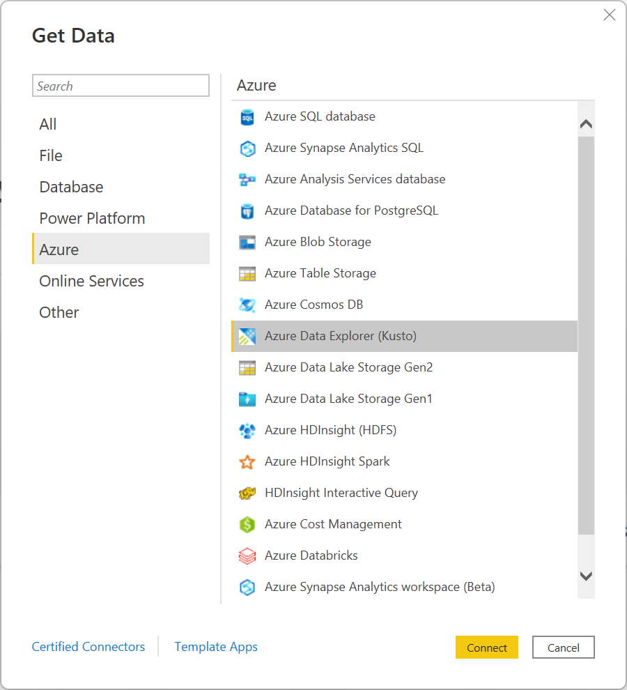
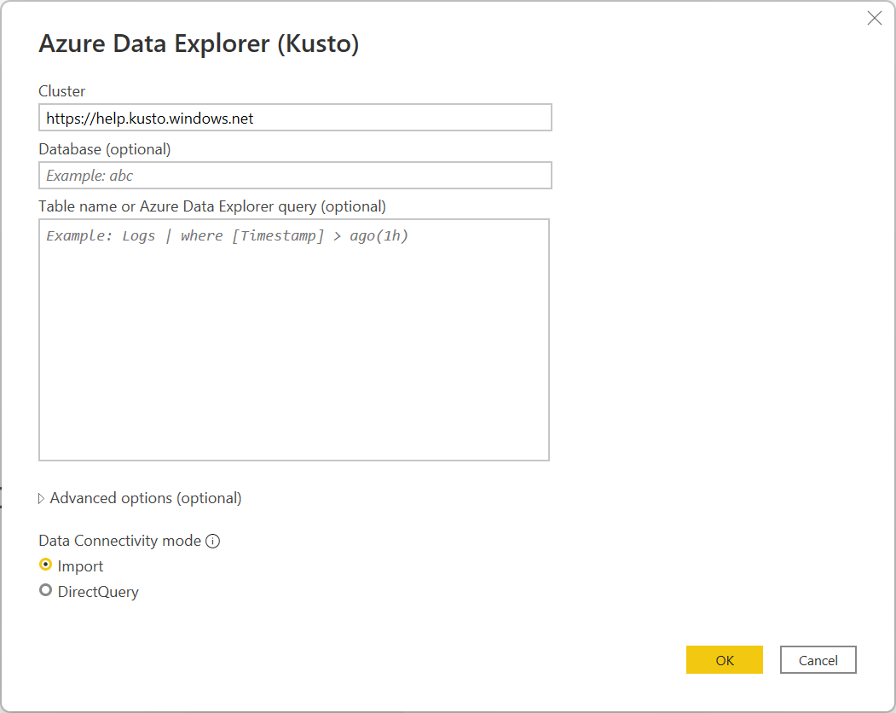
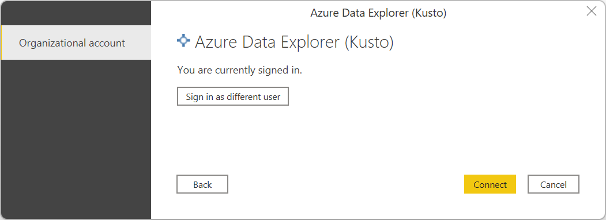
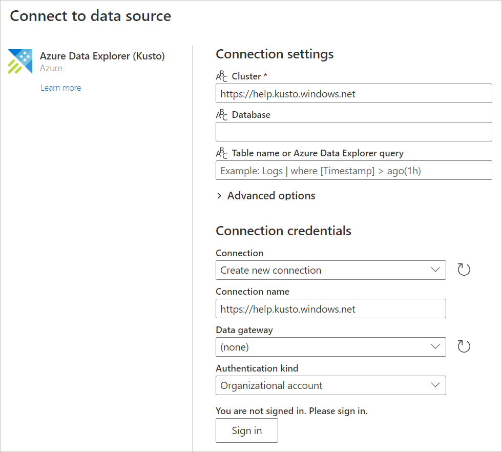
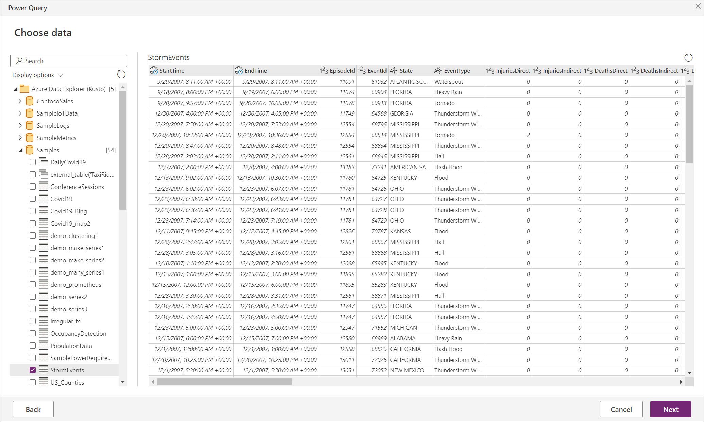

# Azure Data Explorer (Kusto)

## Summary

| Item | Description |
| ---- | ----------- |
| Release State | General Availability |
| Products | Excel Power BI (Datasets) Power BI (Dataflows) Power Apps (Dataflows) Dynamics 365 Customer Insights |
| Authentication Types Supported | Organizational Account |
| Function Reference Documentation | &mdash; |

>[!Note]
> Some capabilities may be present in one product but not others due to deployment schedules and host-specific capabilities.

## Prerequisites

* An Azure subscription. Go to [Get Azure free trial](https://azure.microsoft.com/pricing/free-trial/).

* An organizational email account that is a member of Azure Active directory. This article uses this account to connect to the [Azure Data Explorer help cluster](https://dataexplorer.azure.com/clusters/help/databases/Samples) samples.

## Capabilities supported

* Import
* DirectQuery (Power BI only)
* Advanced options
  * Limit query result record number
  * Limit query result data size in Bytes
  * Disable result-set truncation
  * Additional set statements

## Connect to Azure Data Explorer from Power Query Desktop

To connect to Azure Data Explorer from Power Query Desktop:

1. In **Get Data**, select **Azure** > **Azure Data Explorer (Kusto)**, and then select **Connect**. More information: [Where to get data](../where-to-get-data.md)

    

2. In **Azure Data Explorer (Kusto)**, provide the name of your Azure Data Explorer cluster. For this example, use `https://help.kusto.windows.net` to access the sample help cluster. For other clusters, the URL is in the form https://_\<ClusterName>_._\<Region>_.kusto.windows.net.

    You can also select a database that's hosted on the cluster you're connecting to, and one of the tables in the database, or a query like `StormEvents | take 1000`.

3. If you want to use any advance options, select the option and enter the data to use with that option. More information: [Connect using advanced options](#connect-using-advanced-options)

   >[!Note]
   >You might need to scroll down to display all of the advanced options and the data connectivity selection.

4. Select either the **Import** or **DirectQuery** data connectivity mode (Power BI Desktop only). More information: [When to use Import or Direct Query mode](#when-to-use-import-or-direct-query-mode)

5. Select **OK** to continue.

    

6. If you don't already have a connection to the cluster, select **Sign in**. Sign in with an organizational account, then select **Connect**.

    

7. In **Navigator**, select the database information you want, then either select **Load** to load the data or **Transform Data** to continue transforming the data in the Power Query editor. In this example, StormEvents was selected in the Samples database.

    

## Connect to Azure Data Explorer from Power Query Online

To connect to Azure Data Explorer from Power Query Online:

1. Select the **Azure Data Explorer (Kusto)** option from **Choose data source**. More information: [Where to get data](../where-to-get-data.md)

2. In **Connect to data source**, provide the name of your Azure Data Explorer cluster. For this example, use `https://help.kusto.windows.net` to access the sample help cluster. For other clusters, the URL is in the form https://_\<ClusterName>_._\<Region>_.kusto.windows.net.

    You can also select a database that's hosted on the cluster you're connecting to, and one of the tables in the database, or a query like `StormEvents | take 1000`.

   

3. If needed, select the on-premises data gateway in **Data gateway**.

4. If you don't already have a connection to the cluster, select **Sign in**. Sign in with an organizational account.

5. After you've successfully signed in, select **Next**.

6. In the **Choose data** page, select the database information you want, then either select **Transform Data** or **Next** to continue transforming the data in the Power Query editor. In this example, StormEvents was selected in the Samples database.

   

## Connect using advanced options

Both Power Query Desktop and Power Query Online provide a set of advanced options that you can add to your query if needed.

The following table lists all of the advanced options you can set in Power Query Desktop and Power Query Online.

| Advanced option | Description |
| --------------- | ----------- |
| Limit query result record number | The maximum number of records to return in the result. |
| Limit query result data size in Bytes | The maximum data size in bytes to return in the result. |
| Disable result-set truncation | Enable or disable result truncation by using the notruncation request option. |
| Additional Set Statements | Sets query options for the duration of the query. Query options control how a query executes and returns results. Multiple Set statements can be separated by semicolons. |

## When to use Import or Direct Query mode

In Import mode, data is moved to Power BI. In DirectQuery mode, data is queried directly from your cluster.

Use Import mode when:

* Your data set is small.
* You don't need near real-time data.
* Your data is already aggregated or you perform aggregation in Kusto

Use DirectQuery mode when:

* Your data set is very large.
* You need near real-time data.

To learn more about using DirectQuery, go to [About using DirectQuery in Power BI](/power-bi/connect-data/desktop-directquery-about).
