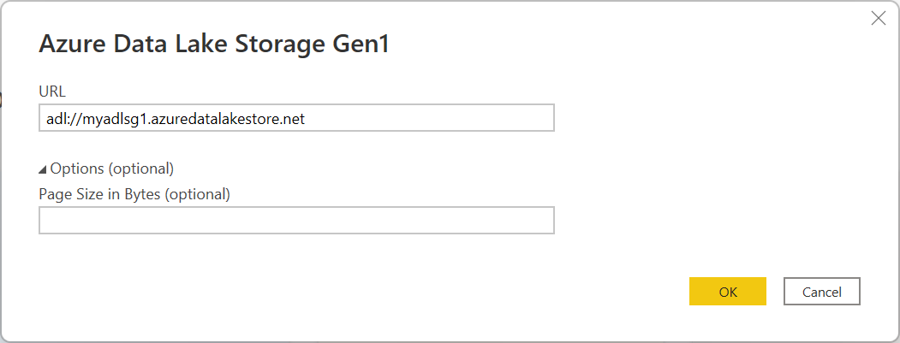
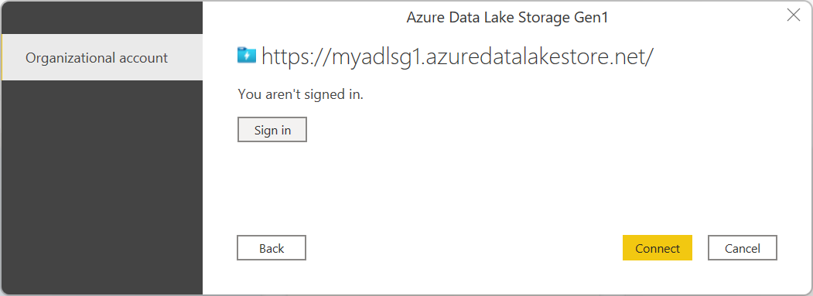
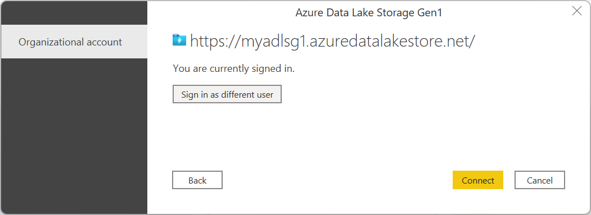

# Azure Data Lake Storage Gen1

>[!Note]
> On Feb 29, 2024 Azure Data Lake Storage Gen1 will be retired. For more information, go to [the official announcement](https://azure.microsoft.com/updates/action-required-switch-to-azure-data-lake-storage-gen2-by-29-february-2024/). If you use Azure Data Lake Storage Gen1, make sure to migrate to Azure Data Lake Storage Gen2 prior to that date. To learn how, go to [Migrate Azure Data Lake Storage from Gen1 to Gen2](/azure/storage/blobs/data-lake-storage-migrate-gen1-to-gen2).
>
>Unless you already have an Azure Data Lake Storage Gen1 account, you can't create new ones.

## Summary

| Item | Description |
| ---- | ----------- |
| Release State | General Availability |
| Products | Power BI (Datasets) Excel Analysis Services |
| Authentication Types Supported | Organizational Account |
| Function Reference Documentation | [AzureStorage.DataLake](/powerquery-m/azurestorage-datalake) [AzureStorage.DataLakeContents](/powerquery-m/azurestorage-datalakecontents) |

>[!Note]
> Some capabilities may be present in one product but not others due to deployment schedules and host-specific capabilities.

## Prerequisites

* An Azure subscription. Go to [Get Azure free trial](https://azure.microsoft.com/pricing/free-trial/).

* An Azure Data Lake Storage Gen1 account. Follow the instructions at [Get started with Azure Data Lake Storage Gen1 using the Azure portal](/azure/data-lake-store/data-lake-store-get-started-portal). This article assumes that you've already created a Data Lake Storage Gen1 account, called **myadlsg1**, and uploaded a sample data file (**Drivers.txt**) to it. This sample file is available for download from [Azure Data Lake Git Repository](https://github.com/Azure/usql/tree/master/Examples/Samples/Data/AmbulanceData/Drivers.txt).

## Capabilities supported

* Import
* Advanced options
  * Page size in bytes

## Connect to Azure Data Lake Storage Gen1

1. Select the **Azure Data Lake Storage Gen1** option in the **Get Data** selection, and then select **Connect**. More information: [Where to get data](../where-to-get-data.md)

   

2. In the **Azure Data Lake Store** dialog box, provide the URL to your Data Lake Storage Gen1 account. Optionally, enter a value in **Page Size in Bytes**. Then select **OK**.

    

3. If this is the first time you're connecting to this database, select **Sign in** to sign into the Azure Data Lake Storage Gen1 account. You'll be redirected to your organization's sign-in page. Follow the prompts to sign in to the account.

   

4. After you've successfully signed in, select **Connect**.

   

5. The **Navigator** dialog box shows the file that you uploaded to your Azure Data Lake Storage Gen1 account. Verify the information and then select either **Transform Data** to transform the data in Power Query or **Load** to load the data in Power BI Desktop.

   

## See also

* [Azure Data Lake Storage Gen2](DataLakeStorage.md)
* [Azure Data Lake Storage Gen1 documentation](/azure/data-lake-store/)
