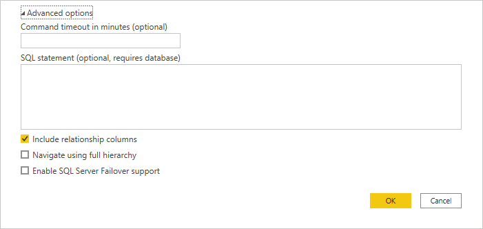

# Azure SQL database
 
## Summary
 
| Item | Description |
| ------- | ------------|
|Release state | General Availability |
| Products supported | Power BI Desktop Power BI Service (Enterprise Gateway) Dataflows in PowerBI.com (Enterprise Gateway) Dataflows in PowerApps.com (Enterprise Gateway) Excel |
| Authentication types supported| Windows (Power BI Desktop, Excel, Power Query Online with gateway) Database (Power BI Desktop, Excel) Microsoft Account (all)  Basic (Power Query Online) |
| Function reference docs | [Sql.Database](https://docs.microsoft.com/powerquery-m/sql-database) [Sql.Databases](https://docs.microsoft.com/powerquery-m/sql-databases) |
| | |

> [!NOTE]
> Some capabilities may be present in one product but not others due to deployment schedules and host-specific capabilities.
 
## Prerequisites

By default, Power BI installs an OLE DB driver for Azure SQL database. However, for optimal performance, we recommend that the customer installs the [SQL Server Native Client](https://docs.microsoft.com/sql/relational-databases/native-client/applications/installing-sql-server-native-client) before using the Azure SQL database connector. SQL Server Native Client 11.0 and SQL Server Native Client 10.0 are both supported in the latest version.

 
## Capabilities supported
* Import
* DirectQuery (Power BI only)
* Advanced options
    * Command timeout in minutes
    * Native SQL statement
    * Relationship columns
    * Navigate using full hierarchy
    * SQL Server failover support
    
## Connect to Azure SQL database from Power Query Desktop

To connect to an Azure SQL database from Power Query Desktop, take the following steps:
 
1. Select the **Azure SQL database** option in the connector selection.
 
2. In **SQL Server database**, provide the name of the server and database (optional). 

   

3. Select either the **Import** or **DirectQuery** data connectivity mode.

4. Optionally, you can select and enter advanced options that will modify the connection query, such as a command timeout or a native query (SQL statement). For information: [Connect using advance options](#connect-using-advanced-options)

5. Select **OK**.

6. If this is the first time you're connecting to this database, select the authentication type, input your credentials, and select the level to apply the authentication settings to. Then select **Connect**.

   

   >[!Note]
   >  If the connection is not encrypted, you'll be prompted with the following message.

   

   Select **OK** to connect to the database by using an unencrypted connection, or follow the instructions in [Enable encrypted connections to the Database Engine](https://docs.microsoft.com/sql/database-engine/configure-windows/enable-encrypted-connections-to-the-database-engine) to set up encrypted connections to Azure SQL database.

7. In **Navigator**, select the database information you want, then either select **Load** to load the data or **Transform Data** to continue transforming the data in Power Query Editor.

   

## Connect to Azure SQL database from Power Query Online

To connect to an Azure SQL database from Power Query Online, take the following steps:
 
1. Select the **Azure SQL database** option in the connector selection.

2. In **Azure SQL database**, provide the name of the server and database.

   

   You can also select and enter advanced options that will modify the connection query, such as a command timeout or a native query (SQL statement). For information: [Connect using advanced options](#connect-using-advanced-options)

3. If this is the first time you're connecting to this database, select the authentication kind and input your credentials.

4. If necessary, select the name of your on-premises data gateway.

5. If the connection is not encrypted, clear the **Use Encrypted Connection** check box.

6. Select **Next** to continue.

7. In **Navigator**, select the data you require, and then select **Transform data**.

   

## Connect using advanced options

Both Power Query Desktop and Power Query Online provide a set of advanced options that you can add to your query if needed. 

The following table lists all of the advanced options you can set in Power Query Desktop and Power Query Online.

| Advanced option | Description |
| --------------- | ----------- |
| Command timeout in minutes | If your connection lasts longer than 10 minutes (the default timeout), you can enter another value in minutes to keep the connection open longer. This option is only available in Power Query Desktop. |
| SQL statement | For information, go to [Import data from a database using native database query](../native-database-query.md). |
| Include relationship columns | If checked, includes columns that might have relationships to other tables. If this box is cleared, you won’t see those columns. |
| Navigate using full hierarchy | If checked, the Navigator displays the complete hierarchy of tables in the database you're connecting to. If cleared, Navigator displays only the tables whose columns and rows contain data. |
| Enable SQL Server Failover support | If checked, when a node in the Azure SQL [failover group](https://docs.microsoft.com/azure/azure-sql/database/auto-failover-group-overview?tabs=azure-powershell) isn't available, Power Query moves from that node to another when failover occurs. If cleared, no failover will occur. |
| | |

Once you've selected the advanced options you require, select **OK** in Power Query Desktop or **Next** in Power Query Online to connect to your Azure SQL database.
