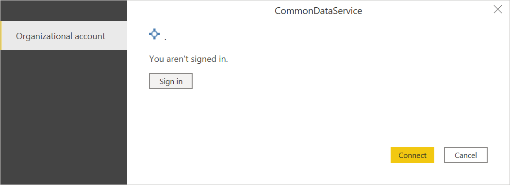
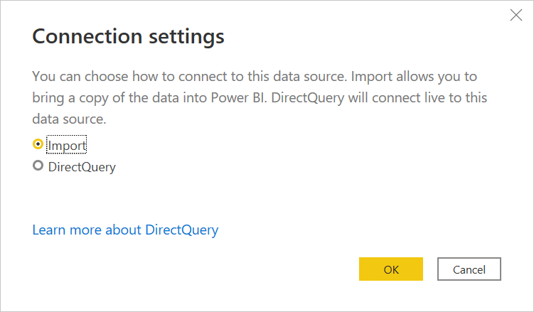
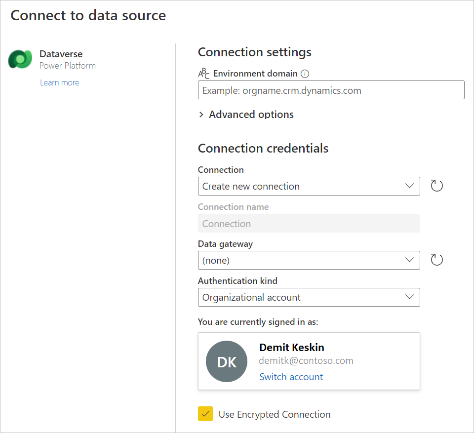
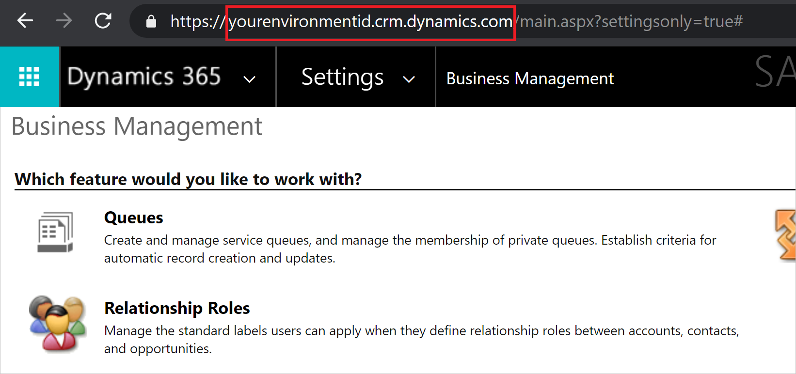

# Dataverse

## Summary

| Item | Description |
| ---- | ----------- |
| Release State | General Availability |
| Products | Power BI (Datasets)<br/>Power BI (Dataflows)<br/>Dynamics 365 Customer Insights<br/>Power Apps (Dataflows)<br/>Excel |
| Authentication types | Organizational account |
| | |

>[!Note]
>Some capabilities may be present in one product but not others due to deployment schedules and host-specific capabilities.

## Prerequisites

You must have a Dataverse environment.

You must have read permissions to access data within tables.

To use the Dataverse connector, the **TDS endpoint** setting must be enabled in your environment. More information: [Manage feature settings](/power-platform/admin/settings-features)

To use the Dataverse connector, one of TCP ports 1433 or 5558 need to be open to connect. Port 1433 is used automatically. However, if port 1433 is blocked, you can use port 5558 instead. To enable port 5558, you must append that port number to the Dataverse environment URL, such as *yourenvironmentid.crm.dynamics.com,5558*. More information: [SQL Server connection issue due to closed ports](#sql-server-connection-issue-due-to-closed-ports)

>[!Note]
> If you are using Power BI Desktop and need to use port 5558, you must create a source with the Dataverse environment URL, such as *yourenvironmentid.crm.dynamics.com,5558*, in Power Query M.

## Capabilities supported

* Server URL
* Import
* DirectQuery (Power BI only)
* Advanced
  * Reorder columns
  * Add display column

## Connect to Dataverse from Power BI Desktop

>[!Note]
> The Power Query Dataverse connector is mostly suited towards analytics workloads, not bulk data extraction. More information: [Alternative Dataverse connections](#alternative-dataverse-connections)

To connect to Dataverse from Power BI Desktop:

1. Select **Get data** from the **Home** tab.

2. In the **Get Data** dialog box, select **Power Platform > Dataverse**, and then select **Connect**.

   

3. If this attempt is the first time you're connecting to this site, select **Sign in** and input your credentials. Then select **Connect**.

   

4. In **Navigator**, select the data you require, then either load or transform the data.

   

5. Select either the **Import** or **DirectQuery** data connectivity mode. Then select **OK**.

   

## Connect to Dataverse from Power Query Online

To connect to Dataverse from Power Query Online:

1. From the **Data sources** page, select **Dataverse**.

   

2. Leave the server URL address blank. Leaving the address blank will list all of the available environments you have permission to use in the Power Query Navigator window.

   

   >[!Note]
   >If you need to use port 5558 to access your data, you'll need to load a specific environment with port 5558 appended at the end in the server URL address. In this case, go to [Finding your Dataverse environment URL](#finding-your-dataverse-environment-url) for instructions on obtaining the correct server URL address.

3. If necessary, enter an on-premises data gateway if you're going to be using on-premises data. For example, if you're going to combine data from Dataverse and an on-premises SQL Server database.

4. Sign in to your organizational account.

5. When you've successfully signed in, select **Next**.

6. In the navigation page, select the data you require, and then select **Transform Data**.

   

## Finding your Dataverse environment URL

If you need to use port 5558 to connect to Dataverse, you'll need to find your Dataverse environment URL. Open [Power Apps](https://make.powerapps.com/?utm_source=padocs&utm_medium=linkinadoc&utm_campaign=referralsfromdoc). In the upper right of the Power Apps page, select the environment you're going to connect to. Select the  settings icon, and then select **Advanced settings**.

In the new browser tab that opens, copy the root of the URL. This root URL is the unique URL for your environment. The URL will be in the format of https://\<*yourenvironmentid*>.crm.dynamics.com/. **Make sure you remove https:// and the trailing / from the URL before pasting it to connect to your environment.** Append port 5558 to the end of the environment URL, for example *yourenvironmentid.crm.dyamics.com,5558*



## When to use the Common Data Service (Legacy) connector

Dataverse is the direct replacement for the Common Data Service connector. However, there may be times when it's necessary to choose the Common Data Service (Legacy) connector instead of the [Dataverse](dataverse.md) connector:

There are certain Tabular Data Stream (TDS) data types that are supported in OData when using Common Data Service (Legacy) that aren't supported in Dataverse. The supported and unsupported data types are listed in [How Dataverse SQL differs from Transact-SQL](/powerapps/developer/data-platform/how-dataverse-sql-differs-from-transact-sql?tabs=supported).

All of these features will be added to the Dataverse connector in the future, at which time the Common Data Service (Legacy) connector will be deprecated.

More information: [Accessing large datasets](#accessing-large-datasets)

## Limitations and issues

### Dataverse performance and throttling limits

For information about performance and throttling limits for Dataverse connections, go to [Requests limits and allocations](/power-platform/admin/api-request-limits-allocations). These limitations apply to both the Dataverse connector and the [OData Feed](odatafeed.md) connector when accessing the same endpoint.

### Table retrieval rate

As a guideline, most default tables will be retrieved at a rate of approximately 500 rows per second using the Dataverse connector. Take this rate into account when deciding whether you want to connect to Dataverse or export to data lake. If you require faster retrieval rates, consider using the Export to data lake feature or Tabular Data Stream (TDS) endpoint. For more information, go to [Alternative Dataverse connections](#alternative-dataverse-connections).

### Alternative Dataverse connections

There are several alternative ways of extracting and migrating data from Dataverse:

* Use the **Azure Synapse Link** feature in Power Apps to extract data from Dataverse into Azure Data Lake Storage Gen2, which can then be used to run analytics. For more information about the Azure Synapse Link feature, go to [What is Azure Synapse Link for Dataverse?](/powerapps/maker/data-platform/export-to-data-lake).

* Use the OData connector to move data in and out of Dataverse. For more information on how to migrate data between Dataverse environments using the dataflows OData connector, go to [Migrate data between Dataverse environments using the dataflows OData connector](/powerapps/developer/common-data-service/cds-odata-dataflows-migration).

>[!Note]
> Both the Dataverse connector and the OData APIs are meant to serve analytical scenarios where data volumes are relatively small. The recommended approach for bulk data extraction is “Azure Synapse Link”.

### SQL Server connection issue due to closed ports

When connecting with the Dataverse connector, you might encounter an **Unable to connect** error indicating that a network or instance-specific error occurred while establishing a connection to SQL Server. This error is likely caused by the TCP ports 1433 or 5558 being blocked during connection. To troubleshoot the blocked port error, go to [Blocked ports](/powerapps/developer/data-platform/dataverse-sql-query#blocked-ports).

### Using native database queries with Dataverse

You can connect to Dataverse using a custom SQL statement or a [native database query](../native-database-query.md). While there's no user interface for this experience, you can enter the query using the Power Query Advanced Editor. In order to use a native database query, a **Database** must be specified as the Source. 

```
Source = CommonDataService.Database([DATABASE URL])
```

Once a database source has been defined, you can specify a native query using the [Value.NativeQuery](/powerquery-m/value-nativequery) function.

```
myQuery = Value.NativeQuery(Source, [QUERY], null, [EnableFolding=true])
```

Altogether, the query will look like this.

```
let
    Source = CommonDataService.Database("[DATABASE]"),
    myQuery = Value.NativeQuery(Source, "[QUERY]", null, [EnableFolding=true])
in
    myQuery
```

Note that misspelling a column name may result in an error message about query folding instead of missing column.

### Accessing large datasets

Power BI datasets contained in Dataverse can be very large. If you're using the Power Query Dataverse connector, any specific query that accesses the dataset must return less than 80 MB of data. So you might need to query the data multiple times to access all of the data in the dataset. Using multiple queries can take a considerable amount of time to return all the data.

If you're using the [Common Data Service (Legacy)](CommonDataServiceLegacy.md) connector, you can use a single query to access all of the data in the dataset. This connector works differently and returns the result in “pages” of 5 K records. Although the Common Data Service (Legacy) connector is more efficient in returning large amounts of data, it can still take a significant amount of time to return the result.

Instead of using these connectors to access large datasets, we recommend that you use [Azure Synapse Link](/powerapps/maker/data-platform/export-to-data-lake) to access large datasets. Using Azure Synapse Link is even more efficient that either the Power Query Dataverse or Common Data Service (Legacy) connectors, and it is specifically designed around data integration scenarios.

### Performance issues related to relationship columns

Similar to the SQL Server connector, there's an option available to disable navigation properties (relationship columns) in the Dataverse connector to improve performance. This option is not yet available in the user interface, but can be set using the `CreateNavigationProperties=false` parameter in the Dataverse connector function. 

```powerquery-m
 Source = CommonDataService.Database("{crminstance}.crm.dynamics.com",[CreateNavigationProperties=false]),
```
