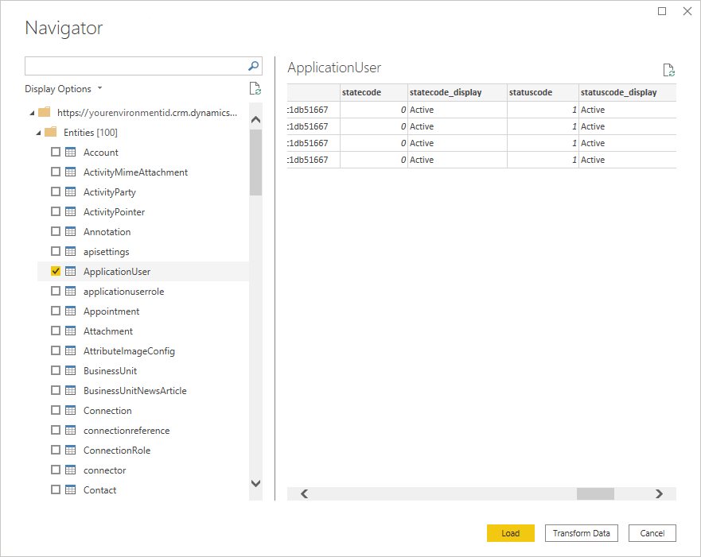
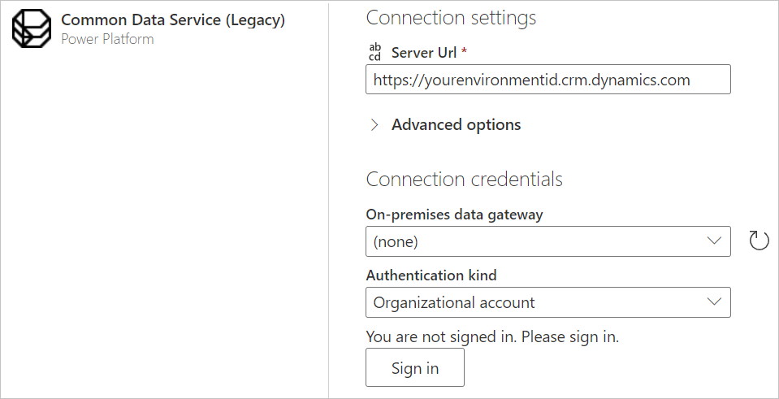

# Dataverse

## Summary

| Item | Description |
| ---- | ----------- |
| Release State | General Availability |
| Products | Power BI (Datasets) Power BI (Dataflows) Dynamics 365 Customer Insights |
| Authentication types | Organizational account |
| | |

## Prerequisites

You must have a Dataverse environment with maker permissions to access the portal, and read permissions to access data within tables.

To use the Dataverse connector, the **TDS endpoint** setting must be enabled in your environment. More information: [Manage feature settings](/power-platform/admin/settings-features)

To use the Dataverse connector, TCP ports 1433 and/or 5558 need to be open to connect. If only port 5558 is enabled, you must append that port number to the Dataverse environment URL, such as *yourenvironmentid.crm.dynamics.com:5558*. More information: [SQL Server connection issue due to closed ports](#sql-server-connection-issue-due-to-closed-ports)

## Capabilities supported

* Server URL
* Advanced
  * Reorder columns
  * Add display column

## Finding your Dataverse environment URL

Open [Power Apps](https://make.powerapps.com/?utm_source=padocs&utm_medium=linkinadoc&utm_campaign=referralsfromdoc). In the upper right of the Power Apps page, select the environment you're going to connect to. Select the  settings icon, and then select **Advanced settings**.

In the new browser tab that opens, copy the root of the URL. This root URL is the unique URL for your environment. The URL will be in the format of https://\<*yourenvironmentid*>.crm.dynamics.com/. **Make sure you remove https:// and the trailing / from the URL before pasting it to connect to your environment.** Keep this URL somewhere handy so you can use it later, for example, when you create Power BI reports.

## Connect to Dataverse from Power BI Desktop

>[!Note]
> The Power Query Dataverse connector is mostly suited towards analytics workloads, not bulk data extraction. More information: [Alternative Dataverse connections](#alternative-dataverse-connections)

To connect to Dataverse from Power BI Desktop:

1. Select **Get data** from the **Home** tab.

2. In the **Get Data** dialog box, select **Power Platform > Dataverse**, and then select **Connect**.

   

3. Enter the Dataverse environment URL of the data you want to load. Use the format *\<yourenvironmentid>.crm.dynamics.com*. Be sure to remove the `https://` prefix and `/` suffix from the URL before entering the name in **Environment domain**. More information: [Finding your Dataverse environment URL](#finding-your-dataverse-environment-url)

   

4. Select one of the following Data Connectivity mode options:

   * **Import**: We recommend that you import data to Power BI wherever possible. With this mode, data is cached in the Power BI service and imported on a scheduled interval.
   * **DirectQuery**: Connects directly to the data in Dataverse. Use this mode for real-time data retrieval. This mode can also more strictly enforce the Dataverse security model. More information: DirectQuery model guidance in Power BI Desktop.

   When you've finished filling in the information, select **OK**.

5. If this attempt is the first time you're connecting to this site, select **Sign in** and input your credentials. Then select **Connect**.

   

6. In **Navigator**, select the data you require, then either load or transform the data.

   

## Connect to Dataverse from Power Query Online

To connect to Dataverse from Power Query Online:

1. From the **Data sources** page, select **Common Data Service (Legacy)**.

   

2. Enter the server URL address of the data you want to load.

   

3. If necessary, enter an on-premises data gateway if you're going to be using on-premises data. For example, if you're going to combine data from Dataverse and an on-premises SQL Server database.

4. Sign in to your organizational account.

5. When you've successfully signed in, select **Next**.

6. In the navigation page, select the data you require, and then select **Transform Data**.

## Limitations and issues

### When to use the Common Data Service (Legacy) connector

Dataverse is the direct replacement for the Common Data Service connector. However, there may be times when it's necessary to choose the Common Data Service (Legacy) connector instead of the Dataverse connector:

* If you're connecting to data using Power Apps, you'll still have to use the Common Data Service (Legacy) connector.
* If you're accessing large datasets that are greater than 80 MB.
* If you want paging of the query results and want to build reports that use the image data type.

Also, there are certain Tabular Data Stream (TDS) data types that are supported in OData when using Common Data Service (Legacy) that aren't supported in Dataverse. The supported and unsupported data types are listed in [How Dataverse SQL differs from Transact-SQL (Preview)](/powerapps/developer/data-platform/how-dataverse-sql-differs-from-transact-sql?tabs=supported).

All of these features will be added to the Dataverse connector in the future, at which time the Common Data Service (Legacy) connector will be deprecated.

### Dataverse OData API performance and throttling limits

For information about OData API performance and throttling limits for Dataverse connections, go to [Requests limits and allocations](/power-platform/admin/api-request-limits-allocations). These limitations apply to both the Dataverse connector (which uses the OData API as an implementation detail) and the [OData Feed](odatafeed.md) connector when accessing the same endpoint.

### Table retrieval rate

As a guideline, most default tables will be retrieved at a rate of approximately 500 rows per second using the Dataverse connector. Take this rate into account when deciding whether you want to connect to Dataverse or export to data lake. If you require faster retrieval rates, consider using the Export to data lake feature or Tabular Data Stream (TDS) endpoint. For more information, go to [Alternative Dataverse connections](#alternative-dataverse-connections).

### Alternative Dataverse connections

There are several alternative ways of extracting and migrating data from Dataverse:

* Use the OData connector to move data in and out of Dataverse. For more information on how to migrate data between Dataverse environments using the dataflows OData connector, go to [Migrate data between Dataverse environments using the dataflows OData connector](/powerapps/developer/common-data-service/cds-odata-dataflows-migration).

* Use the **Export to data lake** feature in Power Apps to extract data from Dataverse into Azure Data Lake Storage, which can then be used to run analytics. For more information about the export to data lake feature, go to [Exporting Dataverse data to Azure Data Lake is Generally Available](https://powerapps.microsoft.com/blog/exporting-cds-data-to-azure-data-lake-preview/#:~:text=Exporting%20CDS%20data%20to%20Azure%20Data%20Lake%20is,BI%20reporting%2C%20ML%2C%20Data%20Warehousing%20and%20other%20).

* Use the Tabular Data Stream (TDS) Protocol endpoint to access read-only data in Dataverse. For more information about this preview feature and a video on how it works, go to [Tabular Data Stream (TDS) Protocol endpoint for Dataverse](https://powerapps.microsoft.com/blog/tabular-data-stream-tds-protocol-endpoint-for-common-data-service-cds/).

>[!Note]
> Both the Dataverse connector and the OData APIs are meant to serve analytical scenarios where data volumes are relatively small. The recommended approach for bulk data extraction is “Export to Data Lake”. The TDS endpoint is a better option than the Dataverse connector and OData endpoint, but is currently in Preview.

### SQL Server connection issue due to closed ports

When connecting with the Dataverse connector, you may encounter an **Unable to connect** error indicating that a network or instance-specific error occurred while establishing a connection to SQL Server. This error is likely caused by the TCP ports 1433 and 5558 being blocked during connection. To troubleshoot the blocked port error, go to [Blocked ports](/powerapps/developer/data-platform/dataverse-sql-query#blocked-ports).
