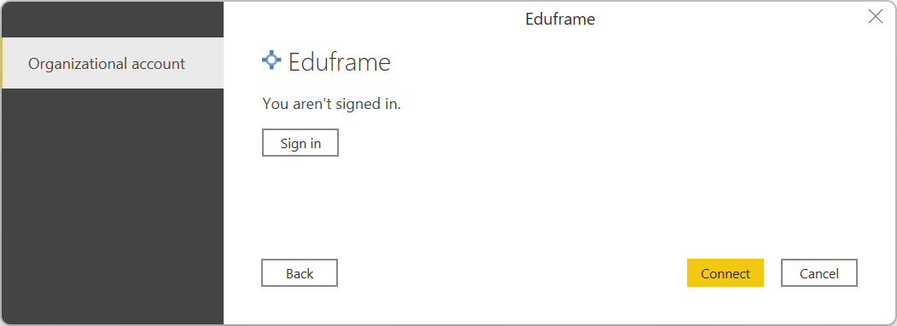

# Eduframe Reporting (Beta)

## Summary

| Item | Description |
| ---- | ----------- |
| Release State | Beta |
| Products | Power BI (datasets) |
| Authentication Types Supported | Eduframe account |

> [!NOTE]
> The following connector article is provided by Drieam, the owner of this connector and a member of the Microsoft Power Query Connector Certification Program. If you have questions regarding the content of this article or have changes you would like to see made to this article, visit the Drieam website and use the support channels there.

## Prerequisites

Before you can sign in to Eduframe Reporting, you must have an Eduframe Admin account (username/password) and have enabled the Eduframe Reporting integration. To enable this integration, you can send an email to: support@eduframe.nl.

## Capabilities Supported

* Import

## Connect to Eduframe Reporting data

To connect to Eduframe Reporting data:

1. Select **Get Data** from the **Home** ribbon in Power BI Desktop. Select **Online Services** from the categories on the left, select **Eduframe (Beta)**, and then select **Connect**.

   

2. If this is the first time you're getting data through the Eduframe connector, a preview connector notice will be displayed. Select **Don't warn me again with this connector** if you don't want this message to be displayed again, and then select **Continue**.

3. Enter the Eduframe domain that you want to access (this domain is the URL without the .eduframe.nl), and if you want to exclude personal information. Then select **OK**.

   

4. To sign in to your Eduframe account, select **Sign in**.

   

5. In the window that appears, provide your credentials to sign in to your Eduframe account and select **Sign in**.

6. Next it will show a window where you have to approve this integration with Power BI. Select **approve**.

   

7. Once you've successfully signed in, select **Connect**.

8. In **Navigator**, select the information you want, then either select **Load** to load the data or **Transform Data** to continue transforming the data in the Power Query editor.

## Limitations and issues

You should be aware of the following limitations and issues associated with accessing Eduframe data.

* There's a throttling limit of 100 API calls per 60 seconds.

## Next steps

You can find additional information and templates for this connector on our [documentation page](https://drieam.github.io/EduFramePowerBiConnector/).
