# Essbase

## Summary

| Item | Description |
| ---- | ----------- |
| Release State | General Availability |
| Products | Power BI (Datasets) |
| Authentication Types Supported | Basic (Username/Password) |
| Function Reference Documentation | [Essbase.Cubes](/powerquery-m/essbase-cubes) |
|  |  |

> [!Note]
> Some capabilities may be present in one product but not others due to deployment schedules and host-specific capabilities.

## Prerequisites

None

## Capabilities Supported

- Import
- Direct Query
- Advanced options
  - Command timeout in minutes
  - Server
  - Application
  - MDX statement

## Connect to Essbase from Power Query Desktop

To connect to an Essbase server:

1. Select the **Essbase** option in the **Get Data** experience.

2. Enter the **URL** to the Oracle Essbase Hyperion server. Typically, the URL looks like `http://[hostname]:[port number]/aps/XMLA`. The components of the URL are:

   - The `hostname` (for example, `yourservername.domain.com`) is the hostname or IP address of the Oracle Hyperion Application Provider Service (APS) server for your in-house system.
   - The `port number` (for example, 19000) is the port number the APS server is listening to for XMLA requests.
   - The last portion of the URL, the path (that is, **/aps/XMLA**), is case-sensitive and must be specified exactly as shown.

      

   Some example URLs would be:

   - `http://apsserver.company.com:19000/aps/XMLA`&mdash;Using fully qualified host name with default port 19000.
   - `http://hypserver01:13080/aps/XMLA`&mdash;Using a not fully qualified host name and port 13080.
   - `http://10.10.10.10/aps/XMLA`&mdash;Using an IP address and port 80&ndash;changed from default 19000.

3. Select either the **Import** or **DirectQuery** data connectivity mode. More information: [Use DirectQuery in Power BI Desktop](/power-bi/connect-data/desktop-use-directquery)
<!-- 4. Optionally, enter values in any advanced options that you want to use to modify the connection query. More information: [Connect using advanced options](#connect-using-advanced-options) -->

4. The first time you connect to a data source (identified by each unique URL), you'll be prompted to enter account credentials. Enter the **User name** and **Password** for the connection. More information: [Authentication with a data source](../ConnectorAuthentication.md)

   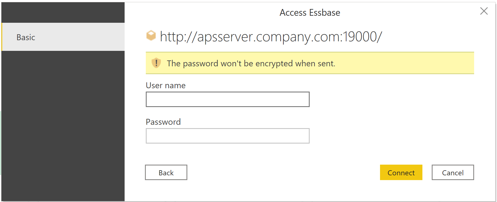

5. In **Navigator**, select the data you require. Then, either select **Transform data** to transform the data in Power Query Editor, or **Load** to load the data in Power BI.

   

## Using data source navigator when importing data

When **Data Connectivity mode** is set to **Import**, the data source navigator loads the servers configured for the APS server you've provided in the URL. Expanding a server node in the tree reveals the available applications. Expanding an application node reveals the available databases (also known as cubes). Expanding a database node reveals the available measures and dimensions. The dimension can be further expanded to reveal the levels in the hierarchy for each dimension.

Choose a measure and all (or specific) dimension levels by selecting the checkbox next to the name. A preview of the data is provided in the pane on the right. You can select the **Load** button to retrieve the data associated with the selection or select the **Transform Data** button to set further filters on the data before loading it in Power BI.

### Differences in display compared with Essbase administration

When expanding a dimension hierarchy in the navigator, you might notice that it looks different when compared to using the Essbase Administration Services control panel.

As an example, the following image shows the expanded Entity dimension hierarchy from Essbase Administration Services.

While in the Power Query navigator, the same Entity being expanded appears like this:

Be aware that this look is a stylistic decision and that there are no differences in data. The levels in the Power Query navigator correspond to the hierarchical level.

In the example above, Level 1 would contain “R_ReportingUnits”, “Adjustment Entity Input” and “No_Entity”. Level 2 would contain “R_Americas”, “R_EMEA”, “R_AsiaPacific”, “1_ReportingUnits_Adjustment”, “CALA_HFM_Input”, “CALA_Total”, and so on.

The reason is because the navigator in Power Query is limited to 10,000 members to display, and there can be millions or billions of members underneath a hierarchy. Even for the case of no member display limit (such as with Power Query Online), navigating and selecting every individual member in a tree format with so many possible values quickly becomes tedious and difficult to use.

So, the grouping of the hierarchical levels makes it easier to select what to import, and the subsequent report generation can use filters to target only the members the end user wants.

## Using data source navigator for DirectQuery

When a **Data Connectivity mode** of **DirectQuery** is chosen, the data source navigator loads the servers configured for the APS server you've provided in the URL. Expanding a server node in the tree reveals the available applications. Expanding an application node reveals the available databases (also known as cubes).

## Known limitations

The Essbase connector doesn't support measure hierarchies. All measures are displayed at the same level. You can still select all the measures that you need. The search field can be used to narrow down the displayed measures if there are large numbers of measures.

## Performance considerations

Interacting with Power BI in DirectQuery mode is very dynamic. When selecting a checkbox to include a measure or dimension level in the visualization, Power BI Desktop generates a query and sends it to the Oracle Essbase server to get the results. Power BI is optimized to cache any repeated queries to improve performance. But if any new query is generated, it's sent to the Oracle Essbase server to produce a new result. Depending on the number of selected measures, dimension levels, and the filters applied, the query might get sent more quickly than the Oracle Essbase server can respond. To improve performance and increase responsiveness, consider the following three methods to optimize your interaction with the Oracle Essbase server.

## Query reductions options

There are three options to reduce the number of queries sent. In Power BI Desktop, select the **File** tab, then select **Options and settings > Options**, and then select **Query reductions** under the **Current File** section.

Selecting the **Disabling cross highlighting/filtering by default** option under **Reduce number of queries sent by** disables cross highlighting/filtering by default. When disabled, member lists in the filter don't get updated when filtering members in other levels of the same dimension. Selecting the **Slicer selections** option under **Show an Apply button and only send queries once for** section displays the **Apply** button when a slicer selection is changed. Selecting the **Filter selections** option under **Show an Apply button and only send queries once for** section displays the **Apply** button when a filter selection is changed.

>[!Note]
> These options apply only to the current file you are working on. **Current File** option settings are saved with the file and restored when opening the same file.

## Iterative filter application when adding dimension levels in import mode

When interacting in import mode with a multidimensional cube data source like Oracle's Essbase, Power Query initially displays the measures, dimensions, and dimension levels in the database **Navigator** dialog box. However, while Power BI makes it easy to select and visualize data it can, at times, lead to retrieving too much data from the server.

The following procedure demonstrates how to reduce the chances of retrieving more data than is necessary when importing data into Power BI by iteratively applying filters on dimension members at each level.

### Connecting to the Oracle Essbase data source

1. Follow the instructions in [Connect to Essbase from Power Query Desktop](#connect-to-essbase-from-power-query-desktop) to connect to an Essbase server using import mode.

2. Expand the tree to drill down to your desired server, application, and database until it exposes the measures and dimensions for your database. For now, select your measures and only one dimension level. Pick the most important dimension level. In later steps, you'll build the result by incrementally adding more dimensions levels.

   

3. Select **Load** to import the selected measures and dimension level.

   

### Editing queries to add more dimension levels

Now that you have a starting point, you can start adding more dimension levels and applying filters as you go.

1. Select **Edit Queries** on the Power BI Desktop ribbon to start the process.

   [ 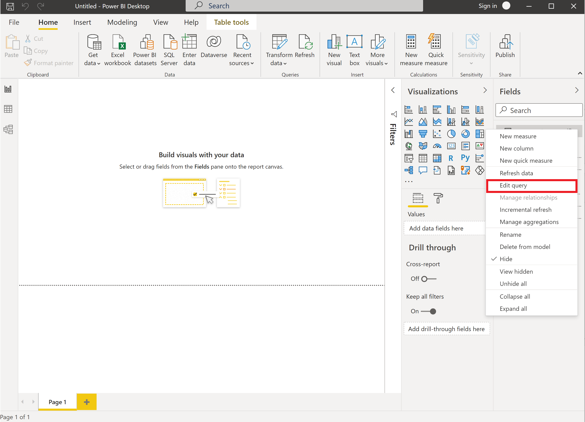 ](./media/essbase/iterative-import-select-edit-queries.png#lightbox)

2. If you have members you want to filter on in the initial dimension, select the column properties button  to display the list of available dimension members at this level. Select only the dimension members you need at this level and then select **OK** to apply the filter.

   

3. The resulting data is now updated with the applied filter. **Applied Steps** now contains a new step (**Filtered Rows**) for the filter you set. You can select the settings button  for the step to modify the filter at a later time.

   [ 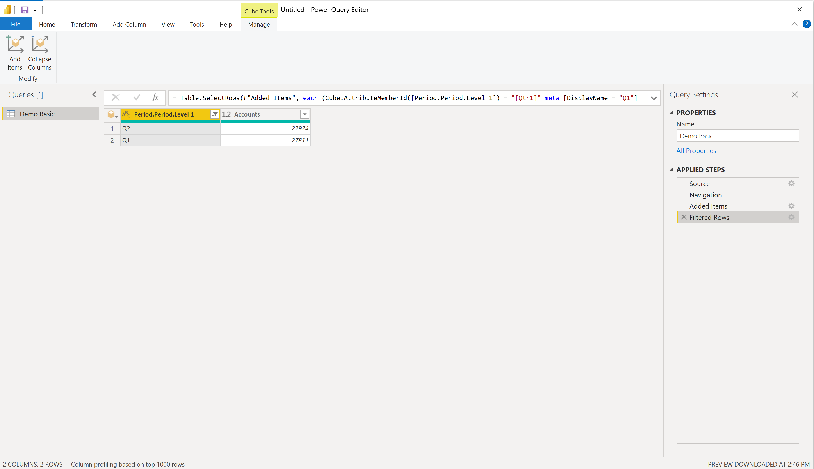 ](./media/essbase/iterative-import-modifier-filter.png#lightbox)

4. Now you'll add a new dimension level. In this case, you're going to add the next level down for the same dimension you initially chose. Select **Add Items** on the ribbon to bring up the **Navigator** dialog box.

   [ 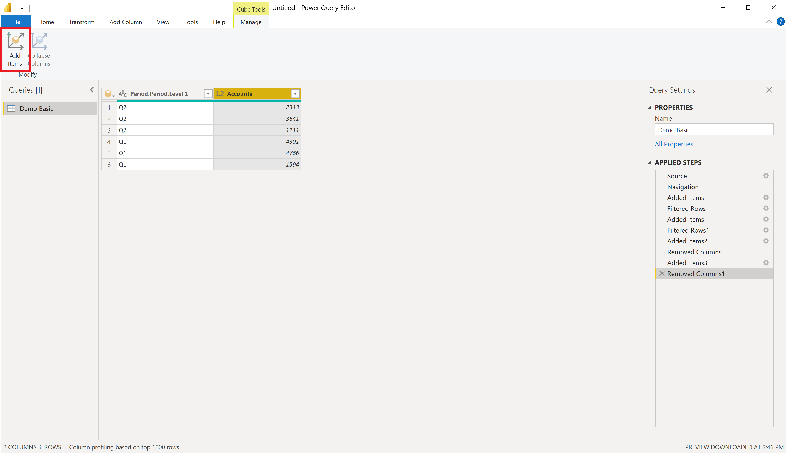 ](./media/essbase/iterative-import-select-add-items.png#lightbox)

5. Navigate to the same dimension, but this time select the next level below the first level. Then select **OK** to add the dimension level to the result.

   

6. The result grid now has the data from the new dimension level. Notice that because you've applied a filter at the top level, only the related members in the second level are returned.

   

7. You can now apply a filter to the second-level dimension as you did for the first level.

   [ 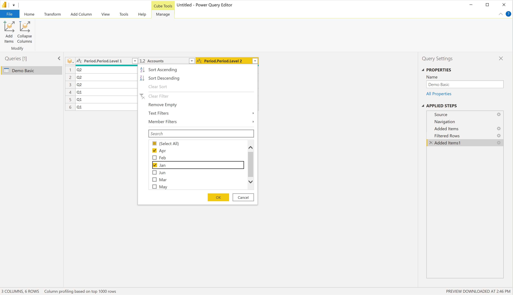 ](./media/essbase/iterative-import-apply-filter-on-second-level.png#lightbox)

8. In this way, each subsequent step ensures only the members and data you need are retrieved from the server.

   [ 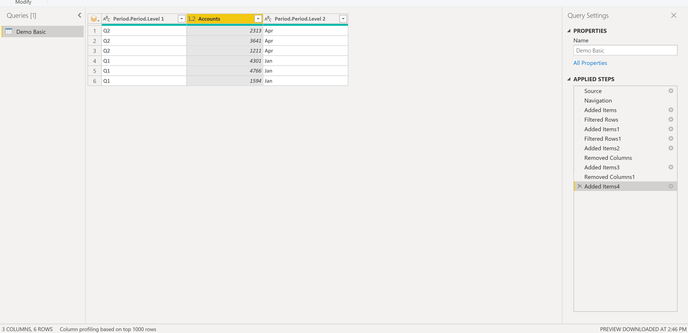 ](./media/essbase/iterative-import-filter-applied.png#lightbox)

9. Now let's add a new dimension level by repeating the previous steps. Select **Add Items** on the ribbon bar again.

   [ 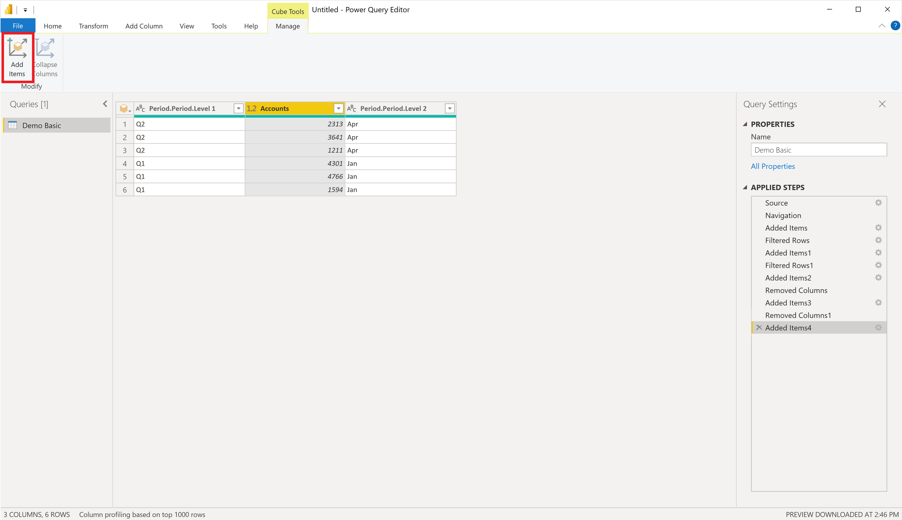 ](./media/essbase/iterative-import-select-add-items-again.png#lightbox)

10. Navigate to the dimension level you want, select it, and then select **OK** to add the dimension level to the result.

    [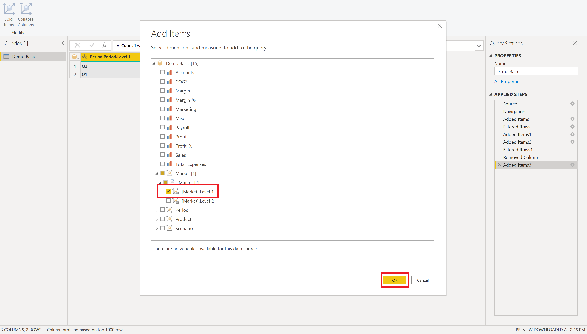 ](./media/essbase/iterative-import-select-desired-dimension-again.png#lightbox)

11. The new dimension level is added to the result.

    

12. Apply a filter to this dimension level, as needed.

    [ 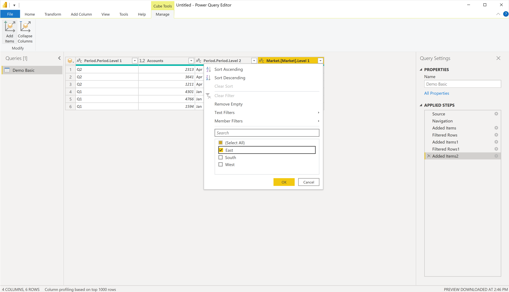 ](./media/essbase/iterative-import-apply-filter-to-new-dimension.png#lightbox)

13. Observe the result.

    

### Applying your changes and loading the data

1. When you've added all the dimension levels you want and have set all the required filters, select **Close** in the upper right corner to close the editor.

   [ 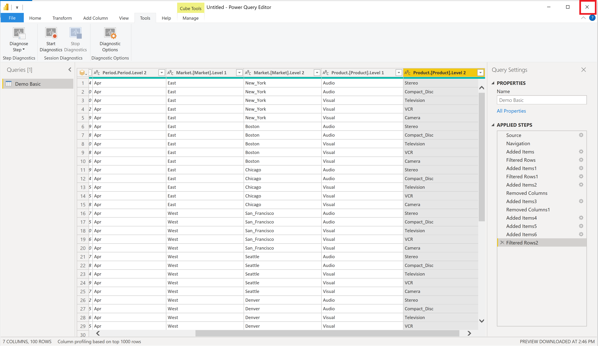 ](./media/essbase/iterative-import-select-close-button.png#lightbox)

2. Select **Yes** to apply your changes.

   [ 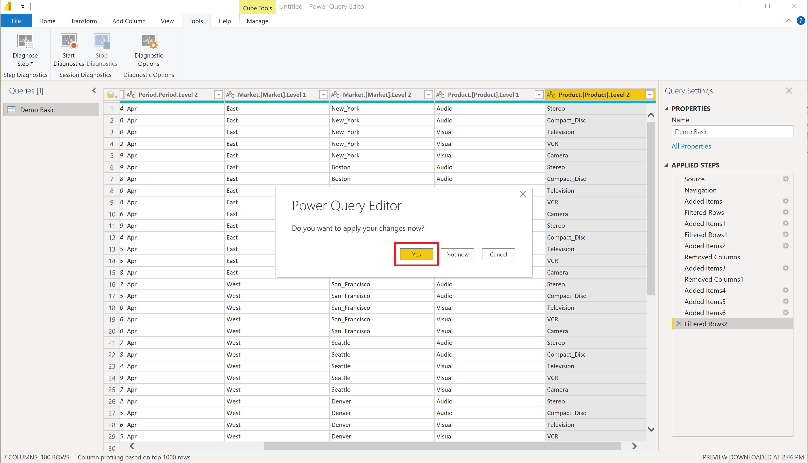 ](./media/essbase/iterative-import-select-yes-button.png#lightbox)

3. Wait for the changes to be applied.

   

4. Observe the new dimension levels in the **Fields** pane.

   

You're now ready to create reports and visualizations.

## Iterative filter application when adding dimension levels in DirectQuery mode

When interacting in DirectQuery mode with a multidimensional cube data source (like Oracle's Essbase), Power BI displays the cube's dimensions and levels in the **Fields** pane.

To view and filter based on dimension members:

1. Drag-and-drop a dimension level from the Fields pane over to the Filters pane. You can drag the dimension level to the **Add data fields here** area under **Filters on this visual**, **Filters on this page**, or **Filters on all pages**, depending on your needs.

   

2. Once a dimension's level is in the **Filter** pane and the filter type is set to **Basic filtering**, you'll notice that the members of that dimension's level are displayed as a list of available filters.

3. You can check the members you want to include in your result.

   Or you can select the Select all option, then uncheck the members you don't want to include in your result.

   Type some characters in the search field for that filter to find members in the list.

   

4. When you have filters for two or more levels of the same dimension, you'll notice that selecting members from a higher level in the dimension changes the members available in the lower levels of that dimension.

    This cross highlighting/filtering behavior can be disabled by checking the **Disabling cross highlighting/filtering by default** option, as described in [Query reductions options](#query-reductions-options).

   

5. When you've finished choosing the members you want in the dimension level filter, it's a good time to add that dimension level to your visualization. Check the matching dimension level in the **Fields** pane and it's then added to your current visualization.

   

For more information about adding filters, go to [Add a filter to a report in Power BI](/power-bi/power-bi-report-add-filter).

## Troubleshooting

This section outlines common issues that you might come across, and includes troubleshooting steps to address the issues.

### Connection issues

**Symptom 1**

Power BI Desktop returns the error message "Unable to connect to the remote server".

**Resolution**

1. Ensure the Essbase Analytic Provider Services (APS) server is configured correctly for the Provider Servers and Standalone Servers in the Essbase Administration Service (EAS) console. See Registering Essbase and Cluster in the Admin Console.

2. Ensure that the URL is correct.

   - Check to ensure the hostname and or IP address is correct.
   - Check to ensure the provided port is correct.
   - Check to ensure the http (not https) protocol is specified.
   - Check to ensure the case is correct for the /aps/XMLA path in the URL.

3. If there's a firewall between Power BI Desktop and the provided hostname, check to ensure the provided hostname and port can pass outbound through your firewall.

**Validation**

Trying to connect again won't show the error and the Cube and member list is in the navigation pane. You can also select and display in preview in Import mode.

**Symptom 2**

Power BI Desktop returns the error message "We couldn't authenticate with the credentials provided. Please try again."

**Resolution**

Ensure the provided username and password are correct. Reenter their values carefully. The password is case-sensitive.

**Validation**

After correcting the username and password, you should be able to display the members and the value in the preview or be able to load the data.

**Symptom 3**

Power BI Desktop returns the error message "Data at the root level is invalid. Line 1, position 1."

**Resolution**

Ensure the Essbase Analytic Provider Services (APS) server is configured correctly for the Provider Servers and Standalone Servers in the Essbase Administration Service (EAS) console. See [Registering Essbase and Cluster in the Admin Console](https://docs.oracle.com/cd/E57185_01/APSAG/ch03s01s01.html).

**Validation**

Trying to connect again won't show the error and the Cube and member list is displayed in the navigation pane. You can also select and display in the preview in Import mode.

**Symptom 4**

Once successfully connected to the Oracle Essbase Analytic Provider Services (APS) server, there are servers listed below the URL node in the data source navigator. However, when you expand a server node, no applications are listed below that server node.

**Resolution**

 We recommend configuring the Oracle Hyperion server to define the provider and standalone servers through the Essbase Administration Service (EAS) console. Refer to section _Addendum: Registering Provider and Standalone Servers in Essbase Administration Service (EAS) Console.

**Validation**

Trying to connect again won't show the error and you can see the Cube and member list in the navigation pane. You can also select and display in the preview in Import mode.

### Time out or large data issue

**Symptom 1**

Power Query returns the error message "The operation has timed out"

**Resolution**

1. Ensure the network is stable and there's a reliable network path to the Essbase Analytic Provider Services (APS) server provided in the data source URL.

2. If there's a possibility that the query to the service could return a large amount of data, specify a long (or longer) command timeout interval. If possible, add filters to your query to reduce the amount of data returned. For example, select only specific members of each dimension you want returned.

**Validation**

Retry to load the data and if the problem persists, try to increase to a longer timeout interval or filter the data further. If the problem still persists, try the resolution on [Symptoms 3](#timeout3).

**Symptom 2**

The query returns the error message "Internal error: Query is allocating too large memory ( > 4GB) and cannot be executed. Query allocation exceeds allocation limits."

**Resolution**

The query you're trying to execute is producing results greater than the Oracle Essbase server can handle. Supply or increase the filters on the query to reduce the amount of data the server will return. For example, select specific members for each level of each dimension or set numeric limits on the value of measures.

**Validation**

Retry to load the data and if the problem persists, try to increase to a longer timeout interval or filter the data further. If the problem still persists, try the resolution on [Symptoms 3](#timeout3).

**Symptom 3**

Essbase Analytic Provider Services (APS) or Essbase server indicates a large number of connections with long running sessions.

**Resolution**

When the connectivity mode is DirectQuery, it's easy to select measures or dimension levels to add to the selected visualization. However, each new selection creates a new query and a new session to the Essbase Analytic Provider Services (APS)/Essbase server. There are a few ways to ensure a reduced number of queries or to reduce the size of each query result. Review [Performance Considerations](#performance-considerations) to reduce the number of times the server is queried and to also reduce the size of query results.

**Validation**

Retry to load the data.

### Key not matching when running MDX

**Symptom**

An MDX statement returns the error message "The key didn't match any rows in the table".

**Resolution**

It's likely that the value or the case of the Server and Application fields don't match. Select the **Edit** button and correct the value and case of the Server and Application fields.

**Validation**

Retry to load the data.

### Unable to get cube issue - MDX

**Symptom**

An MDX statement returns the error message "Unable to get the cube name from the statement. Check the format used for specifying the cube name".

**Resolution**

Ensure the database name in the MDX statement's FROM clause is fully qualified with the application and database name, for example, [Sample.Basic]. Select the **Edit** button and correct the fully qualified database name in the MDX statement's FROM clause.

**Validation**

Retry to load the data.

### Essbase Error (1260060) issue - MDX

**Symptom**

An MDX statement returns the error message "Essbase Error (1260060): The cube name XXXX does not match with current application/database"

**Resolution**

Ensure the application name and the fully qualified database name in the FROM clause match. Select the **Edit** button and correct either the application name or the fully qualified database name in the MDX statement's FROM clause

**Validation**

Retry to load the data.

### Essbase Error (1200549): Repeated dimension [Measures] in MDX query

**Symptom**

Loading a dimension returns the error message "Essbase Error (1200549): Repeated dimension [Measures] in MDX query".

**Resolution**

1. Sign in to the Essbase server, open the Essbase Administration Services Console and sign in with an admin user (or whoever has permissions over the problematic database).
2. Navigate to the Essbase server > application > database with the problematic "Measures" dimension.
3. Unlock the outline of the database and edit it.
4. Determine which dimension should be the "Accounts" dimension type. Right-click it and select **Edit member properties…**.
5. Select the Dimension Type field and set it to **Accounts**. Select **OK**.

   

6. Verify and Save the outline.

**Validation**

Retry to load the dimension.
