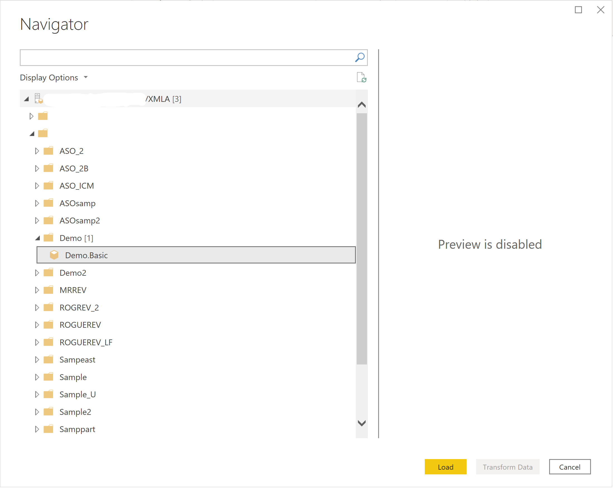
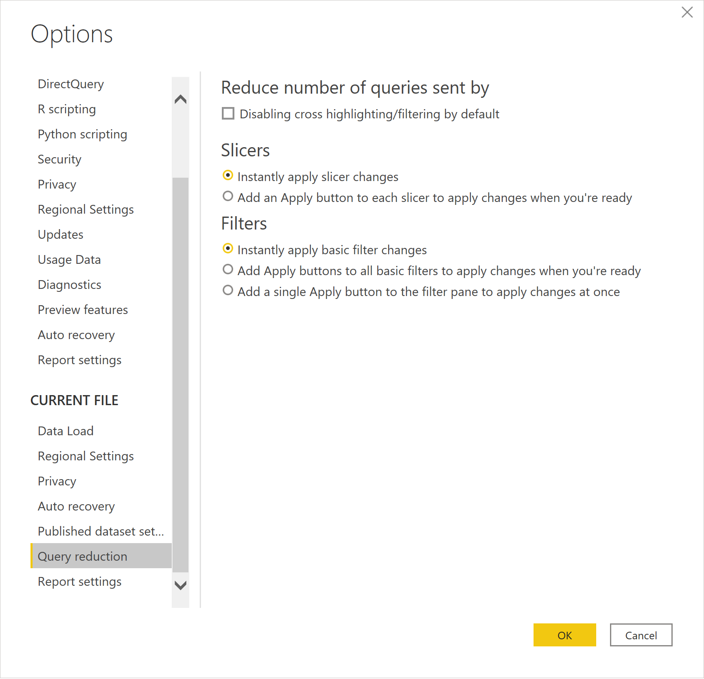
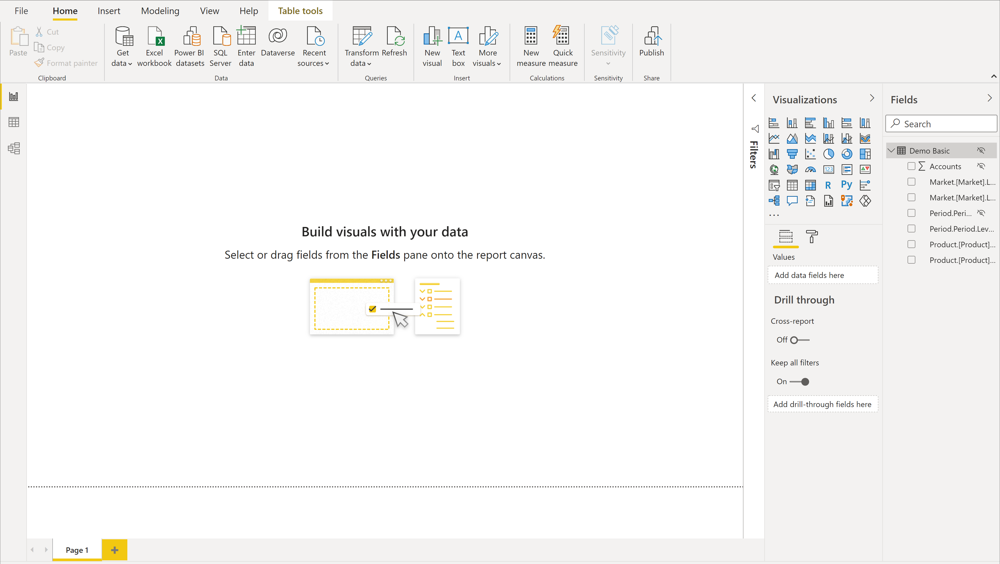
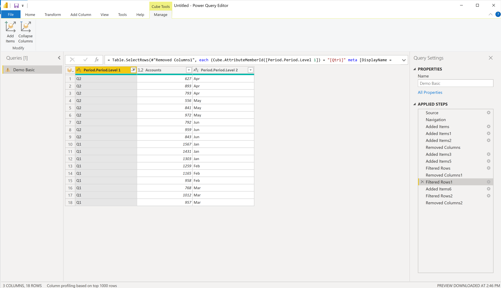
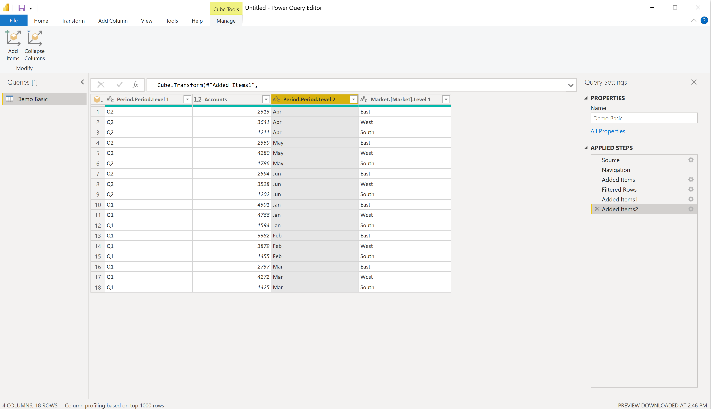
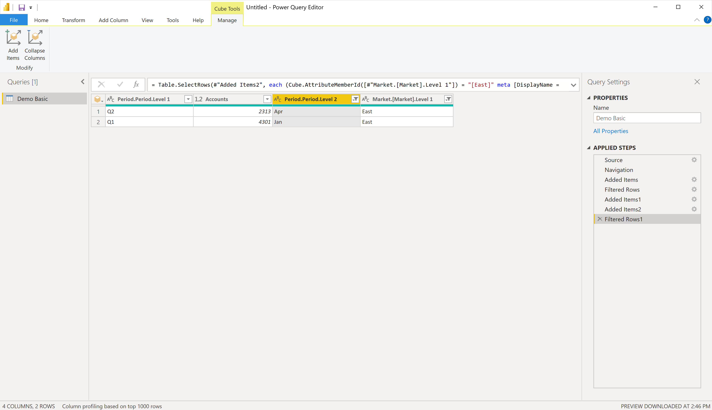
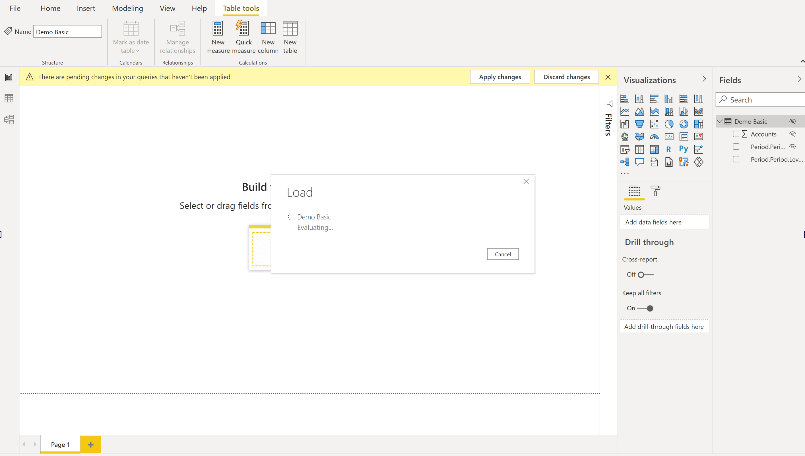
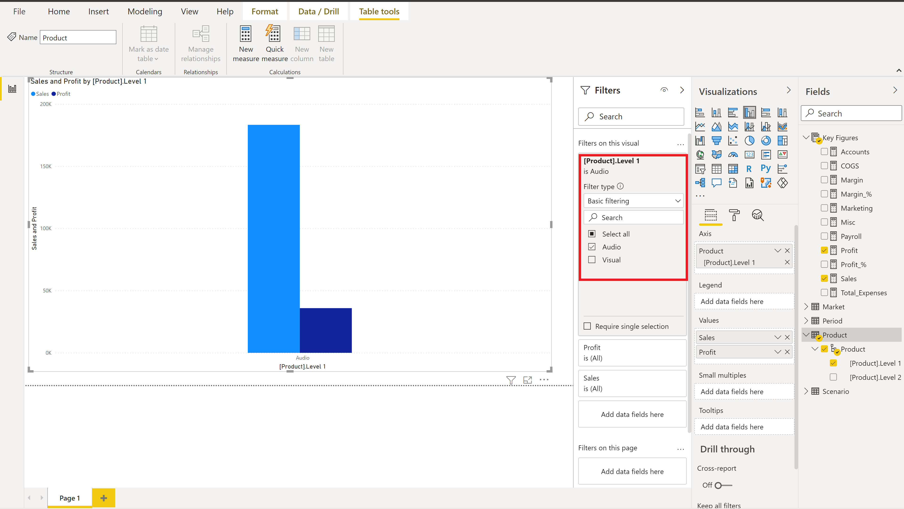
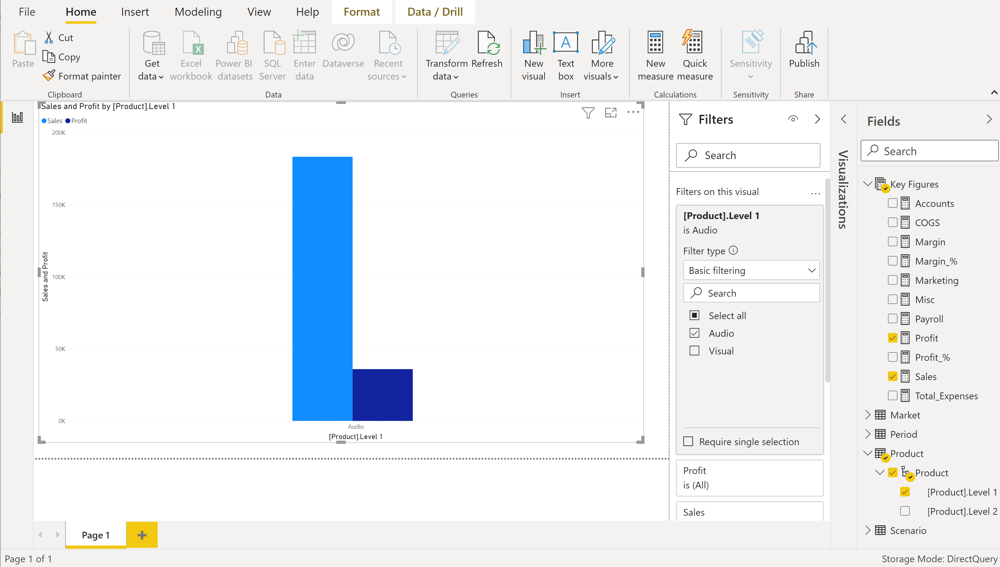

# Essbase

## Summary

| Item | Description |
| ---- | ----------- |
| Release State | General Availability |
| Products | Power BI (Datasets) Power BI (Dataflows) Power Apps (Dataflows) Excel Dynamics 365 Customer Insights Analysis Services |
| Authentication Types Supported | Basic (Username/Password) |
| Function Reference Documentation | [Essbase.Cubes](https://docs.microsoft.com/en-us/powerquery-m/essbase-cubes) |
|  |  |

> [!Note]
> Some capabilities may be present in one product but not others due to deployment schedules and host-specific capabilities.

## Prerequisites

None

## Capabilities Supported

- Import
- Direct Query
- Advanced options
  - Command timeout in minutes
  - Server
  - Application
  - MDX statement

## Connect to Essbase from Power Query Desktop

To connect to an Essbase server:

1. Select the **Essbase** option in the **Get Data** experience.

2. When connecting, you must specify the **URL** to the Oracle Essbase Hyperion server. Typically, the URL looks like http://yourservername.domain.com:portnumber/aps/XMLA. The **hostname** (e.g., yourservername.domain.com) is the hostname or IP address of the Oracle Hyperion **Application Provider Service (APS)** server for your in-house system. The **port number** (e.g., 19000) is the port number the APS server is listening for XMLA requests. The last portion of the URL, the **path** (i.e., **/aps/XMLA**), is case-sensitive and must be specified exactly as shown.

Example URL:

http://apsserver.company.com:19000/aps/XMLA (Using fully qualified name using default port 19000)

http://hypserver01:13080/aps/XMLA (Using a not fully qualified hostname and port 13080)

http://10.10.10.10/aps/XMLA (Using an IP address and port 80 - changed from default 19000)

3. Select either the **Import** or **DirectQuery** data connectivity mode.

4. The first time you connect to a data source (identified by each unique URL), you will be prompted to enter account credentials. Enter the **User name** and **Password** for the connection.

   

5. In **Navigator**, select the data you require, then select **Transform data** to transform the data in Power Query Editor, or load the data by selecting **Load**.

   

## Using Data Source Navigator when Importing Data

When **Data Connectivity mode** is set to **Import**, the data source **Navigator** loads the servers configured for the APS server you’ve provided in the URL. Expanding a server node in the tree reveals the available applications. Expanding an application node reveals the available databases (aka cubes). Expanding a database node reveals the available measures and dimensions. The dimension can be further expanded to reveal the levels in the hierarchy for each dimension.

Select a measure and all (or specific) dimension levels by clicking the checkbox next to the name. A preview of the data is provided in the pane on the right. You may click the **Load** button to retrieve the data associated with the selection or click the **Transform Data** button to set further filters on the data before loading it into Power BI.

### Differences in Display Compared with Essbase Administration

You may notice that when expanding a dimension hierarchy, it looks different when compared to using the Essbase Administration Services control panel.

As an example, here is a screenshot from expanding the Entity dimension hierarchy on the Essbase Administration Services:

While in Power BI Navigator, the same Entity being expanded appears like this:

Please be aware that this is a stylistic decision and that there are no differences in data. PowerBI’s Levels correspond to the hierarchical level.

In our above example, Level 1 would contain “R_ReportingUnits”, “Adjustment Entity Input” and “No_Entity”, Level 2 would contain “R_Americas”, “R_EMEA”, “R_AsiaPacific”, “1_ReportingUnits_Adjustment”, “CALA_HFM_Input”, “CALA_Total”, etc.

The reason is because PowerBI Desktop’s Navigator is limited to 10,000 members to display, and there can be millions or billions of members underneath a hierarchy. Even for the case of no member display limit (such as with Power Query Online), navigating and selecting every individual member in a tree format with so many possible values quickly becomes tedious and very difficult to use.

For that reason, the grouping of the hierarchical levels makes it easier to select what to import, and the subsequent report generation can use filters to target only the members the end user wants.

## Using Data Source Navigator for DirectQuery

When **Data Connectivity mode** of **DirectQuery** is chosen, the data source **Navigator** loads the servers configured for the APS server you’ve provided in the URL. Expanding a server node in the tree reveals the available applications. Expanding an application node reveals the available databases (aka cubes).

## Known Limitations

PowerBI Essbase connector does not support Measure Hierarchies. All measures are displayed at the same level. Users are still able to select all the measures that they need. The search field can be used to narrow down the displayed measures if there are many measures.

# Performance Considerations

Interacting with Power BI in DirectQuery mode is very dynamic. When clicking a checkbox to include a measure or dimension level in the visualization Power BI generates a query and sends it to the Oracle Essbase server to get the results. Power BI is optimized to cache any repeated queries to improve performance. But if any new query is generated, it is sent to the Oracle Essbase server to produce a new result. Depending on the number of selected measures, dimension levels, and the filters applied, the query may get sent more quickly than the Oracle Essbase server can respond. To improve performance and increase responsiveness, consider the following three methods to optimize your interaction with the Oracle Essbase server.

## Query Reductions options

There are three options to reduce the number of queries sent. From the menu path **File/Options** and settings/Options, find the **Query reductions** tab under the **Current File** section.

Selecting the **Reduce number of queries sent by** option will disable cross highlighting/filtering by default. When disabled, member lists in the filter do not get updated when filtering members in other levels of the same dimension. Selecting the **Slicer selections** option under the **Show an Apply button and only send queries once for** the section will display the **Apply** button when a slicer selection is changed. Selecting the **Filter selections** option under the **Show an Apply button and only send queries once for** the section will display the Apply button when a filter selection is changed.

Note: These options apply only to the current file you are working on. **Current File** option settings are saved with the file and restored when opening the same file.

# Iterative Filter Application When Adding Dimension Levels In Import Mode

When interacting in Import mode with a multidimensional cube data source like Oracle's Essbase, Power BI initially displays the measures, dimensions, and dimension levels in the database Navigator dialog. However, while Power BI makes it easy to select and visualize data it can, at times, lead to retrieving too much data from the server.

The following procedure demonstrates how to reduce the chances of retrieving more data than is necessary when Importing data into Power BI by iteratively applying filters on dimension members at each level.

## Connecting to the Oracle Essbase Data Source

1. Follow the instruction in [Power Query Essbase connector](power-query-essbase-connector.md) to connect to an Essbase server via Import mode.

2. Expand the tree to drill down to your desired server, application and database until it exposes the measures and dimensions for your database. For now, select your measures and only one dimension level. Pick the most important dimension level. In later steps, we'll build the result by incrementally adding more dimensions levels.

3. Click the Load button to import the selected measures and dimension level.

## Editing Queries to add more Dimension Levels

1. Now that we have a starting point, we can start adding more dimension levels and applying filters as we go. Click the **Edit Queries** button on the ribbon bar to start the process.

2. If you have members you want to filter on in the initial dimension, click the column properties button  to display the list of available dimension members at this level. Select only the dimension members you need at this level and click the **OK** button to apply the filter.

3. The resulting data is now updated with the applied filter and the **Applied Steps** contains a new step (**Filtered Rows**) for the filter you set. You can click on the Settings  button for the step to modify the filter at a later time.

4. Now let's add a new dimension level. In this case we're going to add the next level down for the same dimension we initially chose. Click the Add Items button on the ribbon to bring up the Navigator dialog.

5. Navigate to the same dimension but this time select the next level below the first level. Then click the OK button to add the dimension level to the result.

6. The result grid now has the data from the new dimension level. Notice that because we've applied a filter at the top level, only the related members in the second level are returned.

7. You can now apply a filter to the second level dimension as we did for the first level.

8. In this way, each subsequent step ensures only the members and data we need are retrieve from the server.

9. Now let's add a new dimension level by follow the previous steps. Click the **Add Items** button on the ribbon bar.

10. Navigate to the desired dimension level, select it and click **OK** to add the dimension level to the result.

11. The new dimension level is added to the result.

12. Apply a filter to this dimension level, as needed.

13. Observe the result.

## Applying Your Changes and Loading the Data

1. When you have added all your desired dimension levels and set all the required filters, click the **Close** button in the upper right corner to close the **Editor** dialog.

2. Click the **Yes** button to apply your changes.

3. Wait for the changes to be applied.

4. Observe the new dimension levels in the Fields column.

5. You are now ready to create reports and visualizations.

# Iterative Filter Application When Adding Dimension Levels In DirectQuery Mode

1. When interacting in DirectQuery mode with a multidimensional cube data source (like Oracle’s Essbase), Power BI displays the cube’s dimensions and levels in the Fields pane.

2. To view and filter based on dimension members, simply drag-and-drop a dimension level from the Fields pane over to the Filters pane. You can drag the dimension level to **Add data fields here** area under the **Filters on this visual**, **Filters on this page**, or **Filters on all pages**, depending on your needs.

3. Once a dimension’s level is in the Filter pane and the Filter type is set to Basic filtering, you’ll notice that the members of that dimension’s level are displayed as a list of available filters.

4. You can check the members you want to include in your result.

   Or you can click the Select all option, then uncheck the members you don’t want to include in your result.

   Type some characters in the Search field for that filter to find members in the list.

5.  When you have filters for two or more levels of the same dimension, you’ll notice that selecting members from a higher level in the dimension changes the members available in the lower levels of that dimension.

    This cross highlighting/filtering behavior can be disabled by checking the **Disabling cross highlighting/filtering by default** option in the **Options** dialog for **Current File/Query reduction/Reduce number of queries send by**.

6.  When you’ve finished choosing your desired members in the dimension level filter, it’s a good time to add that dimension level to your visualization. Check the matching dimension level in the **Fields** pane and it is added to your current visualization.

For more information about adding filters, view the online [documentation](https://docs.microsoft.com/en-us/power-bi/power-bi-report-add-filter).

## Troubleshooting

This section outlines common issues that users may encounter, and troubleshooting steps to address the issues. 

## Connection Issues

### Symptom 1

Power BI Desktop returns the error message “Unable to connect to the remote server”.

### Resolution

1. Ensure the Essbase Analytic Provider Services (APS) server is configured correctly for the Provider Servers and Standalone Servers in the Essbase Administration Service (EAS) console. See Registering Essbase and Cluster in the Admin Console

2. Ensure that the URL is correct

   - Check to see if the hostname and or IP address is correct.
   - Check to see if the provided port is correct.
   - Check to see if the http (not https) protocol is specified.
   - Check to see if the case is correct for the /aps/XMLA path in the URL.

3. If there is a firewall between Power BI and the hostname provided, you should check to ensure the provided hostname and port can pass outbound through your firewall.

### Validation

Trying to connect again will not show the error and can see the Cube and member list in the navigation pane. We can also select and display in preview in the Import mode.

### Symptom 2

Power BI Desktop returns the error message “We couldn’t authenticate with the credentials provided. Please try again.”

### Resolution

Ensure the provided Username and Password are correct. Re-enter their values carefully. The password is case-sensitive.

### Validation

After correcting the Username and Password, the user should be able to display the members and the value in the preview or load the data.

### Symptom 3

Power BI Desktop returns the error message “Data at the root level is invalid. Line 1, position 1.”

### Resolution

Ensure the Essbase Analytic Provider Services (APS) server is configured correctly for the Provider Servers and Standalone Servers in the Essbase Administration Service (EAS) console. See [Registering Essbase and Cluster in the Admin Console](https://docs.oracle.com/cd/E57185_01/APSAG/ch03s01s01.html)

### Validation

Trying to connect again will not show the error and can see the Cube and member list in the navigation pane. We can also select and display in preview in the Import mode.

### Symptom 4

Once successfully connected to the Oracle Essbase Analytic Provider Services (APS) server, there are Servers listed below the URL node in the data source Navigator. However, when you expand a Server node, no Applications are listed below that Server node.

### Resolution

 We recommend configuring the Oracle Hyperion server to define the provider and standalone servers through the Essbase Administration Service (EAS) Console. Refer to section Addendum: Registering Provider and Standalone Servers in Essbase Administration Service (EAS) Console.

### Validation

Trying to connect again will not show the error and can see the Cube and member list in the navigation pane. We can also select and display in preview in the Import mode.

## Time Out or Large Data Issue

### Symptom 1

Power Query returns the error message “The operation has timed out”

### Resolution

1. Ensure the network is stable and there is a reliable network path to the Essbase Analytic Provider Services (APS) server provided in the data source URL.

2. If there is a possibility that the query to the service could return a large amount of data, specify a long (or longer) Command timeout interval. If possible, add filters to your query to reduce the amount of data returned. For example, select only specific members of each dimension you want returned.

### Validation

Retry to load the data, if the problem persists, try to increase a longer timeout interval or filter the data further. If the problem still persists, try resolution on Symptoms 3.

### Symptom 2

The query returns the error message “Internal error: Query is allocating too large memory ( > 4GB) and cannot be executed. Query allocation exceeds allocation limits.”

### Resolution

The query you are trying to execute is producing results greater than the Oracle Essbase server can handle. Supply or increase the filters on the query to reduce the amount of data the server will return. For example, select specific members for each level of each dimension or set numeric limits on the value of measures

### Validation

Retry to load the data, if the problem persists, try to increase a longer timeout interval or filter the data further. If the problem still persists, try resolution on Symptoms 3.

### Symptom 3

Essbase Analytic Provider Services (APS) or Essbase server indicates a large number of connections with long running sessions.

### Resolution

When the Connectivity mode is DirectQuery, it is easy to click on measures or dimension levels to add to the selected visualization. However, each new selection creates a new query and a new session to the Essbase Analytic Provider Services (APS)/Essbase server. There are a few ways to ensure a reduced number of queries or reduce the size of each query result. Review the Performance Consideration section to reduce the number of times the server is queried and to also reduce the size of query results. Refer to section [Performance Consideration](#Performance-Considerations)

### Validation

Retry to load the data.

## Key not matching when running MDX

### Symptom 1

MDX statement returns the error message “The key didn’t match any rows in the table”.

### Resolution

It is likely that the value or the case of the Server and Application fields do not match. Click the Edit button and correct the value and case of the Server and Application fields.

## Validation

Retry to load the data.

## Unable to get cube issue - MDX

### Symptoms

MDX statement returns the error message "Unable to get the cube name from the statement. Check the format used for specifying the cube name".

### Resolution

Ensure the Database name in the MDX statement’s FROM clause is fully qualified with the Application and Database name, e.g., [Sample.Basic]. Click the Edit button and correct the fully qualified Database name in the MDX statement’s FROM clause.

### Validation

Retry to load the data.

## Essbase Error (1260060) issue - MDX

### Symptom

MDX statement returns the error message “Essbase Error (1260060): The cube name XXXX does not match with current application/database"

### Resolution

Ensure the Application name and the fully qualified Database name in the FROM clause match. Click the Edit button and correct either the Application name or the fully qualified Database name in the MDX statement’s FROM clause

### Validation

Retry to load the data.

## Essbase Error (1200549): Repeated dimension [Measures] in MDX query

### Symptom

Loading a dimension returns the error message “Essbase Error (1200549): Repeated dimension [Measures] in MDX query”.

### Resolution
- Log in to the Essbase server, open the Essbase Administration Services Console and log in with an admin user (or whoever has permissions over the problematic database).
- Navigate to the Essbase server → application → database with the problematic “Measures” dimension.
- Unlock the outline of the database and edit it
- Determine which dimension should be the “Accounts” dimension type. Right-click it and select “Edit member properties…”
- Click the Dimension Type field and set it to “Accounts”. Click OK.

- Verify and Save the outline.

### Validation

Retry to load the dimension.

