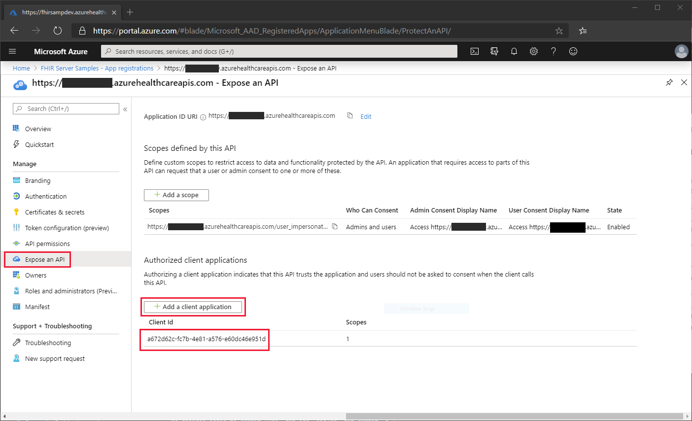

# FHIR Connector Authentication

This article explains authenticated access to FHIR servers using the FHIR Power Query Connector. The connector supports anonymous access to publicly accessible FHIR server and authenticated access to FHIR servers using Azure Active Directory authentication. The [Azure API for FHIR](https://docs.microsoft.com/azure/healthcare-apis) is secured with Azure Active Directory.

## Anonymous Access

There are a number of [publicly accessible FHIR servers for testing](https://wiki.hl7.org/index.php?title=Publicly_Available_FHIR_Servers_for_testing). To enable testing with these public servers, the FHIR Power Query connector supports the "Anonymous" authentication scheme. For example to access the public https://vonk.fire.ly server:

1. Enter the URL of the public Vonk server:

    

1. Select "Anonymous" authentication scheme:

    

After that follow the [query and shape your data](FHIR.md)

## Azure Active Directory (Organizational) Authentication

The FHIR Power Query connector supports OAuth authentication for FHIR servers that are secured with [Azure Active Directory](https://azure.microsoft.com/services/active-directory/). 

To use Azure Active Directory authentication, select "Organizational account" when connecting:

There are some restrictions to be aware of:

1. The expected Audience for the FHIR server **must** be equal to the base URL of the FHIR server. For the [Azure API for FHIR](https://docs.microsoft.com/azure/healthcare-apis/), you can set this when you [provision the FHIR service](https://docs.microsoft.com/azure/healthcare-apis/fhir-paas-portal-quickstart#additional-settings) or later in the portal.

1. If your FHIR server does not return a `WWW-Authenticate` challenge header with an `authorization_uri` field on failed authorization, you must use an organizational account to sign in. You cannot use a guest account in your active directory tenant. For the Azure API for FHIR, you **must** use an Azure Active Directory organizational account.

1. If your FHIR service is not the Azure API for FHIR, e.g., if you are running the [open source Microsoft FHIR server for Azure](https://github.com/Microsoft/fhir-server) you will have registered an [Azure Active Directory resource application](https://docs.microsoft.com/azure/healthcare-apis/register-resource-azure-ad-client-app) for the FHIR server. You must pre-authorize the Power BI client application to be able to access this resource application:

    

    The client id for the Power BI client `a672d62c-fc7b-4e81-a576-e60dc46e951d`

1. The Power Query (e.g. Power BI) client will only request a single scope: `user_impersonation`.

## Next Steps

In this article, you have learned how to use the FHIR Power Query connector authentication features. Next explore query folding.

>[!div class="nextstepaction"]
>[FHIR Power Query folding](FHIR-QueryFoldingOverview.md)