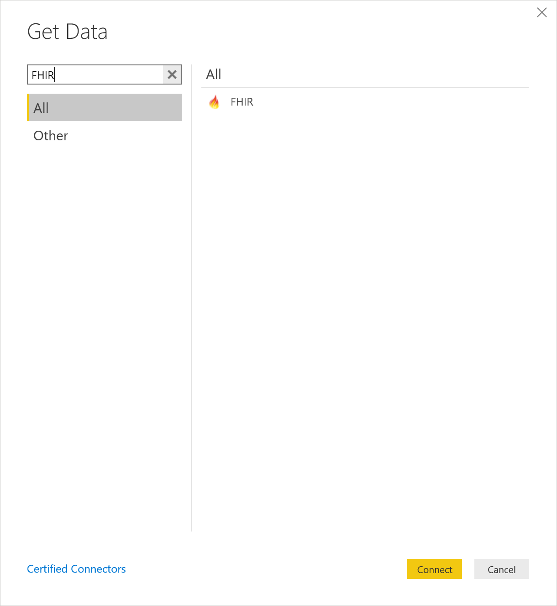
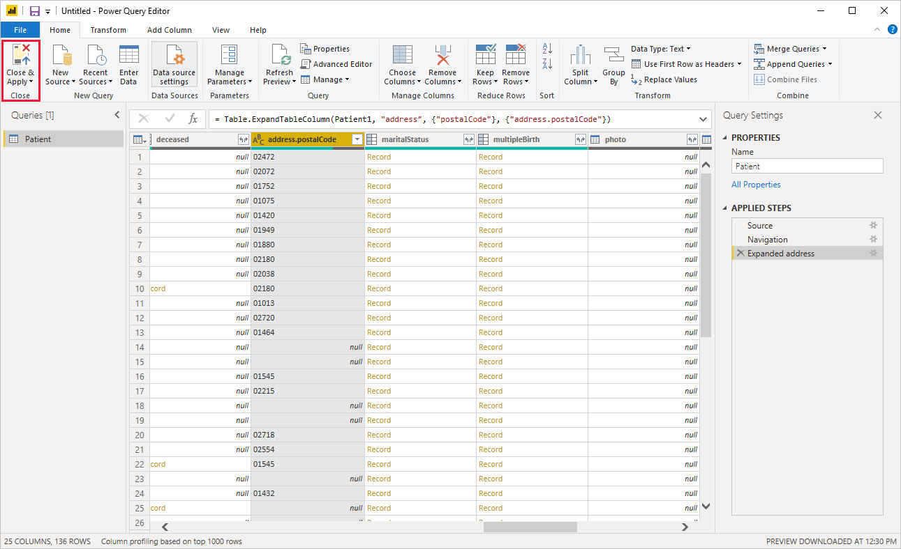

# FHIR

## Summary

Fast Healthcare Interoperability Resources ([FHIR&reg;](https://hl7.org/fhir)) is a new standard for healthcare data interoperability. Healthcare data is represented as resources such as `Patient`, `Observation`, `Encounter`, and son on, and a REST API is used for querying healthcare data served by a FHIR server. The FHIR Power Query connector can be used to import and shape data from a FHIR server.

If you don't have a FHIR server, you can provision the [Azure API for FHIR](https://docs.microsoft.com/azure/healthcare-apis/).

Release State: General Availability

Products: Power BI Desktop, Power BI Service

Authentication Types Supported: Anonymous, Azure Active Directory

## Capabilities Supported

* Import

## Connect to FHIR server

To make a connection to a FHIR server, take the following steps:

1. Select the **Get Data** button.

    

1. Select **More...**.

    

1. Search for "FHIR".

    

    Select the FHIR connector and select **Connect**.

1. Enter the URL for your FHIR server.

    

    You can optionally enter an initial query for the FHIR server, if you know exactly what data you're looking for.

    Select **OK** to proceed.

1. Decide on your authentication scheme.

    

    The connector supports "Anonymous" for FHIR servers with no access controls (for example, public test servers like http://test.fhir.org/r4) or Azure Active Directory authentication. See [FHIR connector authentication](FHIR-Authentication.md) for details.

1. Select the resources you're interested in.

    

    Select **Transform** to shape the data.

1. Shape the data as needed, for example, expand the postal code.

    

1. Save the query when shaping is complete.

    

1. Create dashboards with data, for example, make a plot of the patient locations based on postal code.

    

## Next Steps

In this article, you've learned how to use the FHIR Power Query connector to access FHIR data from Power BI. Next explore the authentication features of the FHIR Power Query connector.

>[!div class="nextstepaction"]
>[FHIR connector authentication](FHIR-Authentication.md)

> FHIR&reg; and the FHIR Flame icon are the registered trademarks of HL7 and are used with the permission of HL7. Use of the FHIR trademark does not constitute endorsement of this product by HL7.
