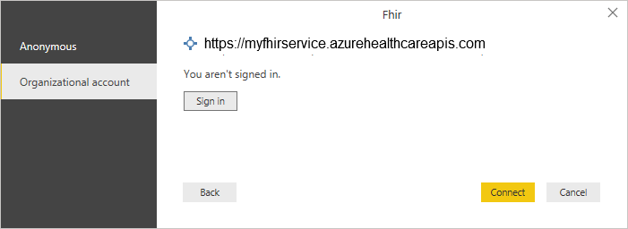
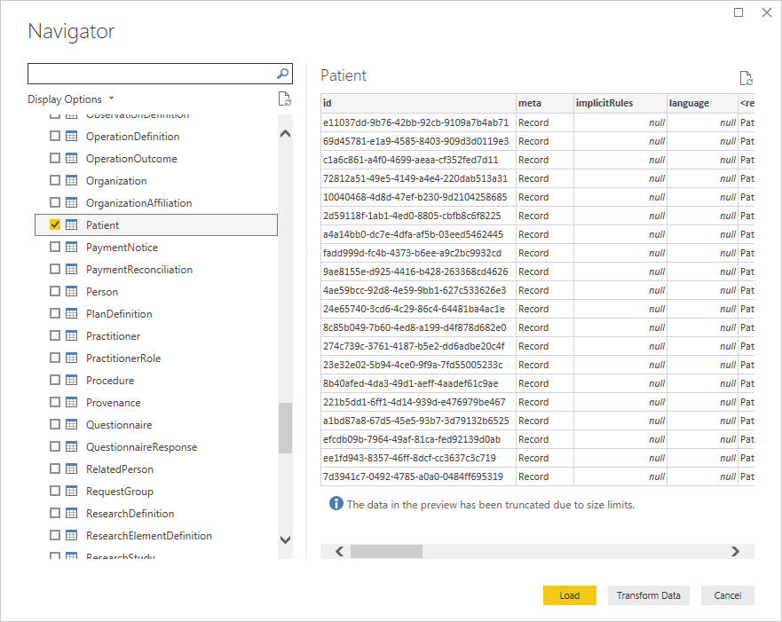
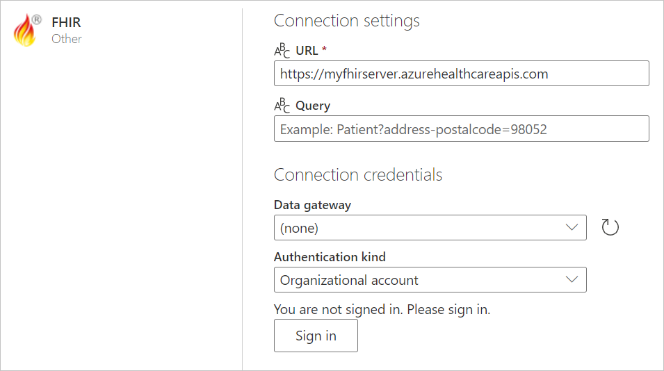
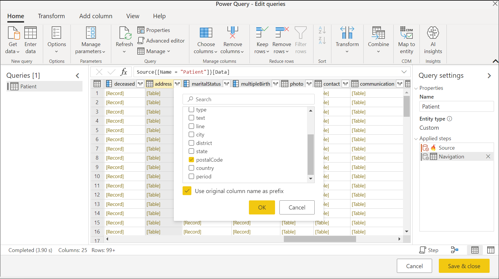
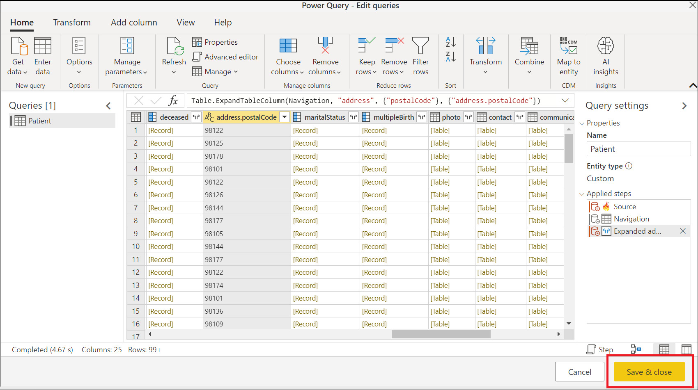

# FHIR

Fast Healthcare Interoperability Resources ([FHIR&reg;](https://hl7.org/fhir)) is a new standard for healthcare data interoperability. Healthcare data is represented as resources such as `Patient`, `Observation`, `Encounter`, and so on, and a REST API is used for querying healthcare data served by a FHIR server. The Power Query connector for FHIR can be used to import and shape data from a FHIR server.

If you don't have a FHIR server, you can provision the [Azure API for FHIR](/azure/healthcare-apis/).

## Summary

| Item | Description |
| ---- | ----------- |
| Release State | General Availability |
| Products | Power BI (Datasets) Power BI (Dataflows) Power Apps (Dataflows) Dynamics 365 Customer Insights |
| Authentication Types Supported | Anonymous Azure Active Directory |
| | |

>[!Note]
> Some capabilities may be present in one product but not others due to deployment schedules and host-specific capabilities.

## Capabilities Supported

* Import

## Prerequisites

You must have FHIR Reader role on the FHIR server to read data from the server.

## Connect to a FHIR server from Power Query Desktop

To make a connection to a FHIR server, take the following steps:

1. Select the **Get Data** button.

    

2. Select **Other** > **FHIR**, and then select **Connect**.

    

3. Enter the URL for your FHIR server.

    

    You can optionally enter an initial query for the FHIR server, if you know exactly what data you're looking for.

    Select **OK** to proceed.

4. Decide on your authentication scheme.

    

    The connector supports "Anonymous" for FHIR servers with no access controls (for example, public test servers (like http://test.fhir.org/r4) or Azure Active Directory authentication. You must have FHIR Reader role on the FHIR server to read data from the server. Go to [FHIR connector authentication](FHIR-Authentication.md) for details.

5. Select the resources you're interested in.

    

    Select **Transform Data** to shape the data.

6. Shape the data as needed, for example, expand the postal code.

    

7. Save the query when shaping is complete.

    

8. Create dashboards with data, for example, make a plot of the patient locations based on postal code.

    

## Connect to a FHIR server from Power Query Online

To make a connection to a FHIR server, take the following steps:

1. In **Power Query - Choose data source**, select the **Other** category, and then select **FHIR**.

   

2. In the **FHIR** dialog, enter the URL for your FHIR server.  

   

    You can optionally enter an initial query for the FHIR server, if you know exactly what data you're looking for.

3. If necessary, include the name of your on-premises data gateway.

4. Select the **Organizational account** authentication kind, and select **Sign in**. Enter your credentials when asked. You must have FHIR Reader role on the FHIR server to read data from the server.

5. Select **Next** to proceed.

6. Select the resources you're interested in.

   

   Select **Transform data** to shape the data.

7. Shape the data as needed, for example, expand the postal code.

   

8. Save the query when shaping is complete.

   

   >[!Note]
   > In some cases, query folding can't be obtained purely through data shaping with the graphical user interface (GUI), as shown in the previous image. To learn more about query folding when using the FHIR connector, see [FHIR query folding](./FHIR-QueryFolding.md).

## Next Steps

In this article, you've learned how to use the Power Query connector for FHIR to access FHIR data. Next explore the authentication features of the Power Query connector for FHIR.

>[!div class="nextstepaction"]
>[FHIR connector authentication](FHIR-Authentication.md)

> FHIR&reg; and the FHIR Flame icon are the registered trademarks of HL7 and are used with the permission of HL7. Use of the FHIR trademark does not constitute endorsement of this product by HL7.
