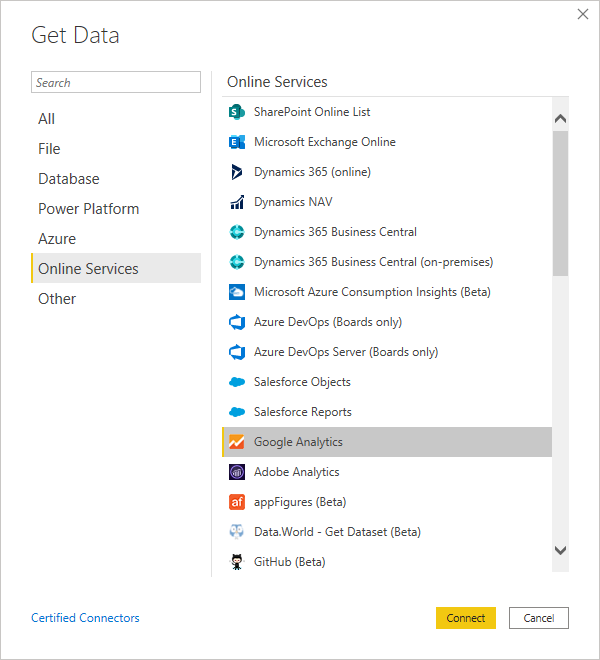
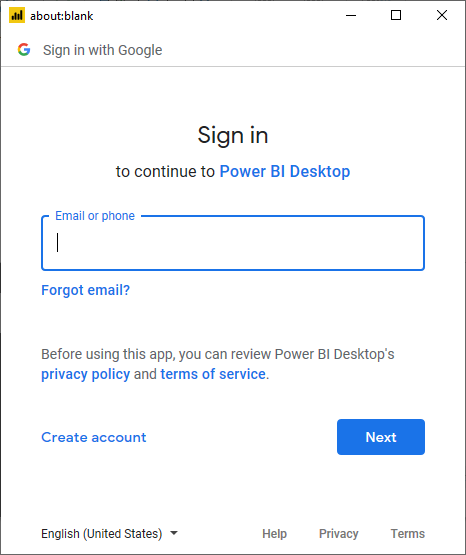
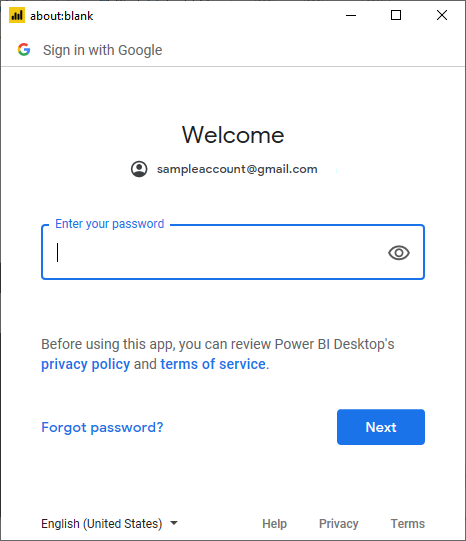
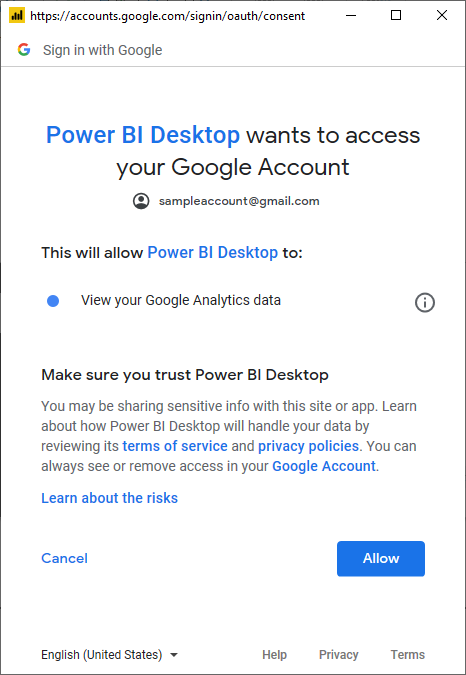
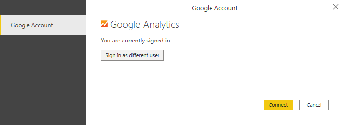

# Google Analytics
 
## Summary
 
Release State: General Availability

Products: Power BI Desktop

Authentication Types Supported: Google Account

Function Reference Documentation: [GoogleAnalytics.Accounts](https://docs.microsoft.com/powerquery-m/googleanalytics-accounts)

## Prerequisites
Before you can sign in to Google Analytics, you must have an Google Analytics account (username/password).

 
## Capabilities Supported
* Import

## Connect to Google Analytics data

To connect to Google Analytics data:

1. Select **Get Data** from the **Home** ribbon in Power BI Desktop. Select **Online Services** from the categories on the left, select **Google Analytics**, and then select **Connect**.

   

2. If this is the first time you're getting data through the Google Analytics connector, a third party notice will be displayed. Select **Don't warn me again with this connector** if you don't want this message to be displayed again, and then select **Continue**.

3. To sign in to your Google Analytics account, select **Sign in**.

   

4. In the **Sign in with Google** window that appears, provide your credentials to sign in to your Google Analytics account. You can either supply an email address or phone number. Then select **Next**.

   

5. Enter your Google Analytics password and select **Next**.

   

6. When asked if you want Power BI Desktop to access your Google account, select **Allow**.

   

6. Once you have successfully signed in, select **Connect**.

   

Once the connection is established, you’ll see a list of the accounts you have access to. Drill through the account, properties, and views to see a selection of values, categorized in display folders.

You can **Load** the selected table, which brings the entire table into Power BI Desktop, or you can select **Transform Data** to edit the query, which opens Power Query Editor. You can then filter and refine the set of data you want to use, and then load that refined set of data into Power BI Desktop.

## Limitations and issues

You should be aware of the following limitations and issues associated with accessing Adobe Analytics data.

### Google Ananlytics quota limits for Power BI

The standard limitations and quotas for Google Analytics AP requests is documented in [Limits and Quotas on API Requests](https://developers.google.com/analytics/devguides/config/mgmt/v3/limits-quotas). However, Power Query Desktop and Power Query Service allow you to use the following enhanced number of queries. 

Power BI Desktop:
* Queries per day&mdash;250,000
* Queries per 100 seconds&mdash;2,000

Power BI Service:
* Queries per day&mdash;1,500,000
* Queries per 100 seconds&mdash;4,000

## Troubleshooting

### Fixing time-slice errors

[Query Diagnostics](././RecordingQueryDiagnostics.md#diagnose-step)

## Next steps

* [Google Analytics Dimensions & Metrics Explorer](https://ga-dev-tools.appspot.com/dimensions-metrics-explorer/)
* [Google Analytics Core Reporting API](https://developers.google.com/analytics/devguides/reporting/core/v3/)

 
