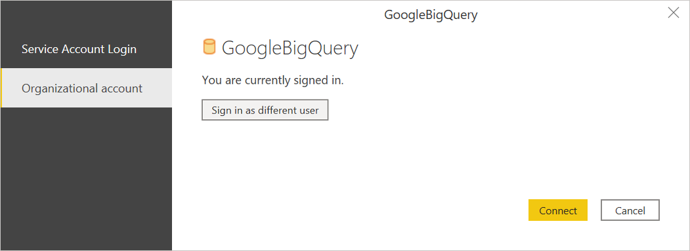
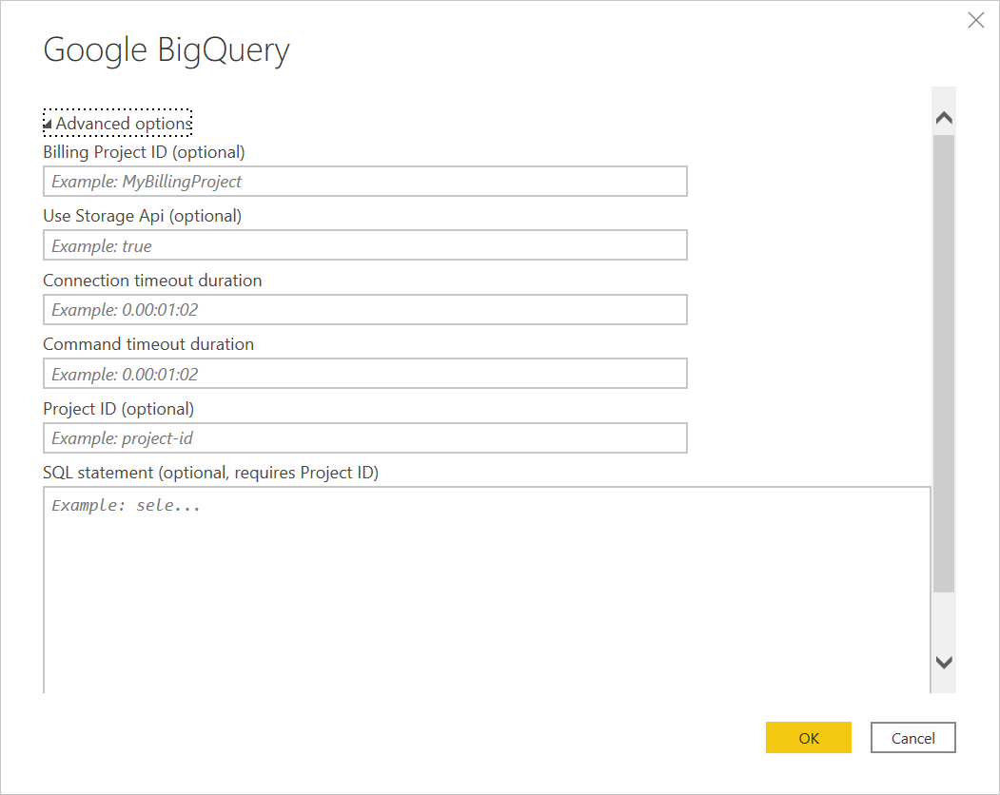
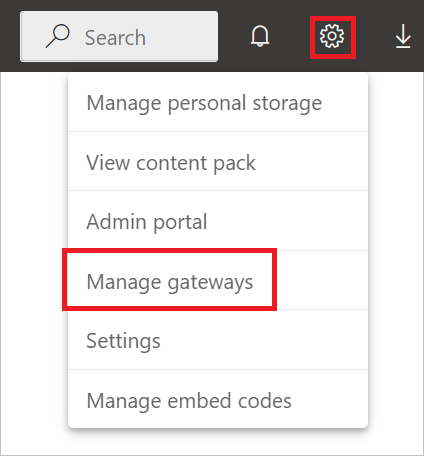
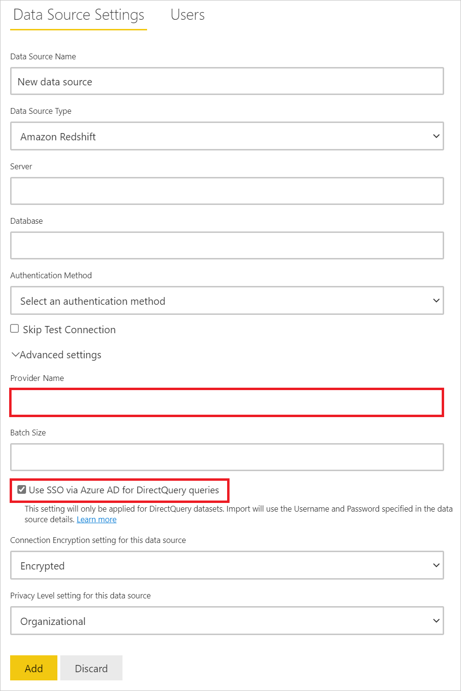

# Google BigQuery

## Summary

| Item | Description |
| ---- | ----------- |
| Release State | General Availability |
| Products | Power BI (Datasets) Power BI (Dataflows) Power Apps (Dataflows) Customer Insights (Dataflows) |
| Authentication Types Supported | Organizational account Service account |

>[!Note]
>Some capabilities may be present in one product but not others due to deployment schedules and host-specific capabilities.

> [!NOTE]
> Effective July 2021, Google will discontinue support for sign-ins to Google accounts from embedded browser frameworks. Due to this change, you will need to [update](https://powerbi.microsoft.com/downloads/) your Power BI Desktop version to June 2021 to support signing in to Google.

## Prerequisites

You'll need a Google account or a Google service account to sign in to Google BigQuery.

## Capabilities supported

* Import
* DirectQuery (Power BI Datasets only)

## Connect to Google BigQuery data from Power Query Desktop

To connect to Google BigQuery from Power Query Desktop, take the following steps:

1. In the Get Data experience, search for and select **Google BigQuery**.

    

2. If you want to use any advance options, select **Advanced options**. Otherwise, select **OK** to continue. More information: [Connect using advanced options](#connect-using-advanced-options)

    

3. The Google BigQuery connector supports connecting through an organizational account or a service account sign-in. In this example, you'll use the organizational account to sign in. Select **Sign In** to continue.

    

    You can also sign in using a Google service account. In this case, select **Service Account Login** and enter your service account email and your service account JSON key file contents. Then select **Connect**.

4. A **Sign in with Google** dialog appears. Select your Google account and approve connecting to Power BI Desktop.

    

5. Once signed in, select **Connect** to continue.

    

6. Once you successfully connect, a **Navigator** window appears and displays the data available on the server. Select your data in the navigator. Then select either **Transform Data** to transform the data in Power Query or **Load** to load the data in Power BI Desktop.

    

## Connect to Google BigQuery data from Power Query Online

To connect to Google BigQuery from Power Query Online, take the following steps:

1. In the Get Data experience, select the **Database** category, and then select **Google BigQuery**.

    

2. In the **Google BigQuery Database** dialog, you may need to either create a new connection or select an existing connection. If you're using on-premises data, select an on-premises data gateway. Then select **Sign in**.

    

3. A **Sign in with Google** dialog appears. Select your Google account and approve connecting.
    >[!NOTE]
    >Although the sign in dialog box says you'll continue to Power BI Desktop once you've signed in, you'll be sent to your online app instead.

    

4. If you want to use any advance options, select **Advanced options**. More information: [Connect using advanced options](#connect-using-advanced-options)

5. Once signed in, select **Next** to continue.

    

6. Once you successfully connect, a **Navigator** window appears and displays the data available on the server. Select your data in the navigator. Then select **Next** to transform the data in Power Query.

    

## Connect using advanced options

Both Power Query Desktop and Power Query Online provide a set of advanced options that you can add to your query if needed.

The following table lists all of the advanced options you can set in Power Query Desktop and Power Query Online.

| Advanced option | Description |
| --------------- | ----------- |
| Billing Project ID | A project against which Power Query will run queries. Permissions and billing are tied to this project. |
| Use Storage Api | A flag that enables using the [Storage API of Google BigQuery](https://cloud.google.com/bigquery/docs/reference/storage). This option is true by default. This option can be set to false to not use the Storage API and use REST APIs instead. |
| Connection timeout duration | The standard connection setting (in seconds) that controls how long Power Query waits for a connection to complete. You can change this value if your connection doesn't complete before 15 seconds (the default value.) |
| Command timeout duration | How long Power Query waits for a query to complete and return results. The default depends on the driver default. You can enter another value in minutes to keep the connection open longer. |
| Project ID | The project that you want to run native queries on. This option is only available in Power Query Desktop. |
| SQL statement | For information, go to [Import data from a database using native database query](../native-database-query.md). In this version of native database query functionality, you need to use fully qualified table names in the format `Database.Schema.Table`, for example `SELECT * FROM DEMO_DB.PUBLIC.DEMO_TABLE`. This option is only available in Power Query Desktop. |

Once you've selected the advanced options you require, select **OK** in Power Query Desktop or **Next** in Power Query Online to connect to your Google BigQuery data.

## Limitations and considerations

This section describes any limitations or considerations of the Google BigQuery connector.

### Connecting to Google BigQuery in Power BI Desktop

There are a few limits and considerations to keep in mind when using the Google BigQuery connector with Power BI.

#### Connector availability

The Google BigQuery connector is available in Power BI Desktop and in the Power BI service. In the Power BI service, the connector can be accessed using the Cloud-to-Cloud connection from Power BI to Google BigQuery.

#### "Access Denied" error

When you try to connect to Google BigQuery from Power BI Desktop, you might get the following error message:

`Datasource.Error: ODBC: ERROR [HY000][Microsoft][BigQuery] (100) Error interacting with REST API: Access Denied: Project <project name>: The user <user name> bigquery.jobs.create permissions in project <project name>.`

In this case, you might need to enter a Billing Project ID in the **Billing Project** advanced option in the Power Query **Connection settings**.

In addition, if you also create a report in Power BI service using a gateway, you might still get this error. In this case, you must manually include the Billing Project ID in the M code for the connection using the Power Query editor or the Power Query formula bar. For example:

`Source = GoogleBigQuery.Database([BillingProject="Include-Billing-Project-Id-Here"])`

### Nested fields

To optimize performance considerations, Google BigQuery does well with large datasets when denormalized, flattened, and nested.

The Google BigQuery connector supports nested fields, which are loaded as text columns in JSON format.

Users should select **Transform Data** and then use the JSON parsing capabilities in the Power Query Editor to extract the data.

1. Under the **Transforms** ribbon tab, the **Text Column** category, select **Parse** and then **JSON**.
2. Extract the JSON record fields using the **Expand Column** option.

### Setting up a Google service account

For more information on setting up or using Google service accounts, go to [Creating and managing service account keys](https://cloud.google.com/iam/docs/creating-managing-service-account-keys) in the Google docs.

### Authenticating through a Google service account

When you authenticate through a Google service account in Power BI Desktop, there's a specific credential format that's required by the connector.

* Service Account Email: must be in email format
* Service Account JSON key file contents: once this JSON key is downloaded, all new lines must be removed from the file so that the contents are in one line. Once the JSON file is in that format, the contents can be pasted into this field.

When you authenticate through a Google service account in Power BI service or Power Query Online, users need to use "Basic" authentication. The **Username** field maps to the **Service Account Email** field above, and the **Password** field maps to the **Service Account JSON key file contents** field above. The format requirements for each credential remain the same in both Power BI Desktop, Power BI service, and Power Query Online.

### Unable to authenticate with Google BigQuery Storage API

The Google BigQuery connector uses [Google BigQuery Storage API](https://cloud.google.com/bigquery/docs/reference/storage) by default. This feature is controlled by the advanced option called [UseStorageApi](#connect-using-advanced-options). You might encounter issues with this feature if you use granular permissions. In this scenario, you might see the following error message or fail to get any data from your query:

`ERROR [HY000] [Microsoft][BigQuery] (131) Unable to authenticate with Google BigQuery Storage API. Check your account permissions`

You can resolve this issue by adjusting the user permissions for the BigQuery Storage API correctly. These storage API permissions are required to access data correctly with BigQueryStorage API:

* `bigquery.readsessions.create`: Creates a new read session via the BigQuery Storage API.
* `bigquery.readsessions.getData`: Reads data from a read session via the BigQuery Storage API.
* `bigquery.readsessions.update`: Updates a read session via the BigQuery Storage API.

These permissions typically are provided in the `BigQuery.User` role. More information, [Google BigQuery Predefined roles and permissions](https://cloud.google.com/bigquery/docs/access-control)

If the above steps don't resolve the problem, you can disable the BigQuery Storage API.

## Enable Azure AD Single Sign-On (SSO) for Google BigQuery

We support Azure AD SSO through both Power BI Service (cloud) and also through the on-premises data gateway. For more information about enabling Azure AD SSO for all connectors, go to [Overview of single sign-on (SSO) for on-premises data gateways in Power BI](/power-bi/connect-data/service-gateway-sso-overview).

### Azure AD Single Sign-On (SSO) through Power BI service

To configure a new connection in Power BI service:

1. In Power BI service, select **Admin portal** from the settings list.

   

2. Enable the **Google BigQuery SSO** option.

   

### Azure AD Single Sign-On (SSO) for Google BigQuery with an on-premises data gateway

Before you can enable Azure AD SSO for Google BigQuery, you must first enable Azure AD SSO for all data sources that support Azure AD SSO with an on-premises data gateway, and ensure you have upgraded to at least the December 2022 release of the on-premises data gateway:

1. In Power BI service, select **Admin portal** from the settings list.

   

2. Under **Tenant settings**, enable **Azure AD Single-Sign On (SSO) for Gateway**.

Once you've enabled Azure AD SSO for all data sources, then enable Azure AD SSO for Google BigQuery:

1. Enable the **Google BigQuery SSO** option.

2. Select **Manage gateways** from the settings list.

   

3. Select a gateway, and then select **Choose Data Source**.

4. Under the **Data Source Settings** tab, enter a value in **Billing Project ID**. The **Billing Project ID** parameter is required when using Azure AD and needs to be specified in **Advanced settings**.

   Also select **Use SSO via Azure AD for DirectQuery queries**.

   
