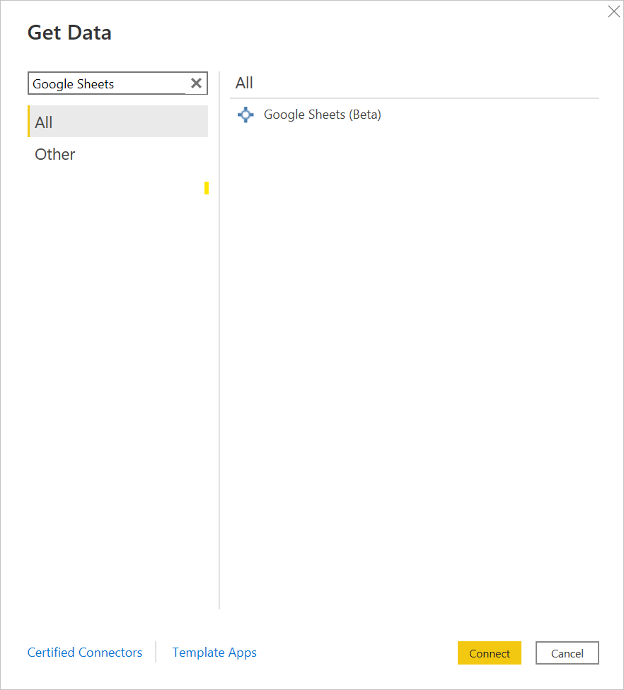
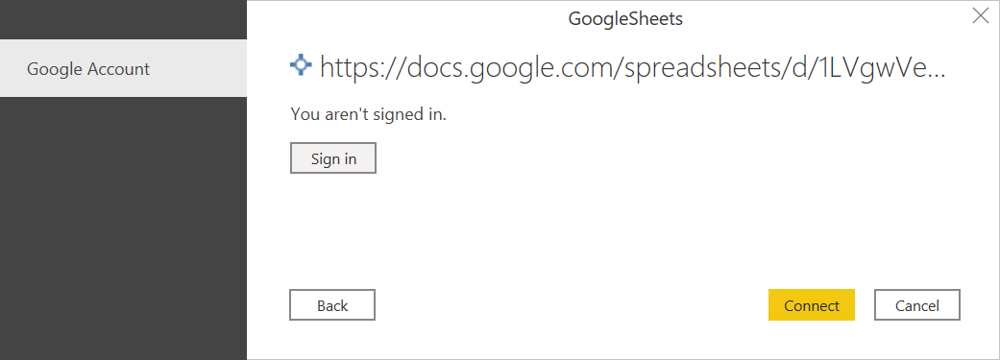
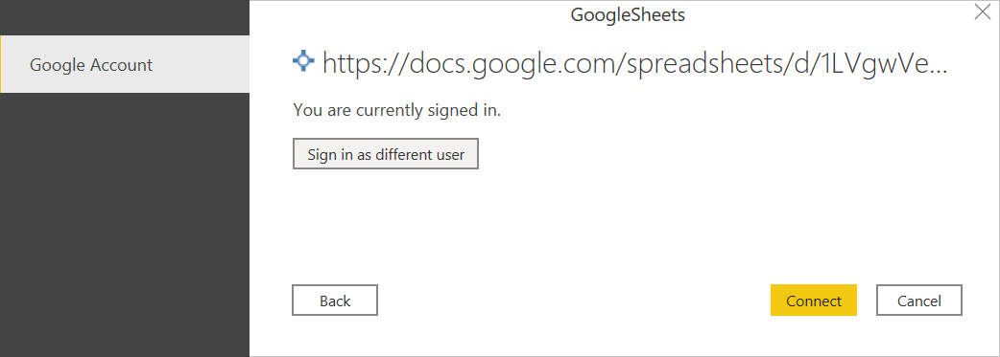

# Google Sheets (Beta)

## Summary

| Item | Description |
| ---- | ----------- |
| Release State | Beta |
| Products | Power BI (Datasets) Power BI (Dataflows) |
| Authentication Types Supported | Organizational account |
| Function Reference Documentation | &mdash; |

## Prerequisites

Before you can use the Google Sheets connector, you must have a Google account and have access to the Google Sheet you're trying to connect to.

## Capabilities Supported

* Import

## Connect to Google Sheets data from Power Query Desktop

To connect to Google Sheets from Power Query Desktop, take the following steps:

1. In the Get Data experience, search for and select **Google Sheets**.

    

2. You'll be prompted for a Google Sheets URL. Copy and paste the URL from your browser address bar into the input prompt.

3. The Google Sheets connector supports connecting through an organizational (Google) account. Select **Sign In** to continue.

    

4. A **Sign in with Google** dialog appears in an external browser window. Select your Google account and approve connecting to Power BI Desktop.

    

5. Once signed in, select **Connect** to continue.

    

6. Once you successfully connect, a **Navigator** window appears and displays the data available on the server. Select your data in the navigator. Then select either **Transform Data** to transform the data in Power Query or **Load** to load the data in Power BI Desktop.

## Limitations and considerations

This section describes any limitations or considerations of the Google Sheets connector.

### Power Query Online

This connector isn't yet available in Power Query Online and dataflows experiences.

### Shared drive support

This connector does support connecting to shared drives.

### Multiple connections

This connector uses a different ResourcePath for every Google Sheet URL. You'll need to authenticate to every new resource path and URL, but you might not need to sign into Google multiple times if the previous sessions remain active.

### Understanding URL parsing

The connector first checks for the signature of the URL, ensuring it starts with `https://docs.google.com/spreadsheets/d/`. The connector then parses the Google Spreadsheet ID from the URL to include in the Google Sheets API call. The rest of the URL isn't used. Each Google Sheet connection is tied to the submitted URL, which will act as the ResourcePath.
