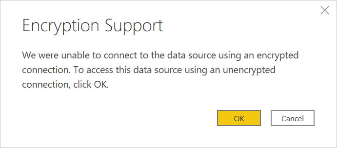
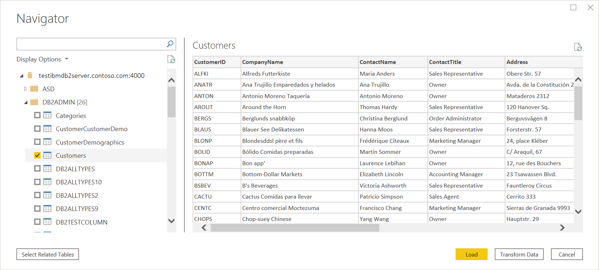
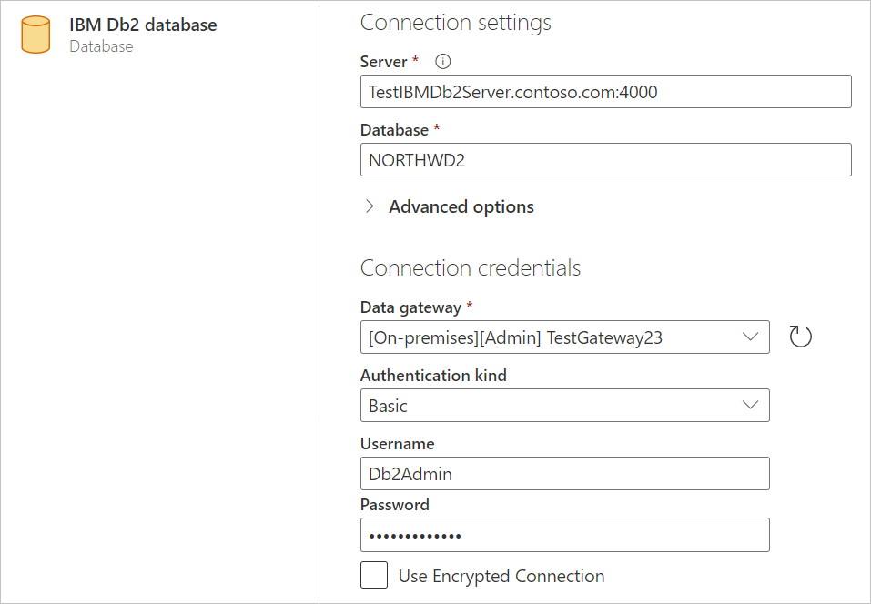
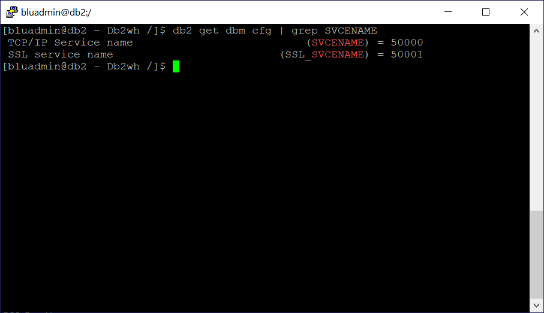
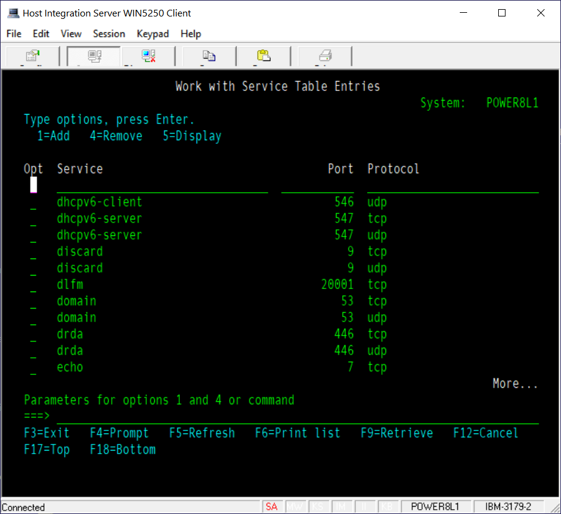
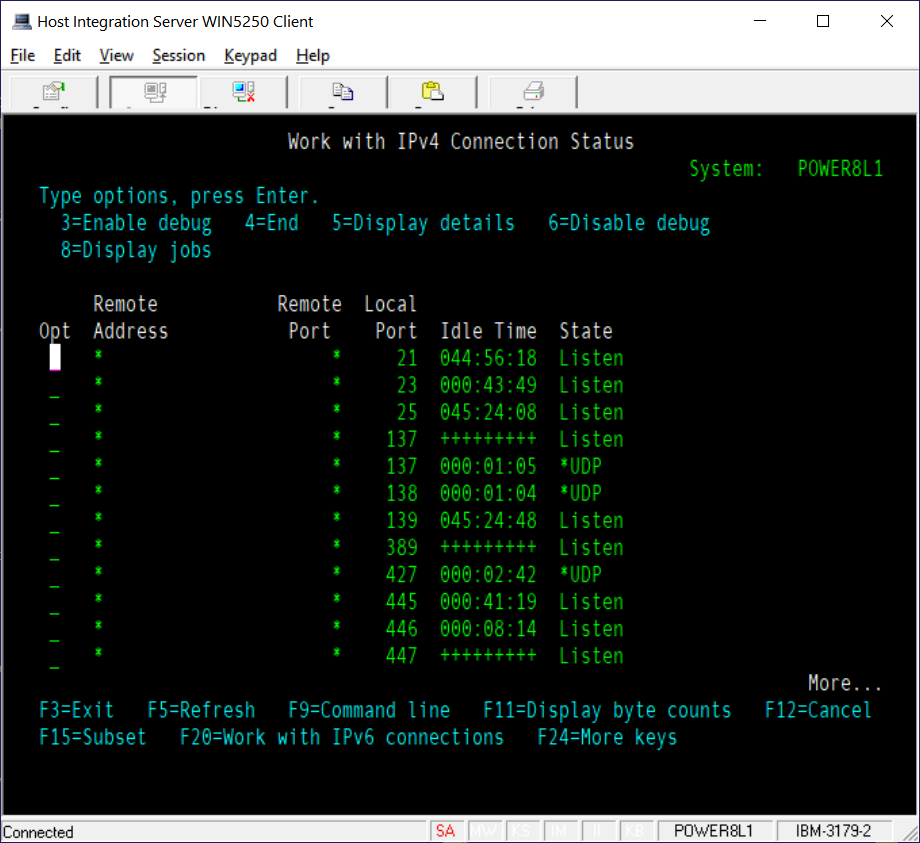

# IBM Db2 database

## Summary

| Item | Description |
| ---- | ----------- |
| Release State | General Availability |
| Products | Power BI (Datasets) Power BI (Dataflows) Power Apps (Dataflows) Excel Dynamics 365 Customer Insights |
| Authentication Types Supported | Basic Database Windows |
| Function Reference Documentation | [DB2.Database](/powerquery-m/db2-database) |
| | |

>[!Note]
> Some capabilities may be present in one product but not others due to deployment schedules and host-specific capabilities.

## Prerequisites

By default, the IBM Db2 database connector uses the Microsoft driver to connect to your data. If you choose to use the IBM driver in the advanced options in Power Query Desktop, you must first install the IBM Db2 driver for .NET on the machine used to connect to the data. The name of this driver changes from time to time, so be sure to install the IBM Db2 driver that works with .NET. For instructions on how to download, install, and configure the IBM Db2 driver for .NET, go to [Download initial Version 11.5 clients and drivers](https://www.ibm.com/support/pages/download-initial-version-115-clients-and-drivers). More information: [Driver limitations](#driver-limitations), [Ensure the IBM Db2 driver is installed](#ensure-the-ibm-db2-driver-is-installed)

## Capabilities Supported

* Import
* DirectQuery (Power BI Desktop only)
* Advanced options
  * Driver (IBM or Microsoft)
  * Command timeout in minutes
  * Package collection
  * SQL statement
  * Include relationship columns
  * Navigate using full hierarchy

## Connect to an IBM Db2 database from Power Query Desktop

To make the connection, take the following steps:

1. Select the **IBM Db2 database** option from **Get Data**.

2. Specify the IBM Db2 server to connect to in **Server**. If a port is required, specify it by using the format *ServerName:Port*, where *Port* is the port number. Also, enter the IBM Db2 database you want to access in **Database**. In this example, the server name and port are `TestIBMDb2server.contoso.com:4000` and the IBM Db2 database being accessed is `NORTHWD2`.

   

3. If you're connecting from Power BI Desktop, select either the **Import** or **DirectQuery** data connectivity mode. The rest of these example steps use the Import data connectivity mode. To learn more about DirectQuery, go to [Use DirectQuery in Power BI Desktop](/power-bi/connect-data/desktop-use-directquery).

   >[!Note]
   > By default, the IBM Db2 database dialog box uses the Microsoft driver during sign in. If you want to use the IBM driver, open **Advanced options** and select **IBM**. More information: [Connect using advanced options](#connect-using-advanced-options)
   >
   > If you select **DirectQuery** as your data connectivity mode, the **SQL statement** in the advanced options will be disabled. DirectQuery currently does not support query push down on top of a native database query for the IBM Db2 connector.

4. Select **OK**.

5. If this is the first time you're connecting to this IBM Db2 database, select the authentication type you want to use, enter your credentials, and then select **Connect**. For more information about authentication, go to [Authentication with a data source](../connectorauthentication.md).

   

   By default, Power Query attempts to connect to the IBM Db2 database using an encrypted connection. If Power Query can't connect using an encrypted connection, an "unable to connect" dialog box will appear. To connect using an unencrypted connection, select **OK**.

   

6. In **Navigator**, select the data you require, then either select **Load** to load the data or **Transform Data** to transform the data.

   

## Connect to an IBM Db2 database from Power Query Online

To make the connection, take the following steps:

1. Select the **IBM Db2 database** option in the **Power Query - Connect to data source** page.

2. Specify the IBM Db2 server to connect to in **Server**. If a port is required, specify it by using the format *ServerName:Port*, where *Port* is the port number. Also, enter the IBM Db2 database you want to access in **Database**. In this example, the server name and port are `TestIBMDb2server.contoso.com:4000` and the IBM Db2 database being accessed is `NORTHWD2`

3. Select the name of your on-premises data gateway.

   >[!Note]
   > You must select an on-premises data gateway for this connector, whether the IBM Db2 database is on your local network or online.

4. If this is the first time you're connecting to this IBM Db2 database, select the type of credentials for the connection in **Authentication kind**. Choose **Basic** if you plan to use an account that's created in the IBM Db2 database instead of Windows authentication.

5. Enter your credentials.

6. Select **Use Encrypted Connection** if you want to use an encrypted connection, or clear the option if you want to use an unencrypted connection.

   

7. Select **Next** to continue.

8. In **Navigator**, select the data you require, then select **Transform data** to transform the data in Power Query Editor.

   

## Connect using advanced options

Power Query provides a set of advanced options that you can add to your query if needed.

The following table lists all of the advanced options you can set in Power Query.

| Advanced option | Description |
| --------------- | ----------- |
| Driver | Determines which driver is used to connect to your IBM Db2 database. The choices are IBM and Windows (default). If you select the IBM driver, you must first ensure that the IBM Db2 driver for .NET is installed on your machine. This option is only available in Power Query Desktop. More information: [Ensure the IBM Db2 driver is installed](#ensure-the-ibm-db2-driver-is-installed) |
| Command timeout in minutes | If your connection lasts longer than 10 minutes (the default timeout), you can enter another value in minutes to keep the connection open longer. |
| Package collection | Specifies where to look for packages. Packages are control structures used by Db2 when processing an SQL statement, and will be automatically created if necessary. By default, this option uses the value `NULLID`. Only available when using the Microsoft driver. More information: [DB2 packages: Concepts, examples, and common problems](https://web.archive.org/web/20200808072933/https:/www.ibm.com/developerworks/data/library/techarticle/dm-0606chun/index.html) |
| SQL statement | For information, go to [Import data from a database using native database query](../native-database-query.md). |
| Include relationship columns | If checked, includes columns that might have relationships to other tables. If this box is cleared, you won’t see those columns. |
| Navigate using full hierarchy | If checked, the navigator displays the complete hierarchy of tables in the database you're connecting to. If cleared, the navigator displays only the tables whose columns and rows contain data. |
| | |

Once you've selected the advanced options you require, select **OK** in Power Query Desktop or **Next** in Power Query Online to connect to your IBM Db2 database.

## Issues and limitations

### Driver limitations

The Microsoft driver is the same one used in Microsoft Host Integration Server, called the "ADO.NET Provider for DB2". The IBM driver is the IBM Db/2 driver that works with .NET. The name of this driver changes from time to time, so be sure it's the one that works with .NET, which is different from the IBM Db2 drivers that work with OLE/DB, ODBC, or JDBC.

You can choose to use either the Microsoft driver (default) or the IBM driver if you're using Power Query Desktop. Currently, Power Query Online only uses the Microsoft driver. Each driver has its limitations.

* Microsoft driver
  * Doesn't support Transport Layer Security (TLS)
* IBM driver
  * The IBM Db2 database connector, when using the IBM Db2 driver for .NET, doesn't work with Mainframe or IBM i systems
  * Doesn't support DirectQuery

Microsoft provides support for the Microsoft driver, but not for the IBM driver. However, if your IT department already has it set up and configured on your machines, your IT department should know how to troubleshoot the IBM driver.

### Native queries not supported in DirectQuery

When you select DirectQuery as the data connectivity mode in Power Query Desktop, the SQL statement text box in the advanced options is disabled. It's disabled because the Power Query IBM Db2 connector doesn’t currently support query push down on top of a native database query.

## Troubleshooting

### Ensure the IBM Db2 driver is installed

If you choose to use the IBM Db2 driver for Power Query Desktop, you first have to download, install, and configure the driver on your machine. To ensure the IBM Db2 driver has been installed:

1. Open Windows PowerShell on your machine.
2. Enter the following command:

   `[System.Data.Common.DbProviderFactories]::GetFactoryClasses() | ogv`

3. In the dialog box that opens, you should see the following name in the **InvariantName** column:

   `IBM.Data.DB2`

If this name is in the **InvariantName** column, the IBM Db2 driver has been installed and configured correctly.

### SQLCODE -805 and SQLCODE -551 error codes

When attempting to connect to an IBM Db2 database, you may sometimes come across the common error SQLCODE -805, which indicates the package isn't found in the `NULLID` or other collection (specified in the Power Query **Package connection** configuration). You may also encounter the common error SQLCODE -551, which indicates you can't create packages because you lack package binding authority.

Typically, SQLCODE -805 is followed by SQLCODE -551, but you'll see only the second exception. In reality, the problem is the same. You lack the authority to bind the package to either `NULLID` or the specified collection.

Typically, most IBM Db2 administrators don't provide bind package authority to end users&mdash;especially in an IBM z/OS (mainframe) or IBM i (AS/400) environment. Db2 on Linux, Unix, or Windows is different in that user accounts have bind privileges by default, which create the MSCS001 (Cursor Stability) package in the user’s own collection (name = user login name).

If you don't have bind package privileges, you'll need to ask your Db2 administrator for package binding authority. With this package binding authority, connect to the database and fetch data, which will auto-create the package. Afterwards, the administrator can revoke the packaging binding authority. Also, afterwards, the administrator can "bind copy" the package to other collections&mdash;to increase concurrency, to better match your internal standards for where packages are bound, and so on.

When connecting to IBM Db2 for z/OS, the Db2 administrator can do the following steps.

1. Grant authority to bind a new package to the user with one of the following commands:
   * GRANT BINDADD ON SYSTEM TO \<_authorization_name_>
   * GRANT PACKADM ON \<_collection_name_> TO \<_authorization_name_>

2. Using Power Query, connect to the IBM Db2 database and retrieve a list of schemas, tables, and views. The Power Query IBM Db2 database connector will auto-create the package NULLID.MSCS001, and then grant execute on the package to public.

3. Revoke authority to bind a new package to the user with one of the following commands:
   * REVOKE BINDADD FROM \<_authorization_name_>
   * REVOKE PACKADM ON \<_collection_name_> FROM \<_authorization_name_>

When connecting to IBM Db2 for Linux, Unix, or Windows, the Db2 administrator can do the following steps.

1. GRANT BINDADD ON DATABASE TO USER \<_authorization_name_>.

2. Using Power Query, connect to the IBM Db2 database and retrieve a list of schemas, tables, and views. The Power Query IBM Db2 connector will auto-create the package NULLID.MSCS001, and then grant execute on the package to public.

3. REVOKE BINDADD ON DATABASE FROM USER \<_authorization_name_>.

4. GRANT EXECUTE ON PACKAGE \<_collection.package_> TO USER \<_authorization_name_>.

When connecting to IBM Db2 for i, the Db2 administrator can do the following steps.

1. WRKOBJ QSYS/CRTSQLPKG. Type "2" to change the object authority.

2. Change authority from *EXCLUDE to PUBLIC or \<_authorization_name_>.

3. Afterwards, change authority back to *EXCLUDE.

### SQLCODE -360 error code

When attempting to connect to the IBM Db2 database, you may come across the following error:

`Microsoft Db2 Client: The host resource could not be found. Check that the Initial Catalog value matches the host resource name. SQLSTATE=HY000 SQLCODE=-360`

This error message indicates that you didn’t put the right value in for the name of the database.

### SQLCODE -1336 error code

`The specified host could not be found.`

Double check the name, and confirm that the host is reachable. For example, use [ping](/windows-server/administration/windows-commands/ping) in a command prompt to attempt to reach the server and ensure the IP address is correct, or use [telnet](/windows-server/administration/windows-commands/telnet) to communicate with the server.

### SQLCODE -1037 error code

`Host is reachable, but is not responding on the specified port.`

The port is specified at the end of the server name, separated by a colon. If omitted, the default value of 50000 is used.

To find the port Db2 is using for Linux, Unix, and Windows, run this command:

`db2 get dbm cfg | findstr SVCENAME`

Look in the output for an entry for SVCENAME (and SSL_SVCENAME for TLS encrypted connections). If this value is a number, that’s the port. Otherwise cross reference the value with the system's "services" table. You can usually find this at /etc/services, or at c:\windows\system32\drivers\etc\services for Windows.

The following screenshot shows the output of this command in Linux/Unix.

The following screenshot shows the output of this command in Windows.

### Determine database name

To determine the database name to use:

1. On IBM i, run `DSPRDBDIRE`.

   

2. One of the entries will have a **Remote Location** of ***LOCAL**. This entry is the one to use.

### Determine port number

The Microsoft driver connects to the database using the Distributed Relational Database Architecture (DRDA) protocol. The default port for DRDA is port 446. Try this value first.

To find for certain what port the DRDA service is running on:

1. Run the IBM i command `WRKSRVTBLE`.

2. Scroll down until your find the entries for DRDA.

   

3. To confirm that the DRDA service is up and listening on that port, run `NETSTAT`.

   

4. Choose either option 3 (for IPv4) or option 6 (for IPv6).

5. Press F14 to see the port numbers instead of names, and scroll until you see the port in question. It should have an entry with a state of “Listen”.

   

## More information

* [HIS - Microsoft OLE DB Provider for DB2](/host-integration-server/db2oledbv/microsoft-ole-db-provider-for-db2)
