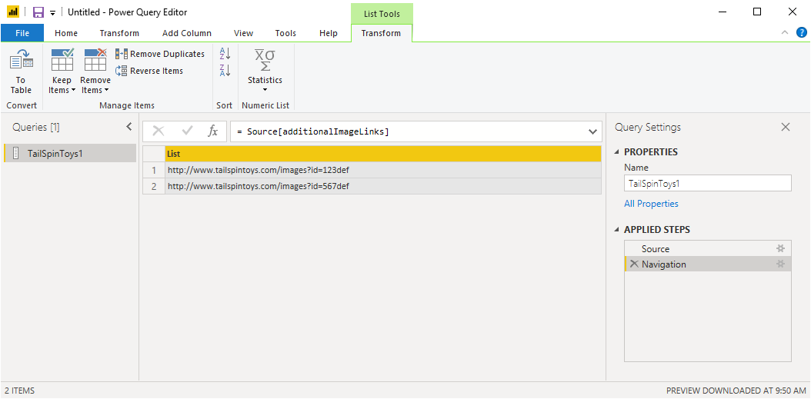
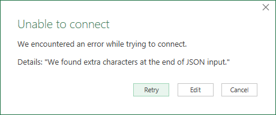

# JSON

## Summary

Release State: General Availability

Products: Power BI Desktop, Power BI Service (Enterprise Gateway), Dataflows in PowerBI.com (Enterprise Gateway), Dataflows in PowerApps.com (Enterprise Gateway), Excel

Authentication Types Supported: Anonymous, Organizational Account, Windows

Function Reference Documentation: [Json.Document](https://docs.microsoft.com/powerquery-m/json-document)

## Capabilities supported

* Import

## Load from JSON File

To load a local JSON file into either Power BI Desktop or Excel, all you need to do is select the **JSON** option in the connector selection. This will launch a local file browser and allow you to select your JSON file.


To load a local JSON file into an online service, such as Power BI service or Power Apps, you'll need to enter the local path to the JSON file, select an on-premises data gateway, and, if authentication is required, enter your credentials.


This will automatically launch the Power Query Editor for you to transform the data if you want, or you can simply close and apply. JSON data is loaded in as a record, with the first column containing the names and the second column containing the values. The values are text, records, or lists. You are presented in the ribbon with the option to turn it into a table, and this may be what you want to do in some cases. This will preserve the initial structure you saw when you loaded it as a record.


If you want to view a specific record or list, you can select the one you want to see. This can be done when you initially load the JSON, or after you convert it to a table. In either case the drill down will return a record or list of additional text, records, or lists.



Finally, if you want to transform your data such that you can easily expand records and lists in a way that keeps existing data in place (multiplying rows) rather than drilling down, you can either use the UI to convert to a table (as in the first option), transpose the table and then promote headers, or you can use the advanced editor.

If you want to use the advanced editor, the function you want to use is `Table.FromRecords`. With the sample data, this is what the application would look like.

```
let
    Source = Json.Document(File.Contents(Path/donuts.json)),
    #"Converted to Table" = Table.FromRecords({Source})
in
    #"Converted to Table"
```

## Load from the web

To load a JSON file from the web, select the [Web connector](web.md), enter the web address of the file, and follow any credential prompts.

## Troubleshooting

If you see the following message, it may be because the file is invalid, for example, it's not really a JSON file, or is malformed. Or you may be trying to load a JSON Lines file.



Select the **Retry** button to retry loading your data in the Power Query Editor. Select the **Edit** button to edit the file path, select the file type, or select a specific language set for the JSON file.