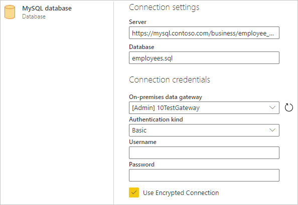

# MySQL database
 
## Summary
 
Release State: General Availability

Products: Power BI Desktop, Power BI Service (Enterprise Gateway), Dataflows in PowerBI.com (Enterprise Gateway), Dataflows in PowerApps.com (Enterprise Gateway), Excel

Authentication Types Supported: Windows (Power BI Desktop, Excel, online service with gateway), Database (Power BI Desktop, Excel), Basic (online service with gateway)

Function Reference Documentation: [MySQL.Database](https://docs.microsoft.com/powerquery-m/mysql-database)

>[!Note]
> Some capabilities may be present in one product but not others due to deployment schedules and host-specific capabilities.
 
## Prerequisites

By default, Power BI installs an OLE DB driver for MySQL database. However, for optimal performance, we recommend that the customer installs the [SQL Server Native Client](https://docs.microsoft.com/sql/relational-databases/native-client/applications/installing-sql-server-native-client?view=sql-server-ver15) before using the MySQL database connector. SQL Server Native Client 11.0 and SQL Server Native Client 10.0 are both supported in the latest version.

 
## Capabilities Supported
* Import
* Advanced options
    * Command timeout in minutes
    * Native SQL statement
    * Relationship columns
    * Navigate using full hierarchy
    
## Connect to MySQL database

To make the connection, take the following steps:
 
1. Select the **MySQL database** option in the connector selection.
 
2. If you're connecting from Power BI desktop or Excel:

   1. In the **MySQL database** dialog, provide the name of the server and database. 

      

   2. Optionally, you may provide a command timeout and a [native query (SQL statement)](../native-database-query.md), as well as select whether or not you want to include relationship columns and navigate using full hierarchy.

   3. Select the **Database** authentication type and input your MySQL credentials in the **User name** and **Password** boxes.

      

   4. Select the level to apply your credentials to.

   5. Once you're done, select **OK**.

3. If you're connecting using an online service:

   1. In the **MySQL database** dialog, provide the name of the server and database.  

      

   2. Select the **Basic** authentication kind and input your MySQL credentials in the **Username** and **Password** boxes.

   3. If required, include the name of your on-premises data gateway.

   2. Select **Next** to connect to the database.

4. In **Navigator**, select the data you require, then either load or transform the data.

   
