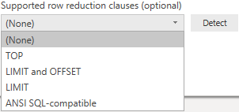

# ODBC
 
## Summary
 
Release State: General Availability

Products: Power BI Desktop, Power BI Service (Enterprise Gateway), Dataflows in PowerBI.com (Enterprise Gateway), Dataflows in PowerApps.com (Enterprise Gateway), Excel, Flow

Authentication Types Supported: Database (Username/Password), Windows, Default or Custom

M Function Reference: [Odbc.DataSource](https://docs.microsoft.com/powerquery-m/odbc-datasource), [Odbc.Query](https://docs.microsoft.com/powerquery-m/odbc-query)

>[!Note]
> Some capabilities may be present in one product but not others due to deployment schedules and host-specific capabilities.
 
## Capabilities Supported
* Import
* Advanced options
  * Connection string (non-credential properties)
  * SQL statement
  * Supported row reduction clauses
    
## Connect to an ODBC data source
To make the connection, take the following steps:
 
From the Power Query **Get Data** dialog (or **Data** tab in the Excel ribbon), select **Database > ODBC**.
 

 
In the **From ODBC** dialog that appears, provide the connection string (optional). With some ODBC sources, you will configure the connection in the [Windows ODBC Data Source Administrator](https://docs.microsoft.com/sql/odbc/admin/odbc-data-source-administrator?view=sql-server-ver15).

You may also choose to provide a SQL statement, depending on the capabilities of the driver. Ask your vendor for more information.

To enable folding support for Table.FirstN click on 'Detect' to find supported row reduction clauses, or select from one of the drop down options.

This option is applicable when not using a native SQL statement. This is due to the fact that when using a native SQL statement, a different function is used (Odbc.Query(), if you look at it in the Advanced Editor), which doesn't support the "supported row reduction clauses" capability.

Once you're done, select Connect. Select the authentication type and input those credentials in the dialogue when prompted.
