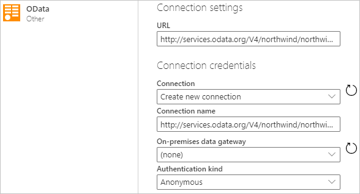

# OData Feed

## Summary

Release State: General Availability

Products: Power BI Desktop, Power BI Service (Enterprise Gateway), Dataflows in PowerBI.com (Enterprise Gateway), Dataflows in PowerApps.com (Enterprise Gateway), Excel

Authentication Types Supported: Anonymous, Windows, Basic, Web API, Organizational Account

Function Reference Documentation: [OData.Feed](https://docs.microsoft.com/powerquery-m/odata-feed), [ODataOmitValues.Nulls](https://docs.microsoft.com/powerquery-m/odataomitvalues-nulls)

## Capabilities supported

* Basic
* Advanced
   * URL parts
   * Open type columns
* Select related tables

## Load data from an OData Feed

To load data from an OData Feed:

1. Select the **OData** or **OData Feed** option in the connector selection. 

2. If you're connecting from Power BI Desktop or Excel:

   1. Choose the **Basic** button and enter a URL address in the text box. This URL should be the root of the OData service you want to connect to. For example, enter `http://services.odata.org/V4/northwind/northwind.svc/`. Then select **OK**.

      

      If the URL address you enter is invalid, a  warning icon will appear next to the **URL** textbox.

   2. If this is the first time you're connecting using the OData Feed, select the authentication type, input your credentials (if required), and select the level to apply the authentication settings to. Then select **Connect**.

       

3. If you're connecting from an online service (such as Power BI service or Power Apps):

   1. In the OData dialog that appears, enter a URL in the text box.

      
   
   2. If this is the first time you're connecting using the OData Feed, select the authentication kind and enter your credentials (if required). Then select **Next**.

4. From the **Navigator** dialog, you can select a table, then either transform the data in the Power Query Editor by selecting **Transform Data**, or load the data by selecting **Load**.

   

   If you have multiple tables that have a direct relationship to one or more of the already selected tables, you can select the **Select Related Tables** button. When you do, all tables that have a direct relationship to one or more of the already selected tables will be imported as well.
   

