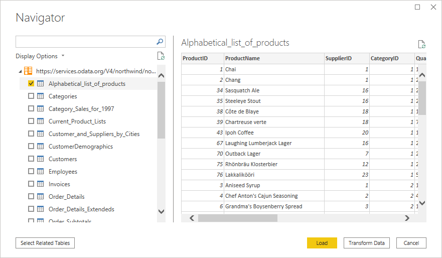
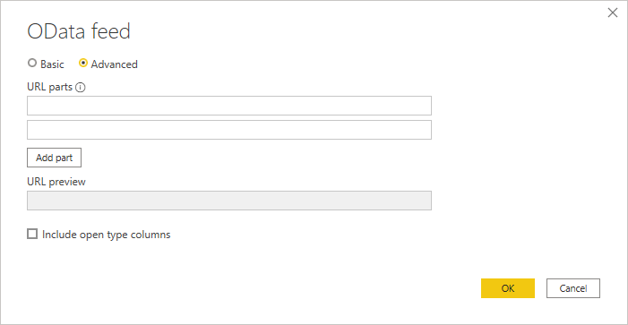

# OData Feed

## Summary

Release State: General Availability

Products: Power BI Desktop, Power BI Service (Enterprise Gateway), Dataflows in PowerBI.com (Enterprise Gateway), Dataflows in PowerApps.com (Enterprise Gateway), Excel

Authentication Types Supported: Anonymous, Windows, Basic, Web API, Organizational Account

Function Reference Documentation: [OData.Feed](https://docs.microsoft.com/powerquery-m/odata-feed), [ODataOmitValues.Nulls](https://docs.microsoft.com/powerquery-m/odataomitvalues-nulls)

## Capabilities supported

* Basic
* Advanced
   * URL parts
   * Open type columns
* Select related tables

## Load data using a basic URL

To load data from an OData Feed using a basic URL:

1. Select the **OData** or **OData Feed** option in the connector selection. 

2. Choose the **Basic** button and enter a URL address in the text box. For example, enter `http://services.odata.org/northwind/northwind.svc/`. Then select **OK**.

   

   If the URL address you enter is invalid, a  warning icon will appear next to the **URL** textbox.

3. If the OData feed requires user credentials, in the **OData feed** credentials dialog box:

    1. Select **Anonymous** if the OData feed requires no authentication.
    
    2. Select **Windows** if the OData feed requires Windows Authentication.

    3. Select **Basic** if the OData feed requires your username and password.

    4. Select **Web API** if the OData feed requires a Web API key.

    5. Click **Organizational account** if the OData feed requires federated access credentials. For Windows Live ID, log into your account.

    6. Select **Save**.

       

4. From the **Navigator** dialog, you can select a table, then either transform the data in the Power Query Editor by selecting **Transform Data**, or load the data by selecting **Load**.

   

   If you have multiple tables that have a direct relationship to one or more of the already selected tables, you can select the **Select Related Tables** button. When you do, all tables that have a direct relationship to one or more of the already selected tables will be imported as well.
   
## Load data using an advanced URL

When you select the OData Feed, in most instances you'll enter URLs in the Basic setting. However, in some cases you may want to assemble a URL from its separate parts and include OData open type columns in the dataset. In this case, in the **OData Feed** dialog, select the **Advanced** option.

Use the **URL parts** section of the dialog to assemble the URL you want to use to get data. The first part of the URL in the **URL parts** section most likely would consist of the scheme, authority, and path of the URI (for example, http://contoso.com/products/). The second text box could include any queries or fragments that you would use to filter the information provided to the web site. If you need to add more than one part, select **Add part** to add another URL fragment text box. As you enter each part of the URL, the complete URL that will be used when you select **OK** is displayed in the **URL preview** box.

If the data you're going to access contains open types that contain dynamic properties you want to be included, select **Include open type columns**. For more information about open types and dynamic properties, see the [OData documentation](https://www.odata.org/documentation/). 

