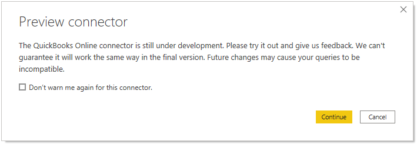
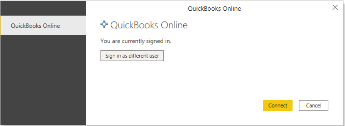

# QuickBooks Online

>[!Note]
> There's a mention of QuickBooks Power BI integration at https://powerbi.microsoft.com/en-us/integrations/quickbooks-online/.

## Summary

Power BI QuickBooks Online connector enables connecting to your QuickBooks Online account and viewing, analysing, and reporting on your company QuickBooks data in Power BI.

Release state: Beta

Products: Power BI Desktop, Power BI Service (Enterprise Gateway)

Authentication Types Supported: QuickBooks Online account

## Prerequisites

To use the QuickBooks Online connector, you must have a QuickBooks Online account username and password.

The QuickBooks Online connector uses the QuickBooks ODBC driver. The QuickBooks ODBC driver is shipped with Power BI Desktop and no additional installation is required.

## Capabilities Supported

* Import

## Connect to QuickBooks Online

To connect to QuickBooks Online:

1. In the **Get Data** dialog box, enter **QuickBooks** in the **Search** box, select **QuickBooks Online (Beta)** from the product specific data connector list, and then select **Connect**.

   
   
2. Select **Continue** in the **Preview connector** message.

   

3. Select **Sign in** to sign into your QuickBooks Online account.

   

4. In the following dialog enter your QuickBooks credentials. You may be required to provide 2FA (two factor authentication code) as well.

   

5. In the following dialog select a company and then select **Next**.

   

6. Once you have successfully signed in, select **Connect**.

   

7. In the **Navigator** dialog box, select the QuickBooks tables you want to load. You can then either load or transform the data.

   

8. Create a report.

   

9. Optionally, publish to Power BI service.

   

10. View the report in Power BI service.

    

