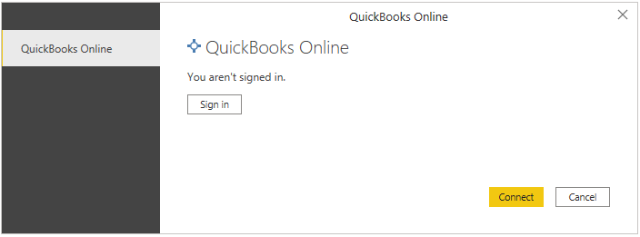
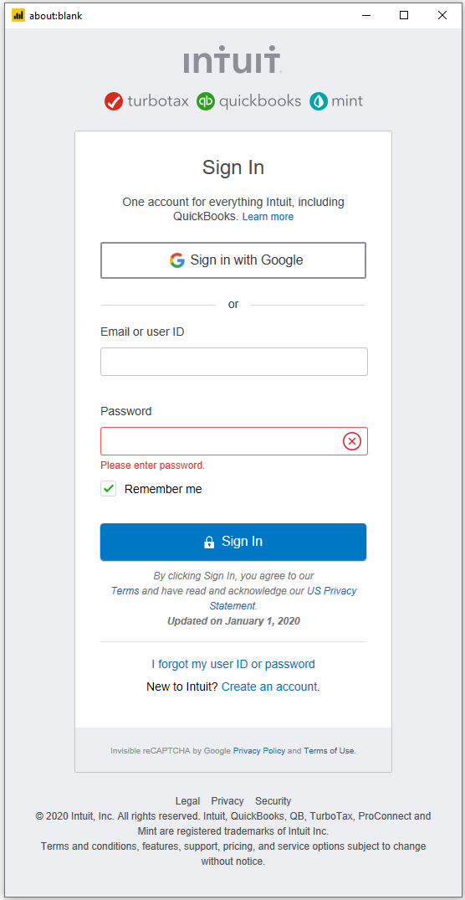
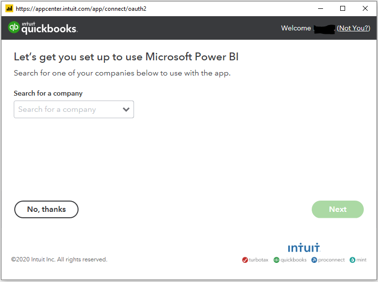
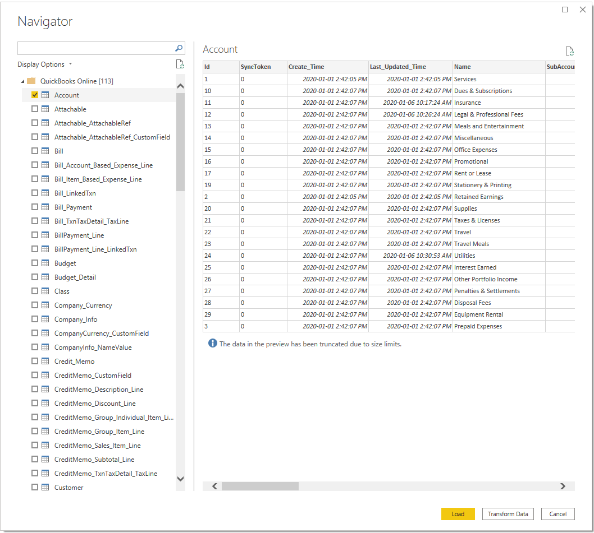

# QuickBooks Online (Beta)

The Power BI QuickBooks Online connector enables connecting to your QuickBooks Online account and viewing, analyzing, and reporting on your company QuickBooks data in Power BI.

## Summary

| Item | Description |
| ---- | ----------- |
| Release State | Beta |
| Products | Power BI (Datasets) |
| Authentication Types Supported | QuickBooks Online account |
| | |

>[!Warning]
> QuickBooks Online has deprecated support for Internet Explorer 11, which Power Query Desktop uses for authentication to online services. To be able to log in to Quickbooks Online from Power BI Desktop, go to [Enabling Microsoft Edge (Chromium) for OAuth Authentication in Power BI Desktop](../oauth-edge-chromium.md).

## Prerequisites

To use the QuickBooks Online connector, you must have a QuickBooks Online account username and password.

The QuickBooks Online connector uses the QuickBooks ODBC driver. The QuickBooks ODBC driver is shipped with Power BI Desktop and no additional installation is required.

## Capabilities Supported

* Import

## Connect to QuickBooks Online

To connect to QuickBooks Online:

1. In the **Get Data** dialog box, enter **QuickBooks** in the **Search** box, select **QuickBooks Online (Beta)** from the product-specific data connector list, and then select **Connect**.

   

2. Select **Continue** in the **Preview connector** message.

   

3. Select **Sign in** to sign into your QuickBooks Online account.

   

4. In the following dialog, enter your QuickBooks credentials. You may be required to provide 2FA (two factor authentication code) as well.

   

5. In the following dialog, select a company and then select **Next**.

   

6. Once you've successfully signed in, select **Connect**.

   

7. In the **Navigator** dialog box, select the QuickBooks tables you want to load. You can then either load or transform the data.

   

## Known issues

Beginning on August 1, 2020, Intuit will no longer support Microsoft Internet Explorer 11 (IE 11) for QuickBooks Online. When you use OAuth2 for authorizing QuickBooks Online, after August 1, 2020, only the following browsers will be supported:

* Microsoft Edge
* Mozilla Firefox
* Google Chrome
* Safari 11 or newer (Mac only)

For more information, see [Alert: Support for IE11 deprecating on July 31, 2020 for Authorization screens](https://blogs.intuit.com/blog/2020/06/27/alert-support-for-ie11-deprecating-on-july-31-2020-for-authorization-screens/).

For information about current Microsoft Edge support in Power BI Desktop, go to [Enabling Microsoft Edge (Chromium) for OAuth Authentication in Power BI Desktop](../oauth-edge-chromium.md).
