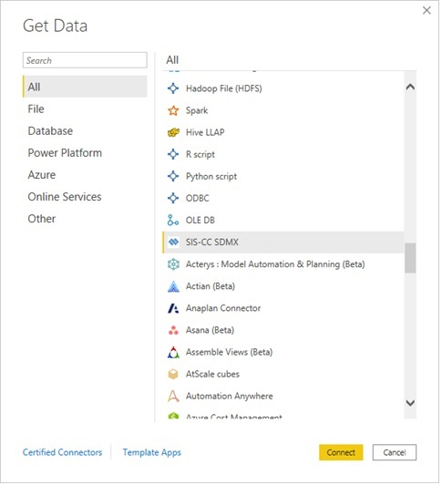
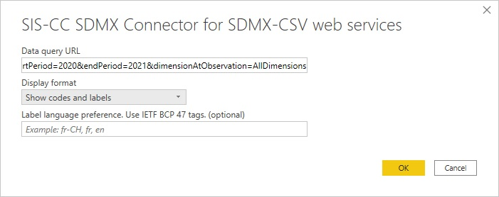
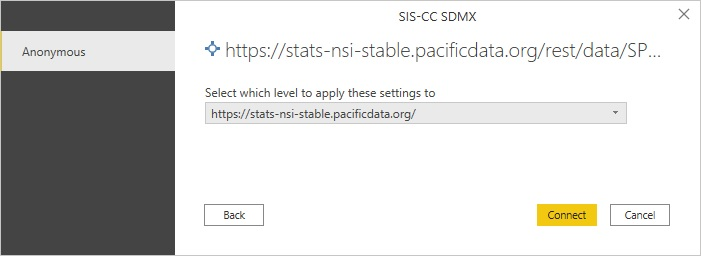

# SIS-CC SDMX 

>[!Note]
>The following connector article is provided by the Statistical Information System Collaboration Community (SIS-CC), the owner of this connector and a member of the Microsoft Power Query Connector Certification Program. If you have questions regarding the content of this article or have changes you would like to see made to this article, visit the SIS-CC website and use the support channels there.

## Summary

| Item | Description |
| ---- | ----------- |
| Release State | General Availability |
| Products | Power BI (Datasets) |
| Authentication Types Supported | Anonymous |
| Function Reference Documentation | SDMX.Contents |
| | |

## Prerequisites

Before you get started, make sure you've properly configured the URL from the Service Provider’s API. The exact process here will depend on the Service Provider.

## Capabilities supported

Import of SDMX-CSV 2.1 format. Other formats aren't supported.

## Connection instructions

To connect to SDMX Web Service data:

1. Select **Get Data** from the **Home** ribbon in Power BI Desktop. Select **All** from the categories on the left, and then select **SIS-CC SDMX**. Then select **Connect**.

   

2. Fill in the parameters:
   1. In the **Data query URL**, enter an SDMX REST data query URL (the web service must support the SDMX-CSV format).
   2. In **Display format**, select one of the options:
      - Show codes and labels, ex: FREQ: Frequency
      - Show codes; ex: FREQ
      - Show labels ex: Frequency
      - Optionally, enter a language preference in **Label language preference** using an IETF BCP 47 tag

   

3. If this is the first time you’re connecting to the REST web service in the previous step **Data query URL**, this authentication step is displayed. As the connection is Anonymous, select **Connect**

   

4. Select **Load** to import the data into Power BI, or **Transform Data** to edit the query in Power Query Editor where you can refine the query before loading into Power BI.

## Limitations and issues

This version of the connector doesn't support importing data formats SDMX-ML or SDMX-JSON.

## Next steps

If you want to submit a feature request or contribute to the open-source project, then go to the [Gitlab project site](https://gitlab.com/sis-cc/sdmx-tools/sdmx-power-bi).
