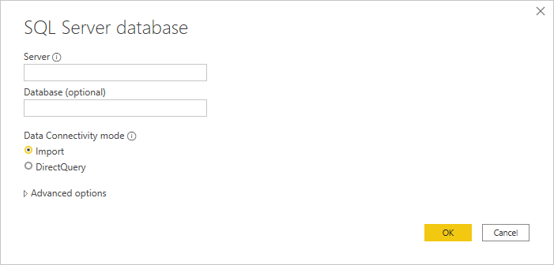
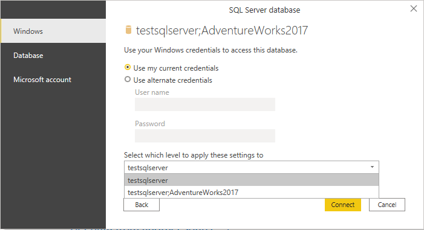
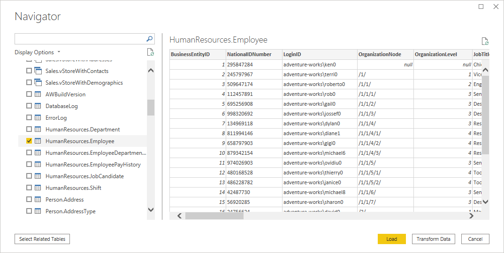
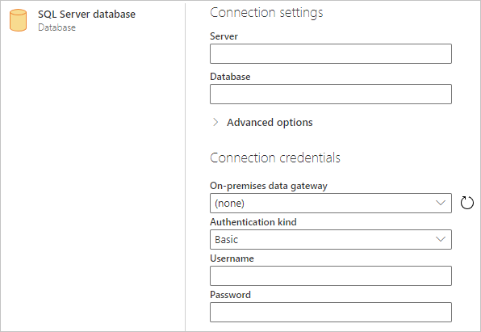
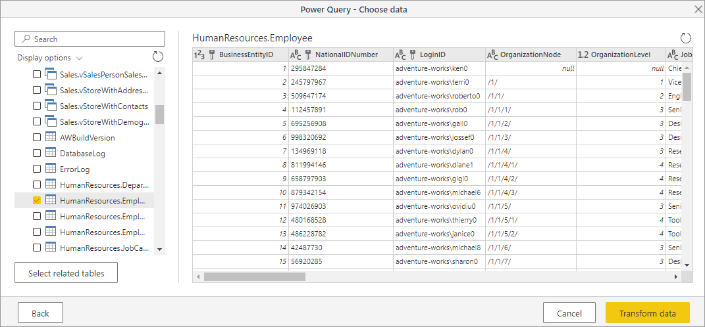

# SQL Server
 
## Summary
 
| Item | Description |
| ---- | ----------- |
| Release State | General Availability |
| Products | Power BI (Datasets) Power BI (Dataflows) Power Apps (Dataflows) Excel Dynamics 365 Customer Insights Analysis Services |
| Authentication Types Supported | Database (Username/Password) Windows |
| M Function Reference | [Sql.Database](/powerquery-m/sql-database) [Sql.Databases](/powerquery-m/sql-databases) |
| | |

>[!Note]
> Some capabilities may be present in one product but not others due to deployment schedules and host-specific capabilities.
 
## Prerequisites
By default, Power BI installs an OLE DB driver for SQL Server. However, for optimal performance, we recommend that the customer installs the [SQL Server Native Client](/sql/relational-databases/native-client/applications/installing-sql-server-native-client) before using the SQL Server connector. SQL Server Native Client 11.0 and SQL Server Native Client 10.0 are both supported in the latest version.

 
## Capabilities Supported
* Import
* DirectQuery (Power BI Desktop)
* Advanced options
    * Command timeout in minutes
    * Native SQL statement
    * Relationship columns
    * Navigate using full hierarchy
    * SQL Server failover support
    
## Connect to SQL Server database from Power Query Desktop

To make the connection, take the following steps:
 
1. Select the **SQL Server database** option in the connector selection.
 
2. In the **SQL Server database** dialog that appears, provide the name of the server and database (optional). 

   

3. Select either the **Import** or **DirectQuery** data connectivity mode (Power BI Desktop only).

4. Select **OK**.

5. If this is the first time you're connecting to this database, select the authentication type, input your credentials, and select the level to apply the authentication settings to. Then select **Connect**.

   

   >[!Note]
   > If the connection is not encrypted, you'll be prompted with the following dialog.

   

    Select **OK** to connect to the database by using an unencrypted connection, or follow these [instructions](/sql/database-engine/configure-windows/enable-encrypted-connections-to-the-database-engine) to setup encrypted connections to SQL Server.

6. In **Navigator**, select the database information you want, then either select **Load** to load the data or **Transform Data** to continue transforming the data in Power Query Editor.

   

## Connect to SQL Server database from Power Query Online

To make the connection, take the following steps:
 
1. Select the **SQL Server database** option in the connector selection.
 
2. In the **SQL Server database** dialog that appears, provide the name of the server and database (optional). 

   

3. If needed, select an on-premises data gateway.

4. If this is the first time you're connecting to this database, select the authentication kind and input your credentials.

5. If the connection is not encrypted, and the connection dialog contains a **Use Encrypted Connection** check box, clear the check box.

6. Select **Next** to continue.

7. In **Navigator**, select the data you require, and then select **Transform data**.

   

## Connect using advanced options

Both Power Query Desktop and Power Query Online provide a set of advanced options that you can add to your query if needed. 

The following table lists all of the advanced options you can set in Power Query Desktop and Power Query Online.

| Advanced option | Description |
| --------------- | ----------- |
| Command timeout in minutes | If your connection lasts longer than 10 minutes (the default timeout), you can enter another value in minutes to keep the connection open longer. This option is only available in Power Query Desktop. |
| SQL statement | For information, go to [Import data from a database using native database query](../native-database-query.md). |
| Include relationship columns | If checked, includes columns that might have relationships to other tables. If this box is cleared, you won’t see those columns. |
| Navigate using full hierarchy | If checked, the Navigator displays the complete hierarchy of tables in the database you're connecting to. If cleared, Navigator displays only the tables whose columns and rows contain data. |
| Enable SQL Server Failover support | If checked, when a node in the SQL Server [failover group](/sql/sql-server/failover-clusters/windows/windows-server-failover-clustering-wsfc-with-sql-server) isn't available, Power Query moves from that node to another when failover occurs. If cleared, no failover will occur. |
| | |

Once you've selected the advanced options you require, select **OK** in Power Query Desktop or **Next** in Power Query Online to connect to your SQL Server database.

## Troubleshooting

### Always Encrypted columns

Power Query doesn't support 'Always Encrypted' columns.

## Next steps

[Optimize Power Query when expanding table columns](../optimize-expanding-table-columns.md)