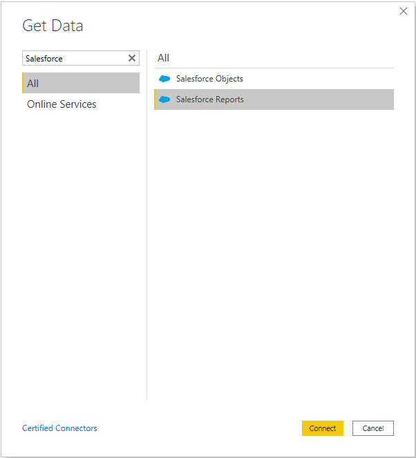
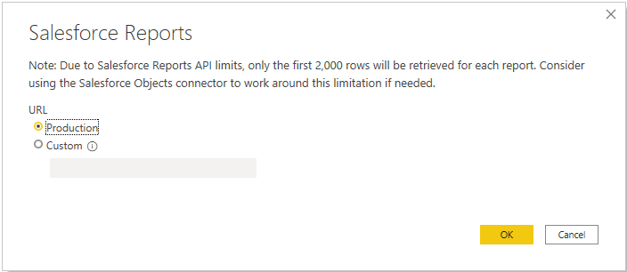

# Salesforce Reports
 
## Summary
 
Release State: General Availability

Products: Power BI Desktop, Power BI Service (Enterprise Gateway), Dataflows in PowerBI.com (Enterprise Gateway), Dataflows in PowerApps.com (Enterprise Gateway), Excel

Authentication Types Supported: Salesforce account

>[!Note]
> Some capabilities may be present in one product but not others due to deployment schedules and host-specific capabilities.

>[!Warning]
> By default, Salesforce does not support the browser used for authentication to web services in Power BI. Please opt-in for "[Extended Support for Accessing Lightning Experience Using Microsoft Internet Explorer 11](https://help.salesforce.com/articleView?id=000333934&type=1&mode=1)". You may also want to review Salesforce documentation on "[Configuring Internet Explorer](https://developer.salesforce.com/docs/atlas.en-us.salesforce_supported_browsers_cheatsheet.meta/salesforce_supported_browsers_cheatsheet/getstart_browser_ie.htm)"
 
## Prerequisites

To use the Salesforce Reports connector, you must have a Salesforce account username and password.

In addition, Salesforce API access should be enabled. To verify access settings, go to your personal Salesforce page, open your profile settings, and search for and make sure the **API Enabled** checkbox is selected. Note that Salesforce trial accounts do not have API access.

## Capabilities Supported

* Production
* Custom 
   * Custom domains
   * CNAME record redirects

## Connect to Salesforce Reports

To connect to Salesforce Reports data:

1. In the **Get Data** dialog box, enter **Salesforce** in the Search box, select **Salesforce Reports** from the product specific data connector list, and then select **Connect**.

   

2. In **Salesforce Reports**, choose the **Production** URL if you use the Salesforce production URL (https://www.salesforce.com) to log in.

   

   You can also select **Custom** and enter a custom URL to log in. This custom URL might be a custom domain you've created within Salesforce, such as https://contoso.salesforce.com. You can also use the custom URL selection if you are using your own CNAME record that redirects to Salesforce.

   Once you've selected the URL, select **OK** to continue.

3. Select **Sign in** to sign in to your Salesforce account.

   

   Once you've successfully signed in, select **Connect**.

4. If this is the first time you've signed in using a specific app, you'll be asked to verify your authenticity by entering a code sent to your email address. You'll then be asked whether you want the app you are using to access the data. For example, you'll be asked if you want to allow Power BI Desktop to access your Salesforce data. Select **Allow**.

5. In the **Navigator** dialog box, select the Salesforce Reports you want to load.

You can then either load or transform the data.

## Known issues and limitations

* There is a limit on the number of fields a query to Salesforce can contain. The limit varies depending on the type of the columns, the number of computed columns, and so on. When you receive an error `Query is either selecting too many fields or the filter conditions are too complicated` it means that your query exceeds the limit. To avoid this, use the **Select Query** advanced option and specify fields that you really need.

* Salesforce session settings can block this integration. Ensure that the setting **Lock sessions to the IP address from which they originated** is disabled.

* The number of rows you can access in Salesforce Reports is limited by Salesforce to 2000 rows. As a workaround for this issue, you can use the [Salesforce Objects](SalesforceObjects.md) connector in Power BI Desktop to retrieve all the rows from individual tables and recreate reports you’d like. The Object connector doesn’t have the 2000 row limit.

* Salesforce API access should be enabled. To verify access settings, go to profile settings for the current user and search for "API Enabled" checkbox.

* Note that Salesforce trial accounts do not have API access.

* Lightning URLs are not supported.

For more information about Salesforce internal API limits, see [Salesforce Developer Limits and Allocations Quick Reference](https://developer.salesforce.com/docs/atlas.en-us.salesforce_app_limits_cheatsheet.meta/salesforce_app_limits_cheatsheet/salesforce_app_limits_platform_api.htm#!).

