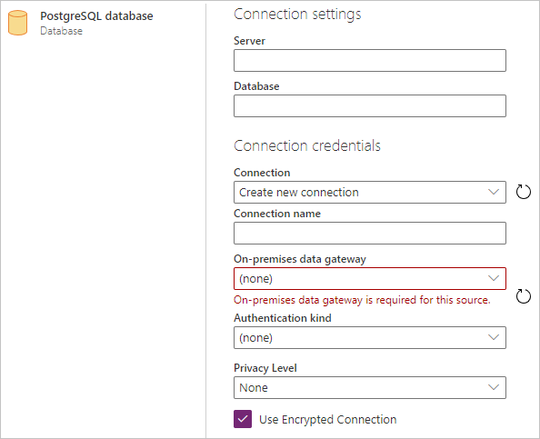

# Snowflake

## Summary

| Item | Description |
| ---- | ----------- |
| Release State | General Availability |
| Products | Power BI (Datasets) Power BI (Dataflows) Power Apps (Dataflows) Excel Dynamics 365 Customer Insights Analysis Services |
| Authentication Types Supported | Database (Username/Password) |
| Function Reference Documentation | [PostgreSQL.Database](https://docs.microsoft.com/powerquery-m/postgresql-database) |
| | |

> [!Note]
> Some capabilities may be present in one product but not others due to deployment schedules and host-specific capabilities.
> 
## Capabilities Supported

- Import
- DirectQuery (Power BI only, learn more)
- Advanced options
  - Command timeout in minutes
  - Native SQL statement
  - Relationship columns
  - Navigate using full hierarchy

## Connect to Snowflake data warehouse from Power BI Desktop

To connect to a **Snowflake** computing warehouse, select **Get Data** from the **Home** ribbon in Power BI Desktop. Select **Database** from the categories on the left, and you see **Snowflake**.

In the **Snowflake** window that appears, type or paste the name of your Snowflake computing warehouse into the box and select **OK**. Note that you can choose to **Import** data directly into Power BI, or you can use **DirectQuery**. You can learn more about [using DirectQuery](desktop-use-directquery.md). Please note that AAD SSO only supports DirectQuery.

When prompted, put in your username and password.

> [!NOTE]
> Once you enter your username and password for a particular **Snowflake** server, Power BI Desktop uses those same credentials in subsequent connection attempts. You can modify those credentials by going to **File > Options and settings > Data source settings**.
> 
> 

If you want to use the Microsoft account option, the Snowflake AAD integration must be configured on the Snowflake side. To do this, read the Getting Started section of the [Snowflake documentation on the topic](https://docs.snowflake.net/manuals/user-guide/oauth-powerbi.html#power-bi-sso-to-snowflake).

Once you successfully connect, a **Navigator** window appears and displays the data available on the server, from which you can select one or multiple elements to import and use in **Power BI Desktop**.

You can **Load** the selected table, which brings the entire table into **Power BI Desktop**, or you can **Edit** the query, which opens **Query Editor** so you can filter and refine the set of data you want to use, and then load that refined set of data into **Power BI Desktop**.

## Connect to a PostgreSQL database from Power Query Online

To make the connection, take the following steps:

1. Select the **PostgreSQL database** option in the connector selection.

2. In the **PostgreSQL database** dialog that appears, provide the name of the server and database.

   

3. Select the name of the on-premises data gateway you want to use.

4. Select the **Basic** authentication kind and input your MySQL credentials in the **Username** and **Password** boxes.

5. If your connection isn't encrypted, clear **Use Encrypted Connection**.

6. Select **Next** to connect to the database.

7. In **Navigator**, select the data you require, then select **Transform data** to transform the data in Power Query Editor.

## Advanced Options

Power Query Desktop provides a set of advanced options that you can add to your query if needed.

The following table lists all of the advanced options you can set in Power Query Desktop.

| Advanced option	| Description |
| --------------- | ----------- |
| Command timeout in minutes | If your connection lasts longer than 10 minutes (the default timeout), you can enter another value in minutes to keep the connection open longer. This option is only available in Power Query Desktop. |
| SQL statement | For information, go to [Import data from a database using native database query](../native-database-query.md). |
| Include relationship columns | If checked, includes columns that might have relationships to other tables. If this box is cleared, you won’t see those columns. |
| Navigate using full hierarchy | If checked, the navigator displays the complete hierarchy of tables in the database you're connecting to. If cleared, the navigator displays only the tables whose columns and rows contain data. |
| | |

Once you've selected the advanced options you require, select **OK** in Power Query Desktop to connect to your PostgreSQL database.

### Custom Roles

The Snowflake connector supports *Custom Roles* beginning with the February 2021 release of Power BI Desktop.

## Troubleshooting
