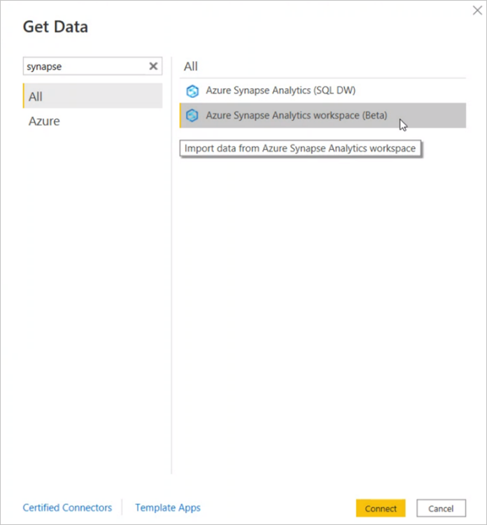
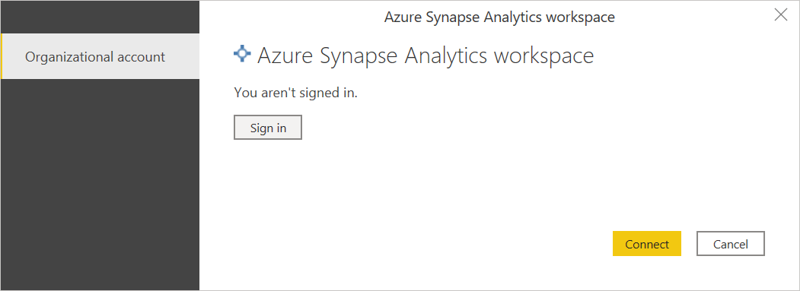

# Azure Synapse Analytics workspace (Beta)

## Summary

| Item | Description |
| ---- | ----------- |
| Release State | Public Review |
| Products | Power BI (Datasets) |
| Authentication Types Supported | Organizational account |

>[!Note]
> This Azure Synapse Analytics workspace connector doesn't replace the Azure Synapse Analytics (SQL DW) connector. This connector makes exploring data in Synapse workspaces more accessible. Some capabilities aren't present in this connector, including native query and DirectQuery support.

>[!Note]
> This connector supports access to all data in your Synapse workspace, including Synapse Serverless, Synapse on-demand, and Spark tables.

## Prerequisites

Before you can sign in to Synapse workspaces, you must have access to [Azure Synapse Analytics Workspace](/azure/synapse-analytics/get-started-create-workspace).

## Capabilities Supported

* Import

## Connect to Synapse workspace data from Power Query Desktop

To connect to Synapse workspace data:

1. Select **Get Data** from the **Home** ribbon in Power BI Desktop. Select **Azure Synapse Analytics workspace (Beta)**. Then select **Connect**.

   

2. If this is the first time you are connecting to this workspace, you'll be asked to sign in to your Synapse account. To sign in, select **Sign in**.

   

3. In the **Sign in with Microsoft** window that appears, provide your credentials to sign in to your Synapse account. Then select **Next**.

4. Once you've successfully signed in, select **Connect**.

Once the connection is established, you’ll see a list of the workspaces you have access to. Drill through the workspaces, databases, and tables.

You can **Load** the selected table, which brings the entire table into Power BI Desktop, or you can select **Transform Data** to edit the query, which opens the Power Query editor. You can then filter and refine the set of data you want to use, and then load that refined set of data into Power BI Desktop.

## Troubleshooting

### I don't see my Synapse workspace in the connector

The Synapse connector is using [Azure role-based access control (RBAC)](/azure/role-based-access-control/overview) to find the Synapse workspaces you have access to.

If your access is only defined in [Synapse RBAC](/azure/synapse-analytics/security/synapse-workspace-synapse-rbac), you might not see the workspace.

Make sure your access is defined by Azure RBAC to ensure all Synapse workspaces are displayed.
