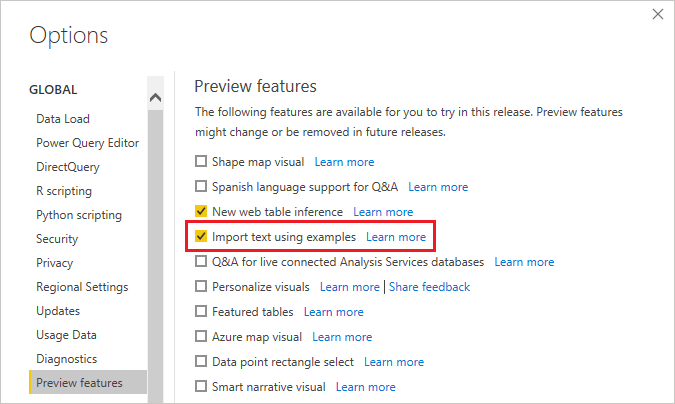
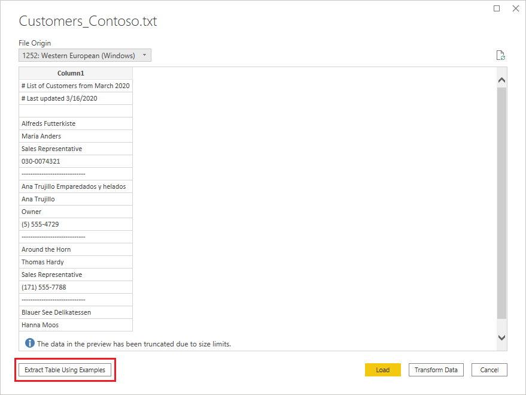

# Text/CSV

## Summary

Release State: General Availability

Products: Power BI Desktop, Power BI Service (Enterprise Gateway), Dataflows in PowerBI.com (Enterprise Gateway), Dataflows in PowerApps.com (Enterprise Gateway), Excel

Function Reference Documentation: [File.Contents](https://docs.microsoft.com/powerquery-m/file-contents), [Lines.FromBinary](https://docs.microsoft.com/powerquery-m/lines-frombinary), [Csv.Document](https://docs.microsoft.com/powerquery-m/csv-document)

## Capabilities supported

* Import

## Load from Text/CSV File

To load a local text or csv file, all you need to do is select the **Text/CSV** option in the connector selection. This action will launch a local file browser and allow you to select your text file. 


Power Query will treat CSVs as structured files with a comma as a delimiter&mdash;a special case of a text file. If you choose a text file, Power Query will automatically attempt to determine if it has delimiter separated values, and what that delimiter is. If it can infer a delimiter, it will automatically treat it as a structured data source.

### Unstructured Text
If your text file doesn't have structure, you'll get a single column with a new row per line encoded in the source text. As a sample for unstructured text, you can consider a notepad file with the following contents:

```
Hello world.
This is sample data.
```

When you load it, you're presented with a navigation screen that loads each of these lines into their own row.


There's only one thing you can configure on this dialog, which is the **File Origin** dropdown select. This dropdown lets you select [which character set](https://docs.microsoft.com/windows/win32/intl/code-page-identifiers) was used to generate the file. Currently, character set isn't inferred, and UTF-8 will only be inferred if it starts with a [UTF-8 BOM](https://docs.microsoft.com/globalization/encoding/byte-order-mark).


### CSV

You can find a sample CSV file [here](https://go.microsoft.com/fwlink/?LinkID=619356).

In addition to file origin, CSV also supports specifying the delimiter and how data type detection will be handled.


Delimiters available include colon, comma, equals sign, semicolon, space, tab, a custom delimiter (which can be any string), and a fixed width (splitting up text by some standard number of characters).


The final dropdown allows you to select how you want to handle data type detection. It can be done based on the first 200 rows, on the entire data set, or you can choose to not do automatic data type detection and instead let all columns default to 'Text'. Warning: if you do it on the entire data set it may cause the initial load of the data in the editor to be slower.


Since inference can be incorrect, it's worth double checking settings before loading.

### Structured Text

When Power Query can detect structure to your text file, it will treat the text file as a delimiter separated value file, and give you the same options available when opening a CSV&mdash;which is essentially just a file with an extension indicating the delimiter type.

For example, if you save the following below as a text file, it will be read as having a tab delimiter rather than unstructured text.
```
Column 1	Column 2	Column 3
This is a string.	1	ABC123
This is also a string.	2	DEF456
```


This can be used for any kind of other delimiter-based file.

### Editing Source

When editing the source step, you'll be presented with a slightly different dialog than when initially loading. Depending on what you are currently treating the file as (that is, text or csv) you'll be presented with a screen with a variety of dropdowns.


The **Line breaks** dropdown will allow you to select if you want to apply line breaks that are inside quotes or not. 


For example, if you edit the 'structured' sample provided above, you can add a line break.

```
Column 1	Column 2	Column 3
This is a string.	1	"ABC
123"
This is also a string.	2	"DEF456"
```

If **Line breaks** is set to **Ignore quoted line breaks**, it will load as if there was no line break (with an extra space).


If **Line breaks** is set to **Apply all line breaks**, it will load an extra row, with the content after the line breaks being the only content in that row (exact output may depend on structure of the file contents).


The **Open file as** dropdown will let you edit what you want to load the file as&mdash;important for troubleshooting. For structured files that aren't technically CSVs (such as a tab separated value file saved as a text file), you should still have **Open file as** set to CSV. This setting also determines which dropdowns are available in the rest of the dialog.


## Text/CSV by Example (preview)

*Text/CSV By Example* in Power Query is now available as a public preview feature in Power BI Desktop. To start using Text/CSV By Example:

1. In Power BI Desktop, under the **File** tab, select **Options and settings** > **Options**. 

2. In the the **Options** page, under **Global**, select **Preview features**.

3. Under **Preview features**, select **Import text using examples**. Then select **OK**.

   

Now when you use the Text/CSV connector, you'll see a new option to **Extract Table Using Examples** on the bottom-left corner of the file preview dialog.



When you select that new button, you’ll be taken into the “Extract Table Using Examples” experience allowing you to specify sample output values for the data you’d like to extract from your Text/CSV file.


Once you’re done constructing that table, you can either select to load or transform the data. Notice how the resulting queries contain a detailed breakdown of all the steps that were inferred for the data extraction. These steps are just regular query steps that you can customize as needed.


## Troubleshooting

### Loading Files from the Web

If you're requesting text/csv files from the web and also promoting headers, and you’re retrieving enough files that you need to be concerned with potential throttling, you should consider wrapping your `Web.Contents` call with `Binary.Buffer()`. In this case, buffering the file before promoting headers will cause the file to only be requested once.

### Unstructured text being interpreted as structured

In rare cases, a document that has similar comma numbers across paragraphs might be interpreted to be a CSV. If this issue happens, edit the **Source** step in the Query Editor, and select **Text** instead of **CSV** in the **Open File As** dropdown select.
