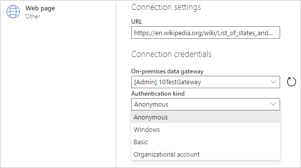
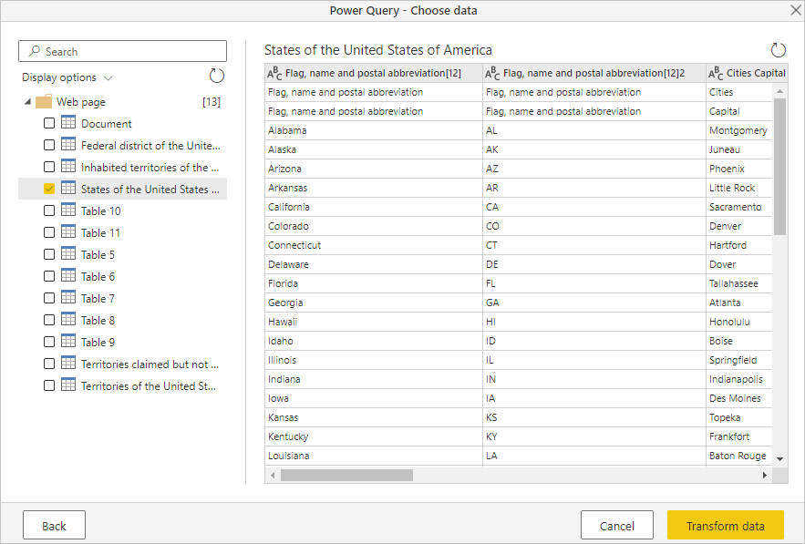
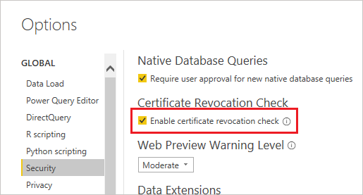

# Web

## Summary

| Item | Description |
| ---- | ----------- |
| Release State | General Availability |
| Products | Power BI (Datasets) Power BI (Dataflows) Power Apps (Dataflows) Excel Dynamics 365 Customer Insights |
| Authentication Types Supported | Anonymous Windows Basic Web API Organizational Account |
| Function Reference Documentation | [Web.Page](https://docs.microsoft.com/powerquery-m/web-page) [Web.BrowserContents](https://docs.microsoft.com/powerquery-m/web-browsercontents) |
| | |

## Prerequisites

* Internet Explorer 10

## Capabilities supported

* Basic
* Advanced
   * URL parts
   * Command timeout
   * HTTP request header parameters

## Load Web data from Power Query Desktop

To load data from a web site with Power Query Desktop:

1. Select **Get Data > Web** in Power BI or **From Web** in the **Data** ribbon in Excel. 

2. Choose the **Basic** button and enter a URL address in the text box. For example, enter `https://en.wikipedia.org/wiki/List_of_states_and_territories_of_the_United_States`. Then select **OK**.

   

   If the URL address you enter is invalid, a  warning icon will appear next to the **URL** textbox.

   If you need to construct a more advanced URL before you connect to the website, go to [Load Web data using an advanced URL](#load-web-data-using-an-advanced-url).

3. Select the authentication method to use for this web site. In this example, select **Anonymous**. Then select the level to you want to apply these settings to&mdash;in this case, **https://en.wikipedia.org/**. Then select **Connect**.

   

   The available authentication methods for this connector are:

   * **Anonymous**: Select this authentication method if the web page doesn't require any credentials.

   * **Windows**: Select this authentication method if the web page requires your Windows credentials.

   * **Basic**: Select this authentication method if the web page requires a basic user name and password.

   * **Web API**: Select this method if the web resource that you’re connecting to uses an API Key for authentication purposes.

   * **Organizational account**: Select this authentication method if the web page requires organizational account credentials.

   The level you select for the authentication method determines what part of a URL will have the authentication method applied to it. If you select the top-level web address, the authentication method you select here will be used for that URL address or any subaddress within that address. However, you might not want to set the top URL address to a specific authentication method because different subaddresses could require different authentication methods. For example, if you were accessing two separate folders of a single SharePoint site and wanted to use different Microsoft Accounts to access each one.
   
   Once you've set the authentication method for a specific web site address, you won't need to select the authentication method for that URL address or any subaddress again. For example, if you select the https://en.wikipedia.org/ address in this dialog, any web page that begins with this address won't require that you select the authentication method again.  

   >[!Note]
   >If you need to change the authentication method later, go to [Changing the authentication method](web-troubleshoot.md#changing-the-authentication-method). 

4. From the **Navigator** dialog, you can select a table, then either transform the data in the Power Query editor by selecting **Transform Data**, or load the data by selecting **Load**.

   

   The right side of the **Navigator** dialog displays the contents of the table you select to transform or load. If you're uncertain which table contains the data you're interested in, you can select the **Web View** tab. The web view lets you see the entire contents of the web page, and highlights each of the tables that have been detected on that site. You can select the check box above the highlighted table to obtain the data from that table.

   On the lower left side of the **Navigator** dialog, you can also select the **Add table using examples** button. This selection presents an interactive window where you can preview the content of the web page and enter sample values of the data you want to extract. For more information on using this feature, go to [Get webpage data by providing examples](https://docs.microsoft.com/power-bi/desktop-connect-to-web-by-example).

## Load Web data from Power Query Online

To load data from a web site with Power Query Online:

1. From the **Get Data** dialog box, select either **Web page** or **Web API**.

   

   In most cases, you'll want to select the Web page connector. For security reasons, you'll need to use an [on-premises data gateway](https://docs.microsoft.com/data-integration/gateway/) with this connector. The Web Page connector requires a gateway due to security-related concerns specific to how HTML pages are processed. This is not an issue with Web API connector, as it does not perform any HTML processing.

   In some cases, you might want to use a URL that points at either an API or a file stored on the web. In those scenarios, the Web API connector (or file-specific connectors) would allow you to move forward without an on-premises data gateway.

   Generally, the Web API connector is used to connect to REST APIs with more relaxed . This connector does not require an on-premises data gateway.

   Also note that if your URL points to a file, you should [use the specific file connector](#open-files-on-the-web) instead of the Web page connector. 

2. Enter a URL address in the text box. For this example, enter `https://en.wikipedia.org/wiki/List_of_states_and_territories_of_the_United_States`.

   

3. Select the name of your on-premises data gateway.

   

4. Select the authentication method you'll use to connect to the web page.

   

   The available authentication methods for this connector are:

   * **Anonymous**: Select this authentication method if the web page doesn't require any credentials.

   * **Windows**: Select this authentication method if the web page requires your Windows credentials.

   * **Basic**: Select this authentication method if the web page requires a basic user name and password.

   * **Organizational account**: Select this authentication method if the web page requires organizational account credentials.

   Once you've chosen the authentication method, select **Next**.

5. From the **Navigator** dialog, you can select a table, then transform the data in the Power Query Editor by selecting **Transform Data**.

   

## Load Web data using an advanced URL

When you select **Get Data > From Web** in Power Query Desktop, in most instances you'll enter URLs in the Basic setting. However, in some cases you may want to assemble a URL from its separate parts, set a timeout for the browser, or provide individualized URL header data. In this case, in the **From Web** dialog, select the **Advanced** option.

Use the **URL parts** section of the dialog to assemble the URL you want to use to get data. The first part of the URL in the **URL parts** section most likely would consist of the scheme, authority, and path of the URI (for example, http://contoso.com/products/). The second text box could include any queries or fragments that you would use to filter the information provided to the web site. If you need to add more than one part, select **Add part** to add another URL fragment text box. As you enter each part of the URL, the complete URL that will be used when you select **OK** is displayed in the **URL preview** box.

Depending on how long the POST request takes to process data, you may need to prolong the time the request continues to stay connected to the web site. The default timeout for both POST and GET is 100 seconds. If this timeout is too short, you can use the optional **Command timeout in minutes** to extend the number of minutes you stay connected.

You can also add specific request headers to the POST you send to the web site using the optional **HTTP request header parameters** drop-down box. The following table describes the request headers you can select. 

| Request Header | Description |
| --- | --- |
| Accept | Specifies the response media types that are acceptable. | 
| Accept-Charset | Indicates which character sets are acceptable in the textual response content. |
| Accept-Encoding | Indicates what response content codings are acceptable in the response. |
| Accept-Language | Indicates the set of natural languages that are preferred in the response. |
| Cache-Control | Specifies directives that specifies behavior that prevents caches from adversely interfering with a request or response. |
| Content-Type | Indicates the media type of the associated representation. |
| If-Modified-Since | Conditionally determines if the web content has been changed since the date specified in this field. If the content has not changed, the server responds with only the headers that have a 304 status code. If the content has changed, the server will return the requested resource along with a status code of 200. |
| Prefer | Indicates that particular server behaviors are preferred by the client, but are not required for successful completion of the request. |
| Range | Specifies one or more subranges of the selected representation data. |
| Referer | Specifies a URI reference for the resource from which the target URI was obtained. |
| | |

## Open files on the web

Normally when you open a local on-premises file in Power Query Desktop, you'll use the specific file-type connector to open that file, for example, the JSON connector to open a JSON file or the CSV connector to open a CSV file. However, if you are using Power Query Desktop and the file you want to open is located on the web, you must use the Web connector to open that file. As in the local case, you'll then be presented with the table that the connector loads by default, which you can then either Load or Transform.

The following file types are supported by the Web Connector:

* [Access database](../accessdatabase.md)
* [CSV document](../textcsv.md)
* [Excel workbook](../excel.md)
* [JSON](../json.md)
* [Text file](../textcsv.md)
* HTML page
* [XML tables](../xml.md)
* PDF

For example, you could use the following steps to open a JSON file on the https://contoso.com/products web site:

1. From the **Get Data** dialog box, select the **Web** connector. 

2. Choose the **Basic** button and enter the address in the **URL** box, for example:

    `http://contoso.com/products/Example_JSON.json`

    

3. Select **OK**.

4. If this is the first time you are visiting this URL, select **Anonymous** as the authentication type, and then select **Connect**.

5. Power Query Editor will now open with the data contained in the JSON file. Select the **View** tab in the Power Query Editor, then select **Formula Bar** to turn on the formula bar in the editor.

    

    As you can see, the Web connector returns the web contents from the URL you supplied, and then automatically wraps the web contents in the appropriate document type specified by the URL (`Json.Document` in this example).

### Capturing Web Requests & Certificate Revocation

We've strengthened the security of web connections to protect your data. However, this means that certain scenarios, like capturing web requests with Fiddler, will no longer work by default. To enable those scenarios:

1. Open Power BI Desktop.
2. Under the **File** tab, select **Options and settings** > **Options**.
3. In **Options**, under **Global** > **Security**, uncheck **Enable certificate revocation check**.

   

4. Select **OK**.
5. Restart Power BI Desktop.

>[!IMPORTANT]
>Be aware that unchecking **Enabel certificate revocation check** will make web connections less secure.

To set this scenario in Group Policy, use the "DisableCertificateRevocationCheck" key under the registry path "Computer\HKEY_LOCAL_MACHINE\SOFTWARE\Microsoft\Microsoft Power BI Desktop". Setting "DisableCertificateRevocationCheck" to 0 will always enable the check (stopping Fiddler and similar software from working) and setting "DisableCertificateRevocationCheck" to 1 will always disable the check (enabling Fiddler and similar software).

### See also

* [Extract data from a Web page by example](web-by-example.md)
* [Troubleshooting the Power Query Web connector](web-troubleshoot.md)
