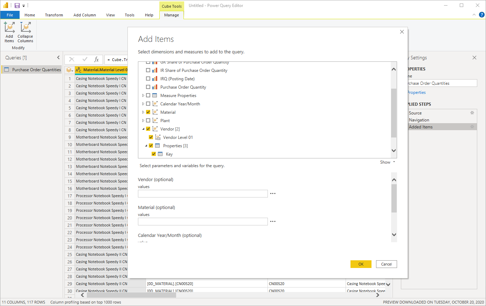
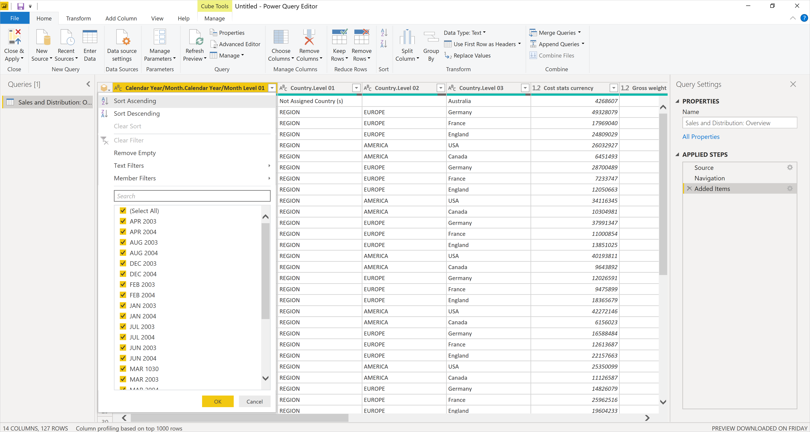
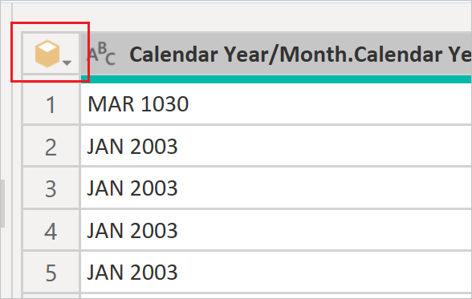
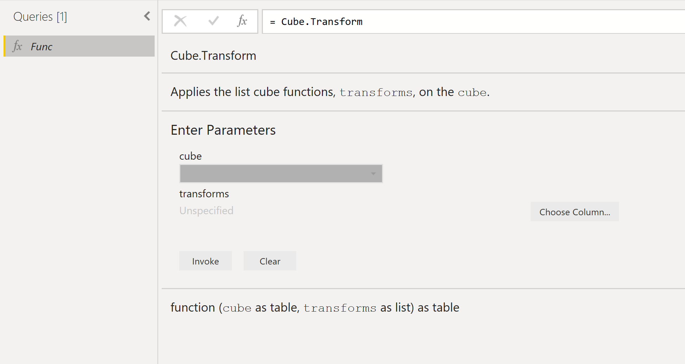

# Transform and filter an SAP BW dataset

With Power Query Editor, you can apply additional data transformations and filtering steps before you bring the dataset from SAP BW into the Power BI Desktop or Power Platform data model.

In Power Query Editor, the *Applied Steps* for the query are shown in the **Query Settings** pane on the right. To modify or review a step, select the gear icon next to a step.

For example, if you select the gear icon next to **Added Items**, you can review the selected data objects in SAP BW, or modify the specified query parameters. This way it's possible to filter a dataset using a characteristic that isn't included in the result set.

You can apply additional filters on the dataset by selecting the drop-down menu for one of the columns. 

Another easy way to set a filter is to right-click on one of the values in the table, then select **Member Filters** or **Text Filters**.

For example, you could filter the dataset to only include records for Calendar Year/Month FEB 2003, or apply a text filter to only include records where Calendar Year/Month contains 2003.

Not every filter will get folded into the query against SAP BW. You can determine if a filter is folded into the query by examining the icon in the top-left corner of the data table, directly above the number 1 of the first data record.

If the icon is a cube, then the filter is applied in the query against the SAP BW system.

If the icon is a table, then the filter isn't part of the query and only applied to the table.

Behind the UI of Power Query Editor, code is generated based on the M formula language for data mashup queries.

You can view the generated M code with the **Advanced Editor** option in the **View** tab.

To see a description for each function or to test it, right-click on the existing SAP BW query in the **Queries** pane and select **Create Function**. In the formula bar at the top, enter:

&nbsp;&nbsp;&nbsp;&nbsp;&nbsp;&nbsp;**= \<_function name_>**

where <_function name_> is the name of the function you want to see described. The following example shows the description of the `Cube.Transform` function.

The following examples show some descriptions of various cube functions:

* `Cube.Transform`: Applies the list of functions or transforms on the cube.
* `Cube.ApplyParameter`: Applies the specified values for a parameter.
* `Cube.DisplayFolders`: Returns a nested tree of objects representing the display folder hierarchy of the cube.
* `Cube.Parameters`: Returns a table with the set of parameters that can be applied to the cube.
* `Cube.Dimensions`: Returns a table with the set of dimensions for the cube.
* `Cube.Measures`: Returns a table with the set of measures for the cube.

### See also

* [Power Query M formula language reference](https://docs.microsoft.com/powerquery-m/)
* [Implementation details](implementation-details.md)