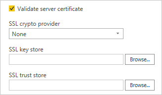
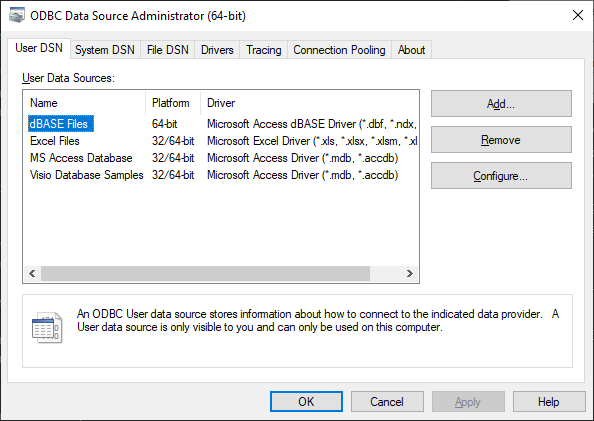
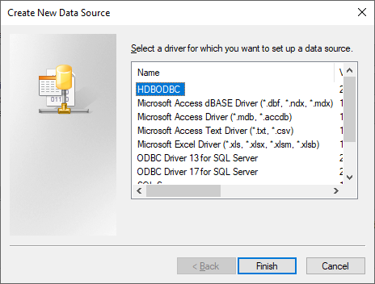
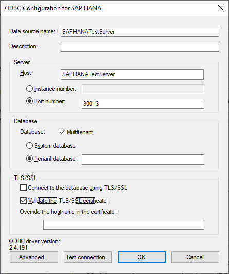

# Configure SSL for ODBC client access to SAP HANA

If you're connecting to an SAP HANA database from Power Query Online, you may need to set up various property values to connect. These properties could be the SSL crypto provider, an SSL key store, and an SSL trust store. You may also require that the connection be encrypted. In this case, you can use the ODBC Data Source Administrator application supplied with Windows to set up these properties.

In Power BI Desktop and Excel, you can set up these properties when you first sign in using the Power Query SAP HANA database connector. The **Validate server certificate** selection in the authentication dialog box is enabled by default. You can then enter values in the **SSL crypto provider**, **SSL key store**, and **SSL trust store** properties in this dialog box. However, all of the validate server certificate selections in the authentication dialog box in Power BI Desktop and Excel are optional. They're optional in case you want to use ODBC Data Source Administrator to set them up at the driver level. 

>[!Note]
> You must have the proper SAP HANA ODBC driver (32-bit or 64-bit) installed before you can set these properties in ODBC Data Source Administrator.

If you're going to use ODBC Data Source Administrator to set up the SSL crypto provider, SSL key store, and SSL trust store in Power BI or Excel, clear the **Validate server certificate** check box when presented with the authentication dialog box.

To use ODBC Data Source Administrator to set up the validate server certificate selections:

1. From the Windows Start menu, select **Windows Administrative Tools** > **ODBC Data Sources**. If you're using a 32-bit version of Power BI Desktop or Excel, open ODBC Data Sources (32-bit), otherwise open ODBC Data Sources (64-bit).

   

2.	In the **User DSN** tab, select **Add**.

3.	In the **Create New Data Source** dialog box, select the **HDBODBC** driver, and then select **Finish**.

    

4.	In the **ODBC Configuration for SAP HANA** dialog box, enter a **Data source name**. Then enter your server and database information, and select **Validate the TLS/SSL certificate**.

    

5.	Select the **Advanced** button.

6.	In the **Advanced ODBC Connection Property Setup** dialog box, select the **Add** button.

    

7.	In the **Add/Modify Connection Property** dialog box, enter **sslCryptoProvider** in the **Property** text box.

8.	In the **Value** text box, enter the name of the crypto provider you'll be using: either **sapcrypto**, **commoncrypto**, **openssl**, or **mscrypto**.

    

9.	Select **OK**.

10.	You can also add the optional sslKeyStore and sslTrustStore properties and values if necessary. If the connection must be encrypted, add **ENCRYPT** as the property and **TRUE** as the value.

11.	In the **Advanced ODBC Connection Property Setup** dialog box, select **OK**.

12.	To test the connection you’ve set up, select **Test connection** in the **ODBC Configuration for SAP HANA** dialog box.

13.	When the test connection has completed successfully, select **OK**.

>[!Note]
>If you select **Validate server certificate** in the SAP HANA authentication dialog box in Power BI Desktop or Excel, any values you enter in **SSL crypto provider**, **SSL key store**, and **SSL trust store** in the authentication dialog box will override any selections you've set up using ODBC Data Source Administrator.

