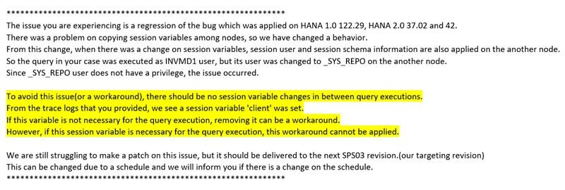

# Troubleshooting

The following section describes some issues that may occur while using the Power Query SAP HANA connector, along with some possible solutions.

## Known issues and limitations

There are a few limitations to using SAP HANA, shown below:

- NVARCHAR strings are truncated to a maximum length of 4000 Unicode characters.
- SMALLDECIMAL isn't supported.
- VARBINARY isn't supported.
- Valid Dates are between 1899/12/30 and 9999/12/31.

## Error: This connector requires one or more additional components to be installed

The connector looks for the driver in the registry, so if the driver wasn’t properly installed it won’t show up.

The registry key is:

`HKEY_LOCAL_MACHINE\Software\ODBC\ODBCINST.INI\ODBC Drivers`

If you’re on a 64-bit machine, but Excel or Power BI Desktop is 32-bit (like the screenshots below), you can check for the driver in the WOW6432 node instead:

`HKEY_LOCAL_MACHINE\Software\WOW6432Node\ODBC\ODBCINST.INI\ODBC Drivers`

Note that the driver needs to match the bit version of your Excel or Power BI Desktop. If you’re using:

* 32-bit Excel/Power BI Desktop, you'll need the 32-bit ODBC driver (HDBODBC32).
* 64-bit Excel/Power BI Desktop, you'll need the 64-bit ODBC driver (HDBODBC).

The driver is usually installed by running hdbsetup.exe.

Finally, the driver should also show up as "ODBC DataSources 32-bit" or "ODBC DataSources 64-bit".

## Collect SAP HANA ODBC Driver traces

To capture an SAP HANA trace:  

1. Open a command-line window.

2. Depending on your installation, you may need to go to C:\Program Files instead of C:\Program Files (x86). The command might also be hdbodbc_cons.exe instead of hdbodb_cons32.exe.

3. Type the following commands:

   **cd C:\Program Files (x86)\sap\hdbclient 
   hdbodbc_cons32.exe config trace api on 
   hdbodbc_cons32.exe config trace sql on 
   hdbodbc_cons32.exe config trace debug on 
   hdbodbc_cons32.exe config trace short on 
   hdbodbc_cons32.exe config trace packet 99999999999999 
   hdbodbc_cons32.exe config trace filename D:\tmp\odbctraces\hana-%p.html 
   hdbodbc_cons32.exe trace refresh 
   hdbodbc_cons32.exe show all**

4. Open Power BI, clear the cache, and rerun the scenario.

5. Once done, zip up the traces:

   * From the **Log File Path** in the **Tracing** tab of the ODBC Data Source Administrator.
   * From the HANA trace based on the path configured with the command **hdbodbc_cons32.exe config trace filename**.

6. Disable tracing by using the following command:

   **hdbodbc_cons.exe trace off**

When capturing an SAP HANA trace, note the following considerations:

* The trace commands should be run as the user that will be running the Mashup process that accesses the SAP HANA server.
* The trace file path you specify should be writable by the user that runs the Mashup process.

For example:

* To capture non-SSO connections from gateway, make sure you use the gateway service user. That is, run the command-line window as the gateway user when you want to execute the hdodbc_cons.exe calls. Make sure that the gateway server user can write to the log file location you specify.
* To capture SSO connections from Gateway, use the SSO user.

## SAP HANA: insufficient privilege

This message might be because of:

* The user legitimately not having enough privileges on the view they're trying to access.
* The following known issue:

   **Issue**: Not able to connect to SAP Hana from PBI Desktop using SAP client 2.0 37.02, but if you downgrade the client version to 1.00.120.128, it works.

   `ERROR MESSAGE: External error: ERROR [S1000] [SAP AG][LIBODBCHDB DLL][HDBODBC] General error;258 insufficient privilege: [2950] user is not authorized`

   *  Response from SAP:

      

   Unfortunately, this is an SAP issue so you'll need to wait for a fix from SAP.

