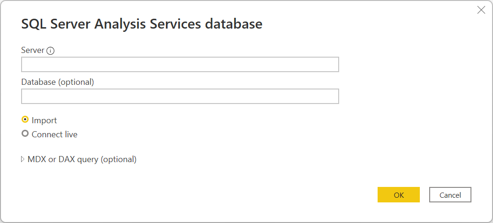
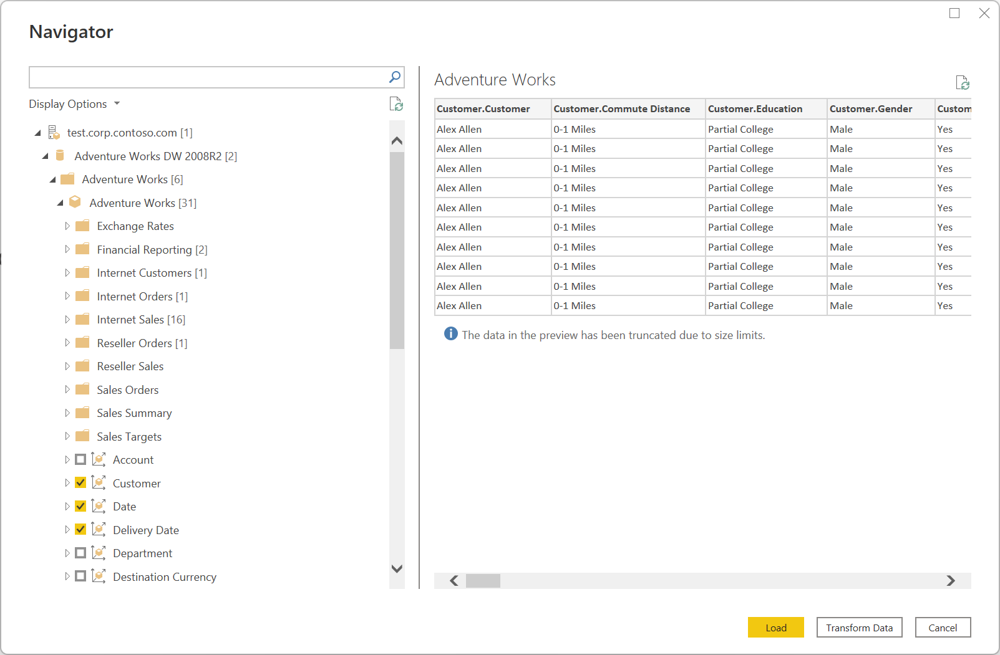
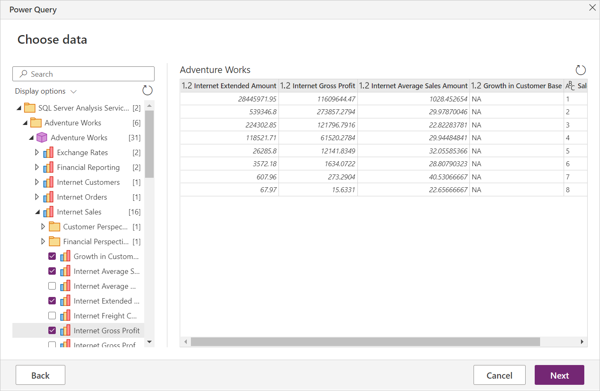

# SQL Server Analysis Services database

## Summary

| Item | Description |
| ---- | ----------- |
| Release State | General Availability |
| Products | Power BI (Datasets) Power Apps (Dataflows) Excel Analysis Services |
| Authentication Types Supported | Basic Microsoft account Organizational account Windows |
| M Function Reference | [Sql.Database](/powerquery-m/sql-database) [Sql.Databases](/powerquery-m/sql-databases) |

>[!Note]
> Some capabilities may be present in one product but not others due to deployment schedules and host-specific capabilities.

## Prerequisites

Analysis Services must be installed along with your SQL Server. For information about installing Analysis Services on your SQL Server, go to [Install SQL Server Analysis Services](/analysis-services/instances/install-windows/install-analysis-services). This connector article assumes that you've already installed Analysis Services on your SQL server and have an existing database on the server instance.

## Capabilities Supported

* Import
* Connect live (Power BI Desktop)
* Advanced options
  * MDX or DAX query

## Connect to SQL Server Analysis Services database from Power Query Desktop

To make the connection, take the following steps:

1. Select the **SQL Server Analysis Services database** option in the connector selection. More information: [Where to get data](../where-to-get-data.md)

2. In the **SQL Server Analysis Services database** dialog that appears, provide the name of the server and database (optional).

   

   >[!NOTE]
   > Only Power BI Desktop will display the **Import** and **Connect live** options. If you're connecting using Power BI Desktop, selecting **Connect live** uses a live connection to load the connected data directly to Power BI Desktop. In this case, you can't use Power Query to transform your data before loading the data to Power BI Desktop. For the purposes of this article, the **Import** option is selected. For more information about using a live connection in Power BI Desktop, go to [Connect to Analysis Services tabular data in Power BI Desktop](/power-bi/connect-data/desktop-analysis-services-tabular-data).

3. Select **OK**.

4. If you're connecting to this database for the first time, select the authentication type and input your credentials. Then select **Connect**.

   

5. In **Navigator**, select the database information you want, then either select **Load** to load the data or **Transform Data** to continue transforming the data in the Power Query editor.

   

## Connect to SQL Server Analysis Services database from Power Query Online

To make the connection, take the following steps:

1. Select the **SQL Server Analysis Services database** option in the connector selection. More information: [Where to get data](../where-to-get-data.md)

2. In the **Connect to data source** page, provide the name of the server and database (optional).

   

3. If needed, select an on-premises data gateway.

4. If you're connecting to this database for the first time, select the authentication kind and input your credentials.

5. Select **Next** to continue.

6. In **Navigator**, select the data you require, and then select **Transform data**.

   

## Connect using advanced options

Power Query provides an advanced option that you can add to your query if needed.

| Advanced option | Description |
| --------------- | ----------- |
| MDX or DAX statement | Optionally provides a specific MDX or DAX statement to the SQL Server Analysis Services database server to execute. |

Once you've entered a value in the advanced option, select **OK** in Power Query Desktop or **Next** in Power Query Online to connect to your SQL Server Analysis Services database.

## See also

* [Connect to Analysis Services tabular data in Power BI Desktop](/power-bi/connect-data/desktop-analysis-services-tabular-data)
* [Connect to SSAS multidimensional models in Power BI Desktop](/power-bi/connect-data/desktop-ssas-multidimensional)
* [Connect to datasets in the Power BI service from Power BI Desktop](/power-bi/connect-data/desktop-report-lifecycle-datasets)
