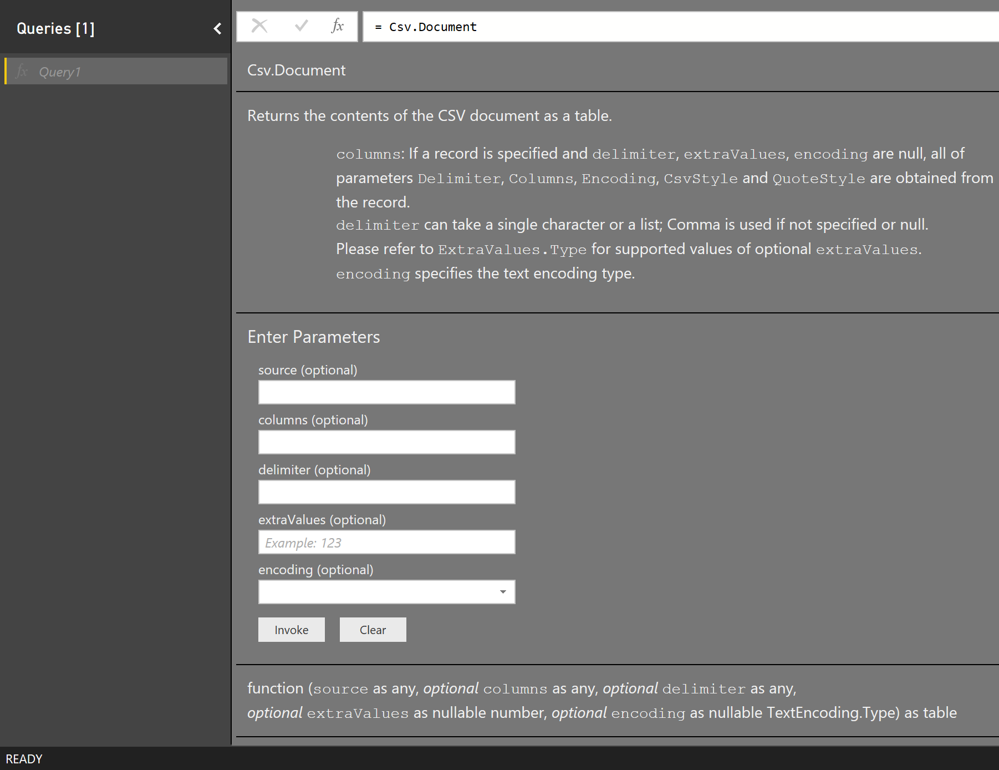
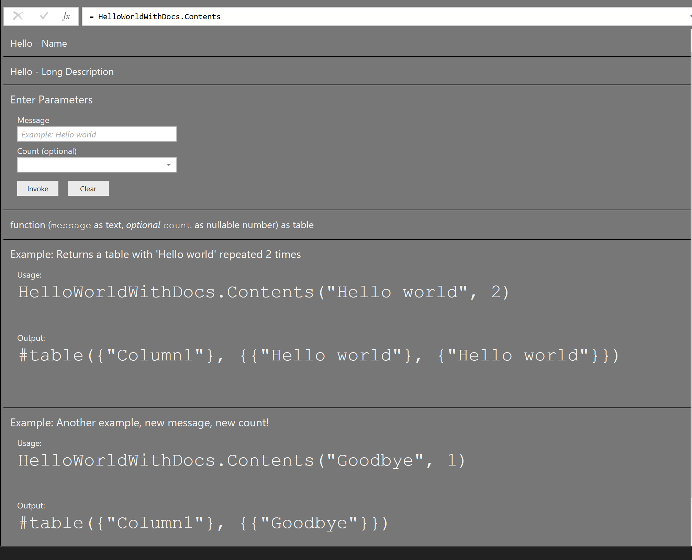

# Adding Function Documentation

Power Query will automatically generate an invocation UI for you based on the arguments for your function. By default, this UI will contain the name of your function, and an input for each of your parameters. 


Similarly, evaluating the name of your function, without specifying parameters, will display information about it. 


You might notice that built-in functions typically provide a better user experience, with descriptions, tooltips, and even sample values. You can take advantage of this same mechanism by defining specific meta values on your function type. This article describes the meta fields that are used by Power Query, and how you can make use of them in your extensions. 



## Function Types

You can provide documentation for your function by defining custom *type* values. The process looks like this:

1. Define a type for each parameter
2. Define a type for your function
3. Add various `Documentation.*` fields to your types metadata record
3. Call [Value.ReplaceType](https://msdn.microsoft.com/en-us/library/mt260838.aspx) to ascribe the type to your shared function

You can find more information about types and metadata values in the [M Language Specification](https://msdn.microsoft.com/library/mt807488.aspx).

Using this approach allows you to supply descriptions and display names for your function, as well as individual parameters. You can also supply sample values for parameters, as well as defining a preset list of values (turning the default text box control into a drop down).

The Power Query experience retrieves documentation from meta values on the type of your function, using a combination of calls to [Value.Type](https://msdn.microsoft.com/en-us/library/mt260827), [Type.FunctionParameters](https://msdn.microsoft.com/en-us/library/mt260943), and [Value.Metadata](https://msdn.microsoft.com/en-us/library/mt260829).

### Function Documentation
The following table lists the Documentation fields that can be set in the metadata for your *function*. All fields are optional.

| Field                         | Type    | Details                                                                                                                                                                                                                                                                                                                    |
|:------------------------------|:--------|:---------------------------------------------------------------------------------------------------------------------------------------------------------------------------------------------------------------------------------------------------------------------------------------------------------------------------|
| Documentation.Examples        | list    | List of record objects with example usage of the function. Only displayed as part of the function info. Each record should contain the following optional text fields: `Description`, `Code`, `Result`. |
| Documentation.LongDescription | text    | Full description of what the function does, displayed in the function info. |
| Documentation.Na<i></i>me     | text    | Text to display across the top of the function invocation dialog. |

### Parameter Documentation
The following table lists the Documentation fields that can be set in the metadata for your *function parameters*. All fields are optional.

| Field                          | Type    | Details                                                                                                                                                                                                                                                                                                                    |
|:-------------------------------|:-------|:-----------------------------------------------------------------------------------------------------------------------------------------------------------------------------------------------------------------------|
| Documentation.AllowedValues    | list   | List of valid values for this parameter. Providing this field will change the input from a textbox to a drop down list. Note, this does not prevent a user from manually editing the query to supply alternate values. |
| Documentation.FieldCaption     | text   | Friendly display name to use for the parameter.                                                                                                                                                                        |
| Documentation.FieldDescription | text   | Description to show next to the display name.                                                                                                                                                                          |
| Documentation.SampleValues     | list   | List of sample values to be displayed (as faded text) inside of the text box.                                                                                                                                          |

### Example
The following code snippet (and resulting dialogs) are from the [HelloWorldWithDocs](https://github.com/Microsoft/DataConnectors/tree/master/samples/HelloWorldWithDocs) sample.

```
[DataSource.Kind="HelloWorldWithDocs", Publish="HelloWorldWithDocs.Publish"]
shared HelloWorldWithDocs.Contents = Value.ReplaceType(HelloWorldImpl, HelloWorldType);

HelloWorldType = type function (
    message as (type text meta [
        Documentation.FieldCaption = "Message",
        Documentation.FieldDescription = "Text to display",
        Documentation.SampleValues = {"Hello world", "Hola mundo"}
    ]),
    optional count as (type number meta [
        Documentation.FieldCaption = "Count",
        Documentation.FieldDescription = "Number of times to repeat the message",
        Documentation.AllowedValues = { 1, 2, 3 }
    ]))
    as table meta [
        Documentation.Name = "Hello - Name",
        Documentation.LongDescription = "Hello - Long Description",
        Documentation.Examples = {[
            Description = "Returns a table with 'Hello world' repeated 2 times",
            Code = "HelloWorldWithDocs.Contents(""Hello world"", 2)",
            Result = "#table({""Column1""}, {{""Hello world""}, {""Hello world""}})"
        ],[
            Description = "Another example, new message, new count!",
            Code = "HelloWorldWithDocs.Contents(""Goodbye"", 1)",
            Result = "#table({""Column1""}, {{""Goodbye""}})"
        ]}
    ];

HelloWorldImpl = (message as text, optional count as number) as table =>
    let
        _count = if (count <> null) then count else 5,
        listOfMessages = List.Repeat({message}, _count),
        table = Table.FromList(listOfMessages, Splitter.SplitByNothing())
    in
        table;
```

This code results in the following dialogs in Power BI. 

**Function invocation**


**Function info**

