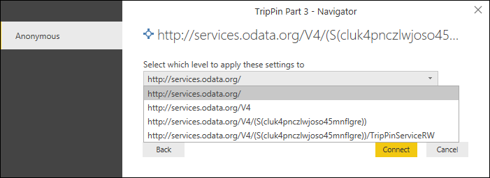

# Handling Resource Path

The M engine identifies a data source using a combination of its *Kind* and *Path*. When a data source is encountered during a query evaluation, the M engine will try to find matching credentials. If no credentials are found, the engine returns a special error which results in a credential prompt in Power Query.

The *Kind* value comes from [Data Source Kind] definition.

The *Path* value is derived from the *required parameters* of your data source function(s). Optional parameters are not factored into the data source path identifier. As a result, all data source functions associated with a data source kind must have the same parameters. There is special handling for functions that have a single parameter of type `Uri.Type`. See below for further details.

You can see an example of how credentials are stored in the *Data source settings* dialog in Power BI Desktop. In this dialog, the Kind is represented by an icon, and the Path value is displayed as text.


> **Note:** If you change your data source function's required parameters during development, previously stored credentials will no longer work (because the path values no longer match). You should delete any stored credentials any time you change your data source function parameters. If incompatible credentials are found, you may receive an error at runtime.

## Data Source Path Format

The *Path* value for a data source is derived from the data source function's required parameters.

By default, you can see the actual string value in the Data source settings dialog in Power BI Desktop, and in the credential prompt. if the Data Source Kind definition has included a `Label` value, you will see the label value instead.

For example, the data source function in the [HelloWorldWithDocs sample] has the following signature:

```
HelloWorldWithDocs.Contents = (message as text, optional count as number) as table => ...
```

The function has a single required parameter (`message`) of type `text`, and will be used to calculate the data source path. The optional parameter (`count`) will be ignored. The path would be displayed as follows:

### Credential prompt:


### Data source settings UI:


When a Label value is defined, the data source path value would not be shown:


> **Note:** We currently recommend that you *do not* inlcude a Label for your data source if your function has required parameters, as users will not be able to distinguish between the different credentials they have entered. We are hoping to improve this in the future (i.e., allowing data connectors to display their own custom data source paths).

## Functions with an Uri parameter

Because data sources with an Uri-based identifier are so common, there is special handling in the Power Query UI when dealing with Uri-based data source paths. When an Uri-based data source is encountered, the credential dialog provides a dropdown allowing the user to select the base path, rather than the full path (and all paths in-between).



As `Uri.Type` is an *ascribed type* rather than a *primitive type* in the M language, you will need to use the [Value.ReplaceType] function in indicate that your text parameter should be treated as a Uri.

```
shared GithubSample.Contents = Value.ReplaceType(Github.Contents, type function (url as Uri.type) as any);
```

[Data Source Kind]: https://github.com/Microsoft/DataConnectors/blob/master/docs/m-extensions.md#data-source-kind

[HelloWorldWithDocs sample]: https://github.com/Microsoft/DataConnectors/blob/master/samples/HelloWorldWithDocs

[Value.ReplaceType]: https://msdn.microsoft.com/library/mt260838
