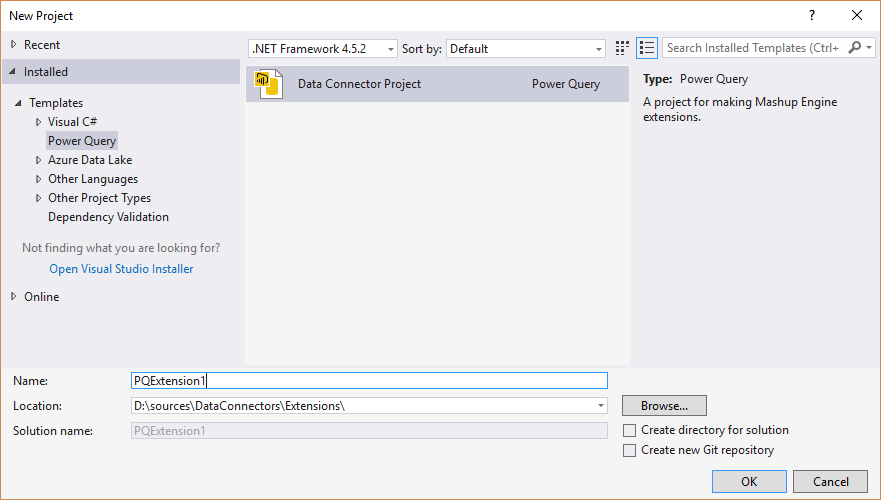

# Installing the Power Query SDK

## Quickstart

> [!Note] 
>The steps to enable extensions changed in the June 2017 version of Power BI Desktop.

1. Install the [Power Query SDK](https://aka.ms/powerquerysdk) from the Visual Studio Marketplace.
2. Create a new data connector project.
3. Define your connector logic.
4. Build the project to produce an extension file.
5. Copy the extension file into [Documents]/Power BI Desktop/Custom Connectors.
6. Check the option **(Not Recommended) Allow any extension to load without validation or warning** in Power BI Desktop (under *File | Options and settings | Options | Security | Data Extensions*).
7. Restart Power BI Desktop.

## Distribution of Data Connectors

Power BI Desktop users can download extension files and place them in a known directory (steps described above). Power BI Desktop will automatically load the extensions on restart.

## Additional links and resources
* [M Library Functions](/powerquery-m/power-query-m-function-reference)
* [M Language Specification](/powerquery-m/power-query-m-language-specification)
* [Power BI Developer Center](https://powerbi.microsoft.com/developers/)
* [Data Connector Tutorial](samples/TripPin/README.md)

## Step by step

### Creating a new extension in Visual Studio
Installing the Power Query SDK for Visual Studio will create a new Data Connector project template in Visual Studio.

This creates a new project containing the following files:

* Connector definition file (\<connectorName>.pq)
* A query test file (\<connectorName>.query.pq)
* A string resource file (resources.resx)
* PNG files of various sizes used to create icons

Your connector definition file will start with an empty Data Source description. See the Data Source Kind section later in this document for details.

### Testing in Visual Studio

The Power Query SDK provides basic query execution capabilities, allowing you to test your extension without having to switch over to Power BI Desktop. See [Query File](#query-file)  for more details.

### Build and deploy from Visual Studio

Building your project will produce your .pqx file.

Data Connector projects don't support custom post build steps to copy the extension file to your [Documents]\Microsoft Power BI Desktop\Custom Connectors directory. If this is something you want to do, you may want to use a third party Visual Studio extension, such as Auto Deploy.

### Extension files

Power Query extensions are bundled in a ZIP file and given a .mez file extension. At runtime, Power BI Desktop will load extensions from the [Documents]\Microsoft Power BI Desktop\Custom Connectors.

>[!Note]
> In an upcoming change the default extension will be changed from .mez to .pqx.

### Extension file format

Extensions are defined within an M section document. A section document has a slightly different format from the query document(s) generated in Power Query. Code you import from Power Query typically requires modification to fit into a section document, but the changes are minor. Section document differences you should be aware of include:

* They begin with a section declaration (for example, `section HelloWorld;`).
* Each expression ends with a semi-colon (for example, `a = 1;` or `b = let c = 1 + 2 in c;`).
* All functions and variables are local to the section document, unless they are marked as shared. Shared functions become visible to other queries/functions, and can be thought of as the exports for your extension (that is, they become callable from Power Query).

More information about M section documents can be found in the M Language specification.

### Query File
In addition to the extension file, Data Connector projects can have a query file (name.query.pq). This file can be used to run test queries within Visual Studio. The query evaluation will automatically include your extension code, without having to register your .pqx file, allowing you to call/test any shared functions in your extension code.

The query file can contain a single expression (for example, `HelloWorld.Contents()`), a `let` expression (such as what Power Query would generate), or a section document.
