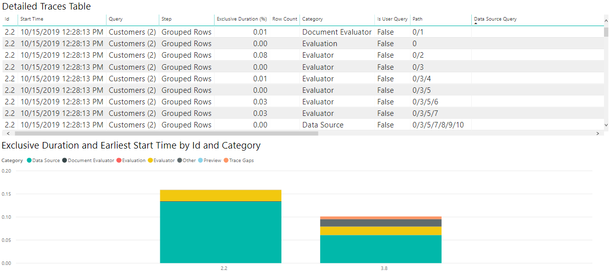
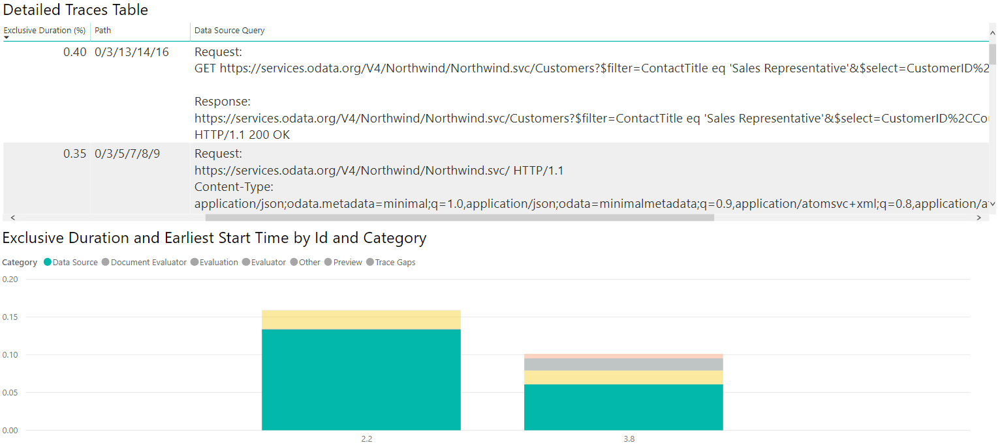
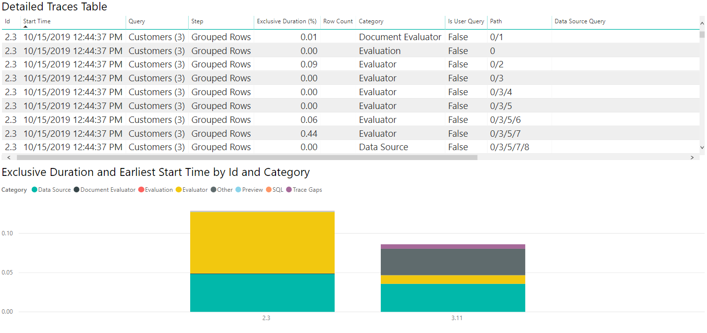

## Introduction

Once you've [recorded](RecordingQueryDiagnostics.md) the diagnostics you want to use, the next step is being able to understand what they say.

It's helpful to have a good understanding of what exactly each column in the query diagnostics schema means, which we're not going to repeat in this short tutorial. There's a full writeup of that [here](QueryDiagnostics.md).

In general, when building visualizations, it's better to use the full detailed table because regardless of how many rows it is, what you're probably looking at is some kind of depiction of how the time spent in different resources adds up, or what the native query emitted was.

As mentioned in our article on recording the diagnostics, I'm working with the OData and SQL traces for the same table (or very nearly so)--the Customers table from Northwind. In particular, I'm going to focus on common ask from our customers, as well as one of the most easy to interpret sets of traces: full refresh of the data model.

## Building the visualizations

When going through traces, there are a lot of ways you can evaluate them. In this article we're going to focus on a two visualization split--one to show the details you care about, and the other to easily look at time contributions of various factors. For the first visualization, a table is used. You can pick any fields you like, but the ones recommended for an easy, high level look at what's going on are:

* Id
* Start Time
* Query
* Step
* Data Source Query
* Exclusive Duration (%)
* Row Count
* Category
* Is User Query

For the second visualization, one choice is to use a Stacked Column Chart. In the 'Axis' parameter, you might want to use 'Id' or 'Step'. If we're looking at the Refresh, because it doesn't have anything to do with steps in the Editor itself, we probably just want to look at 'Id'. For the 'Legend' parameter you should set 'Category' or 'Operation' (depending on the granularity you want). For the 'Value', set 'Exclusive Duration' (and make sure it's not the %, so that you get the raw duration value). Finally, for the Tooltip, set 'Earliest Start Time'.

Once your visualization is built, make sure you sort by 'Earliest Start Time' ascending so you can see the order things happen in.




While your exact needs might differ, this combination of charts is a good place to start for looking at a lot of diagnostics files and for a number of purposes.

## Interpreting the visualizations

As mentioned above, there's a lot of questions you can try to answer with query diagnostics, but the two that we see the most often are asking how time is spent, and asking what the query sent to the source is.

Asking how the time is spent is easy, and will be very similar for most connectors. A warning with query diagnostics, as mentioned elsewhere, is that you'll see drastically different capabilities depending on the connector. For example, many ODBC based connectors won't have an accurate recording of what query is sent to the actual back-end system, as Power Query only sees what it sends to the ODBC driver.

If we want to see how the time is spent, we can just look at the visualizations we built above.

Now, because the time values for the sample queries we're using here are so small, if we want to work with how Power BI reports time it's better if we convert the Exclusive Duration column to 'Seconds' in the Power Query editor. Once we do this, we can look at our chart and get a pretty decent idea of where time is spent.

For my OData results, I see in the image that the vast majority of the time spent was retrieving the data from source--if I click on the 'Data Source' item on the legend, it'll show me all of the different operations related to sending a query to the Data Source.



If we perform all the same operations and build similar visualizations, but with the SQL traces instead of the ODATA ones, we can see how the two data sources compare!



If we click the Data Source table, like with the ODATA diagnostics we can see the first evaluation (2.3 in this image) emits metadata queries, with the second evaluation actually retrieving the data we care about. Because we're retrieving very little data in this case the data pulled back takes very little time (less than a tenth of a second for the entire second evaluation to happen, with less than a twentieth of a second for data retrieval itself), but that won't be true in all cases.

As above, we can click the 'Data Source' category on the legend to see the emitted queries.

### Digging into the data

When you're looking at this, if it seems like time spent is strange--for example, on the OData query you might see that there's a Data Source Query with the following value:

```Request:
https://services.odata.org/V4/Northwind/Northwind.svc/Customers?$filter=ContactTitle%20eq%20%27Sales%20Representative%27&$select=CustomerID%2CCountry HTTP/1.1
Content-Type: application/json;odata.metadata=minimal;q=1.0,application/json;odata=minimalmetadata;q=0.9,application/atomsvc+xml;q=0.8,application/atom+xml;q=0.8,application/xml;q=0.7,text/plain;q=0.7

<Content placeholder>

Response:
Content-Type: application/json;odata.metadata=minimal;q=1.0,application/json;odata=minimalmetadata;q=0.9,application/atomsvc+xml;q=0.8,application/atom+xml;q=0.8,application/xml;q=0.7,text/plain;q=0.7
Content-Length: 435

<Content placeholder>
```

This Data Source Query is associated with an operation that only takes up, say, 1% of the Exclusive Duration. Meanwhile, there's a very similar one:

```
Request:
GET https://services.odata.org/V4/Northwind/Northwind.svc/Customers?$filter=ContactTitle eq 'Sales Representative'&$select=CustomerID%2CCountry HTTP/1.1

Response:
https://services.odata.org/V4/Northwind/Northwind.svc/Customers?$filter=ContactTitle eq 'Sales Representative'&$select=CustomerID%2CCountry
HTTP/1.1 200 OK
```

This Data Source Query is associated with an operation that takes up nearly 75% of the Exclusive Duration. If you turn on the path, you discover the latter is actually a child of the former. This means that the first query basically added very little time on its own, with the actual data retrieval being tracked by the 'inner' query.

These are extreme values, but they're within the bounds of what might be seen.
