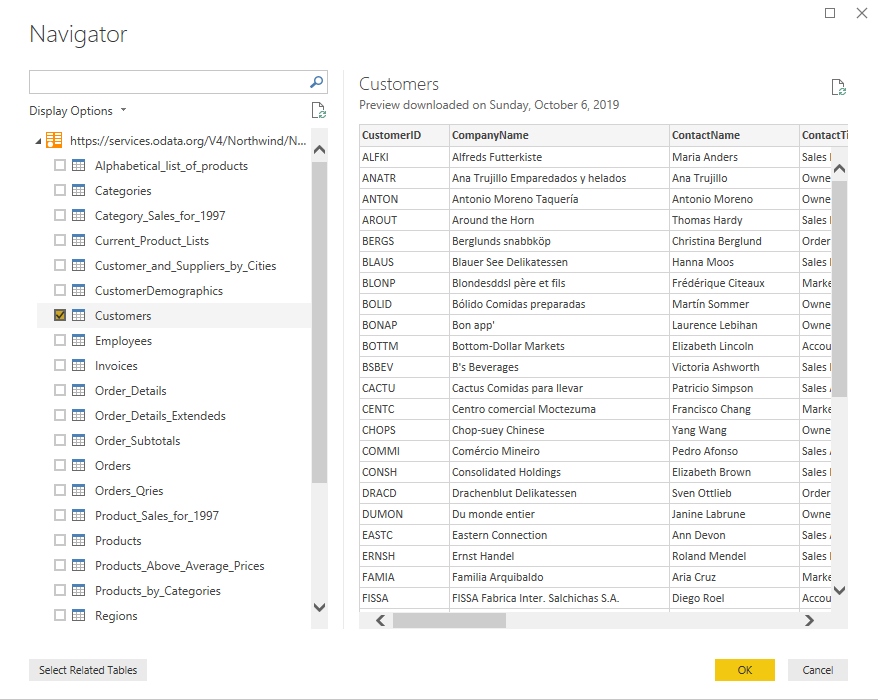
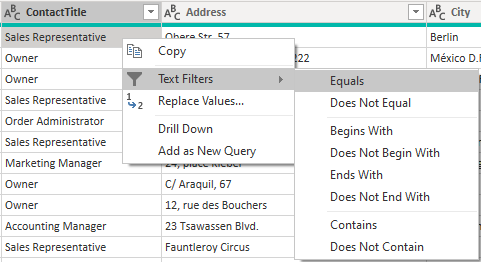
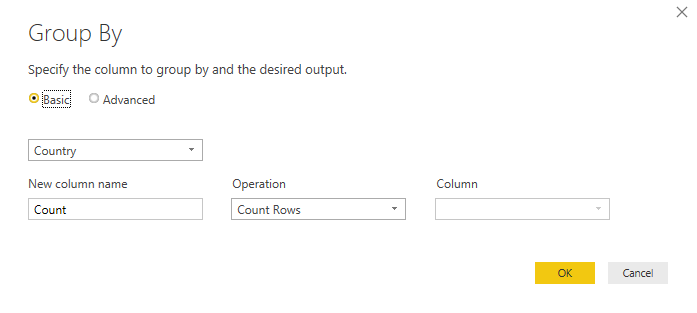
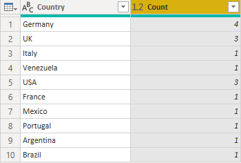
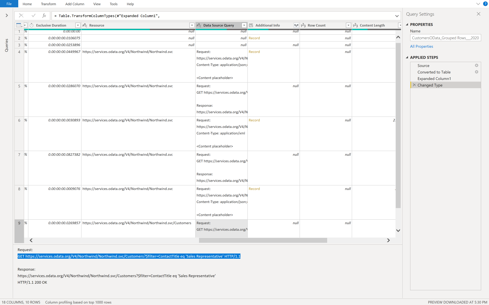

# Recording Query Diagnostics in Power BI

When authoring in Power Query, the basic workflow is that you connect to a data source, apply some transformations, potentially refresh your data in the Power Query editor, and then load it to the Power BI model. Once it's in the Power BI model, you may refresh it from time to time in Power BI Desktop (if you're using Desktop to view analytics), aside from any refreshes you do in the service.

While you may get a similar result at the end of an authoring workflow, refreshing in the editor, or refreshing in Power BI proper, very different evaluations are run by the software for the different user experiences provided. It's important to know what to expect when doing query diagnostics in these different workflows so you aren't surprised by the very different diagnostic data.

To start Query Diagnostics, go to the 'Tools' tab in the Power Query Editor ribbon. You're presented here with a few different options. 

There are two primary options here, 'Diagnose Step' and 'Start Diagnostics' (paired with 'Stop Diagnostics'). The former will give you information on a query up to a selected step, and is most useful for understanding what operations are being performed locally or remotely in a query. The latter gives you more insight into a variety of other cases, discussed below.

## Connector Specifics

It's important to mention that there is no way to cover all the different permutations of what you'll see in Query Diagnostics. There are lots of things that can change exactly what you see in results:

* Connector
* Transforms applied
* System that you're running on
* Network configuration
* Advanced configuration choices
* ODBC configuration

For the most broad coverage this documentation will focus on Query Diagnostics of the Northwind Customers table, both on SQL and OData. The OData notes use the public endpoint found at [the OData.org website](https://services.odata.org/V4/Northwind/Northwind.svc/), while you'll need to provide a SQL server for yourself. Many data sources will differ significantly from these, and will have connector specific documentation added over time.

## Start / Stop Diagnostics

'Start Diagnostics' and 'Stop Diagnostics' are more broadly applicable than 'Diagnose Step', but will also give you a lot more information that you'll need to sort through. For example, starting diagnostics, refreshing a preview, and then stopping will give you equivalent information to running Diagnose Step on every step (due to how Power Query works in the editor to refresh each step independently). 

To start recording, click 'Start Diagnostics', perform whatever evaluations you want (authoring, preview refresh, full refresh), and then click 'Stop Diagnostics'.

### Authoring

The authoring workflow's primary difference is that it will generally generate more individual evaluations than seen in other workflows. As discussed in the primary Query Diagnostics article, these are a result of populating various user interfaces such as the navigator or filter dropdowns.

We're going to walk through an example. We're using the OData connector in this sample, but when reviewing the output we'll also look at the SQL version of the same database. For both data sources, we're going to connect to the data source via 'New Source', 'Recent Sources', or 'Get Data'. For the SQL connection you'll need to put in credentials for your server, but for the public OData endpoint you can put in the endpoint linked above.

Once you connect and choose authentication, select the 'Customers' table from the OData service.

This will present you with the Customers table in the Power Query interface. Let's say that we want to know how many Sales Representatives there are in different countries. First, right click on 'Sales Representative' under the 'Contact Title' column, mouse over 'Text Filters', and select 'Equals'.

Now, select 'Group By' from the Ribbon and do a grouping by 'Country', with your aggregate being a 'Count'.

This should present you with the same data you see below.

Finally, navigate back to the 'Tools' tab of the Ribbon and click 'Stop Diagnostics'. This will stop the tracing and build your diagnostics file for you, and the summary and detailed tables will appear on the left-hand side.

If you trace an entire authoring session, you will generally expect to see something like a source query evaluation, then evaluations related to the relevant navigator, then at least one query emitted for each step you apply (with potentially more depending on the exact UX actions taken). In some connectors, parallel evaluations will happen for performance reasons that will yield very similar sets of data.

### Refresh Preview

When you have finished transforming your data, you have a sequence of steps in a query. When you press 'Refresh Preview' or 'Refresh All' in the Power Query editor, you won't see just one step in your query diagnostics. The reason for this is that refreshing in the Power Query Editor explicitly refreshes the query ending with the last step applied, and then steps back through the applied steps and refreshes for the query up to that point, back to the source.

This means that if you have five steps in your query, including Source and Navigator, you will expect to see five different evaluations in your diagnostics. The first one, chronologically, will often (but not always) take the longest. This is due to two different reasons:

* It may potentially cache input data that the queries run after it (representing earlier steps in the User Query) can access faster locally.
* It may have transforms applied to it that significantly truncate how much data has to be returned.

Note that when talking about 'Refresh All' that it will refresh all queries and you'll need to filter to the ones you care about, as you might expect.

### Full Refresh

Query Diagnostics can be used to diagnose the so-called 'final query' that is emitted during the Refresh in Power BI, rather than just the Power Query editor experience. To do this, you first need to load the data to the model once. If you are planning to do this, make sure that you realize that if you press 'Close and Apply' that the editor window will close (interrupting tracing) so you either need to do it on the second refresh, or click the dropdown icon under 'Close and Apply' and press 'Apply' instead.

Either way, make sure to press 'Start Diagnostics' on the Diagnostics section of the 'Tools' tab in the editor. Once you've done this refresh your model, or even just the table you care about.

Once it's done loading the data to model, press 'Stop' diagnostics.

You can expect to see some combination of metadata and data queries. Metadata calls grab the information it can about the data source. Data retrieval is about accessing the data source, emitting the final built up Data Source Query with folded down operations, and then performing whatever evaluations are missing on top, locally.

It's important to note that just because you see a resource (database, web endpoint, etc.) or a data source query in your diagnostics, it doesn't mean that it's necessarily performing network activity. Power Query may retrieve this information from its cache. In future updates, we will indicate whether or not information is being retrieved from the cache for easier diagnosis.

## Diagnose Step

'Diagnose Step' is more useful for getting an insight into what evaluations are happening up to a single step, which can help you identify, up to that step, what performance is like as well as what parts of your query are being performed locally or remotely.

If you used 'Diagnose Step' on the query we built above, you'll find that it only returns 10 or so rows, and if we look at the last row with a Data Source Query we can get a pretty good idea of what our final emitted query to the data source will be. In this case, we can see that Sales Representative was filtered remotely, but the grouping (by process of elimination) happened locally.

If you start and stop diagnostics and refresh the same query, we get 40 rows due to the fact that, as mentioned above, Power Query is getting information on every step, not just the final step. This makes it harder when you're just trying to get insight into one particular part of your query.

## Additional Reading

[An introduction to the feature](QueryDiagnostics.md)

[More about reading and visualizing your recorded traces](ReadingQueryDiagnostics.md)

[How to understand what query operations are folding using Query Diagnostics](QueryDiagnosticsFolding.md)
