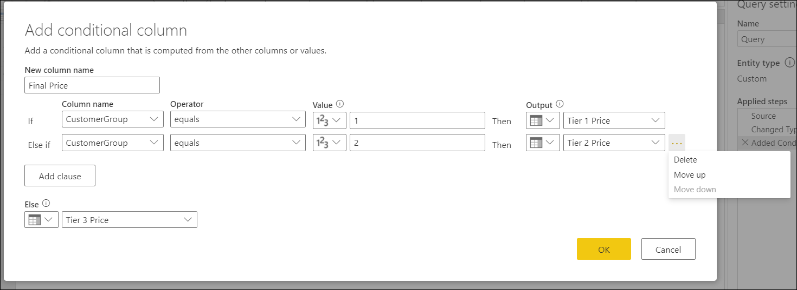

# Add a conditional column

With Power Query, you can add a conditional column to your query by defining IF-THEN-ELSE conditions in your query. When the conditions are fulfilled, the conditional column will automatically display the values that you specified.

The **Conditional column** option is located in the **Add column** tab of the Power Query ribbon, inside the **General** group.

## To add a conditional column

For demonstration purposes, you'll be using the following table:

In this table, you have a field that gives you the **CustomerGroup**. You also have different prices applicable to that customer in the **Tier 1 Price**, **Tier 2 Price**, and **Tier 3 Price** fields. In this example, your goal is to create a new column with the name **Final Price** based on the value found in the **CustomerGroup** field. If the value in the **CustomerGroup** field is equal to 1, then you want to use the value from the **Tier 1 Price** field, else you use the value from the **Tier 3 Price**.   

To add this conditional column, select **Conditional column** button. A new window called **Add conditional column** will appear. In this window you can define three sections numbered in the following image:

The following ordered list will get into the details of each section inside the *Add conditional column* window shown in the previous image where each number represents the section shown in the previous image:

1. **New column name**&mdash;you can define the name of your new column. In this case, you'll use the name **Final Price**.
2. **Conditional clauses**&mdash;where you define your conditional clauses. You can add more clauses by selecting the **Add clause** button. Each conditional clause will be tested on the order shown in the window from top to bottom. Each clause has four parts:
   - **Column name**&mdash;from the dropdown, select the column to be used for the conditional test. For this demonstration, the column that you want to use is **CustomerGroup**.  
   - **Operator**&mdash;select type of test or operator for the conditional test. For this demonstration, the value from the CustomerGroup has to be equal to 1, so select **equals** from the dropdown list of operators. 
   - **Value**&mdash;you can enter a value or select a column to be used for the conditional test.  For this demonstration, this value will be 1.
   - **Output**&mdash;if the test is positive, then the value entered here or the column selected will be the Output. For this demonstration, if the **CustomerGroup** value is equal to 1, then your Output value should be the value from the **Tier 1 Price** column.
3. **Final Else clause**&mdash;if none of the clauses above yield a positive test, the output of this operation will be the one defined here, as a manually entered value or a value from a column. In this case, the output will be the value from the **Tier 3 Price** column.

The result of that operation will give you a new **Final Price** column.

>[!Note]
> New conditional columns will not have a data type defined. You can add a new step to define a data type for this newly created column by following this article on [data types](data-types.md).

### Adding and organizing multiple clauses

For demonstration purposes, let's change your goal. Your new conditional clauses are:
* If the value from the **CustomerGroup** column is equal to 1, then the Output shall be the value from the **Tier 1 Price** column,
* If the value from the **CustomerGroup** column is equal to 2, then the Output shall be the value from the **Tier 2 Price** column.
* If none of the previous tests are positive, then the Output shall be the value from the **Tier 3 Price** column.

>[!Note]
> At the end of each clause you'll have a contextual button (shown as three dots) that will allow you to delete, move up, and move down your clauses.

The result of that operation will give you the result that you were looking.

