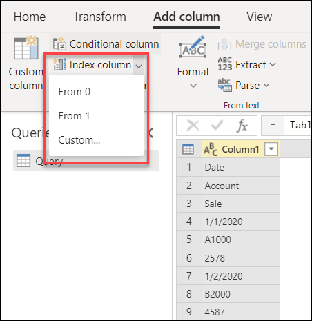
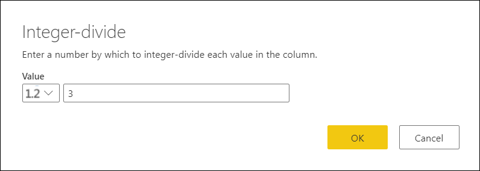

# Add an index column

The 'Add an index column' operation adds a new column named 'Index' to the table with explicit position values. 

By default the starting index will start from the value 0 and have an increment of 1 per row.

We can also configure the behavior of this step by selecting the "Custom..." option and configuring the two parameters:
* **Starting Index** - the initial index value. 
* **Increment** - specifies how much to increment each index value

## Example

The 'Index column' is usually created to support other transformation patterns. In this example we'll see one of those patterns.

We have the following table with only 1 column, but notice the data pattern within the column:

Our goal is to transform that table into the following with the columns Date, Account and Sale:

### Add Index column

To do this, we first need to add a new Index column to our table that starts from 0:

### Add Modulo column from Index column

The next step is to select the newly added index column, go to the 'Add column' tab and select the 'Modulo' operation from the 'Standard' dropdown menu inside the 'From number' group:

Inside the 'Modulo' window, we enter the number from which to find the remainder for each value in the column. In our case, our pattern repeats itself every 3 rows, so we enter the value 3:

The result of that operation will give us a new column called 'Modulo' as shown in the next image:

### Add Integer-divide column from Index column

We now select the index column, and go to the 'Add column' tab and select the 'Divide (integer)' operattion from the 'Standard' dropdown menu inside the 'From number' grou:

Inside the 'Integer-divide' window, we enter a number by which to integer-divide each value in the column. In our case, our pattern repeats itself every 3 rows, so we enter the value 3:

After removing the Index column, as we no longer need it, our table looks like this:

### Pivot a column

Our table now has 3 columns where:
* **Column1** - contains the values that should be inside the final table
* **Modulo** - provides the column position of the value (similar to the y coordinates of an xy chart )
* **Integer-division** - provides the row position of the value (similar to the x coordinates of an xy chart )

To achieve our desired table, we need to pivot the Modulo column using the values from 'Column1' where these values do not get aggregated. We go to the 'Transform' tab, select the 'Modulo' column and click the 'Pivot column' icon from the 'Any column' group. Inside the 'Pivot column' window, we select the Advanced section and make sure that the value column is set to 'Column1' and the 'Aggregate values function' to "Don't aggregate":

>[!Note]
>You can read more about the Pivot column operation inside of Power Query from the article [Pivot columns](pivot-columns.md).

The result of that operation will give us a table with 4 columns as shown in the next image:

### Cleaning the table

We can now delete the 'Integer-division' column and promote the first row of the table to become the headers of our table.

 >[!Note]
>You can read more about the Promote headers operation inside of Power Query from the article [Promote / Demote Headers](table-promote-demote-headers.md).

After defining the correct data types for our columns, our final table has exactly the 3 columns that we needed and the shape that we were looking for:

