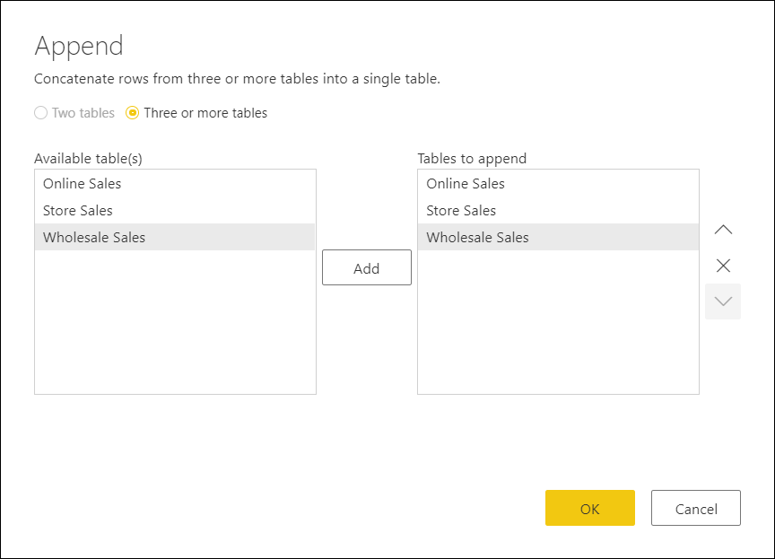

# Append data

In Power Query, you can append multiple tables into a single table. The append operation creates a new table schema from all the column headers from the tables to be combined and appends the tables one on top of the other into a single table.

## To append queries

You can find the **Append queries** option in the **Home** tab under the **Combine** group. From the dropdown, you'll see two options:

* **Append queries**&mdash;displays the **Append** window with the currently selected query as the initial table, also called the primary table, to be appended.
* **Append queries as new**&mdash;displays the **Append** window without any preselected tables for the append operation.

The append operation requires at least two tables. The **Append** window has two modes:
* **Two tables**&mdash;the default behavior, where you select a primary table and a table to be appended to the primary table.

* **Three or more tables**&mdash;an optional behavior, where you select the tables to be combined from a list of available tables.

>[!Note]
>The tables will be appended in the order in which they are selected, starting with the **Primary table** for the *two tables* mode and from the first table in the **Tables to append** list for the *three or more tables* mode.

### Append two tables

For demonstration purposes, this article will be using two tables with sample data:

* **Online Sales**&mdash;sales made through an online channel.

* **Store Sales**&mdash;sales made through the company's physical locations.

To append these tables, first select the **Online Sales** table. Select the **Append** button, which will create a new step inside the **Online Sales** query. The **Online Sales** table will be the primary table and the table to append to the primary table will be the **Store Sales**.

Power Query performs the append operation based on the names of the column headers found on both tables and not on their ordinal position. The final appended table will have all columns from all tables appended. 

In the event that one table doesn't have columns found in another table, `null` values will appear in the corresponding column, as shown in the **Referer** column of the final query.

### Append three or more tables

In this demonstration, you want to not only append the **Online Sales** and **Store Sales** tables, but also a new table called **Wholesale Sales**:

The new approach for this example is to select the **Append queries as new** option and then select the *Three or more tables* mode. From this **Append** window, you can select from the **Available table(s)** list the tables that you want to append. Once selected, the tables to append will appear on the list to the right under the **Tables to append** section.

After selecting **OK**, a new query will be created with all of our tables appended.

