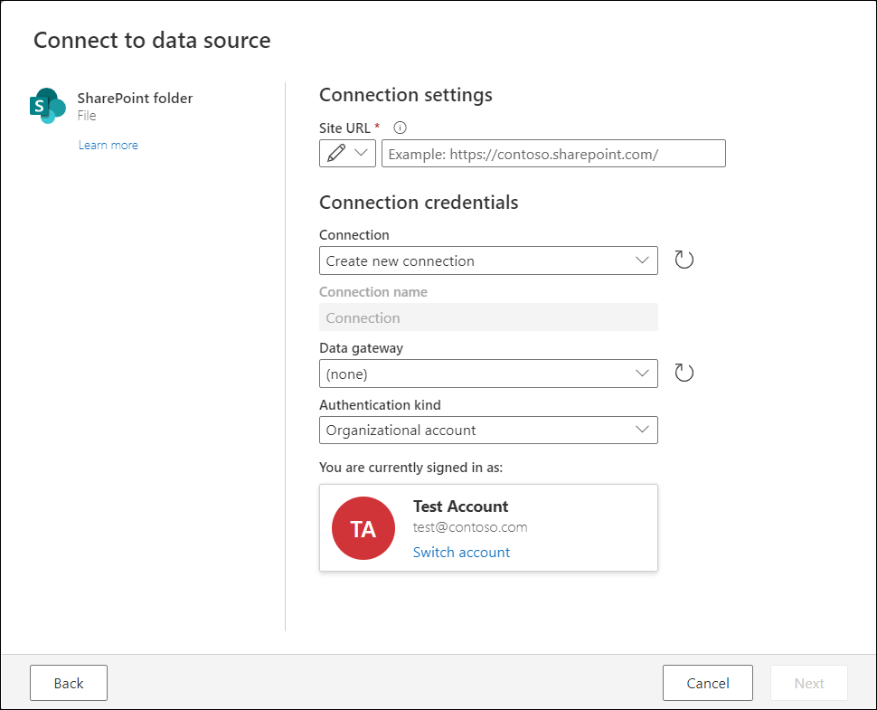

# Auto-login for Azure Active Directory data sources

The auto-login feature for Azure Active Directory data sources uses the information derived from the currently authenticated user in the Power Query Online experience to request a new access token for a selected data source during the connection settings and authentication step of the [Get data](/powerquery-docs/get-data-experience.md#1-connection-settings-and-authentication) process. 
It does this to expedite the authentication process and minimize the time it takes to start working with your data.

>[!NOTE]
>This functionality is currently only available in Power Query Online and is enabled by default for a select set of connectors. There is no setting to configure or enable this feature.

When selecting a connector that has this capability, it will automatically log you in with the **Organizational account** set as the authentication kind.

>[!TIP]
>If you'd like to authenticate with a different account, you can click the **Switch account** link shown in the dialog.

## Further reading

* [Authentication in Power Query Online](/powerquery-docs/authentication-pqo.md)
* [Microsoft identity platform and OAuth 2.0 On-Behalf-Of flow](https://docs.microsoft.com/azure/active-directory/develop/v2-oauth2-on-behalf-of-flow)