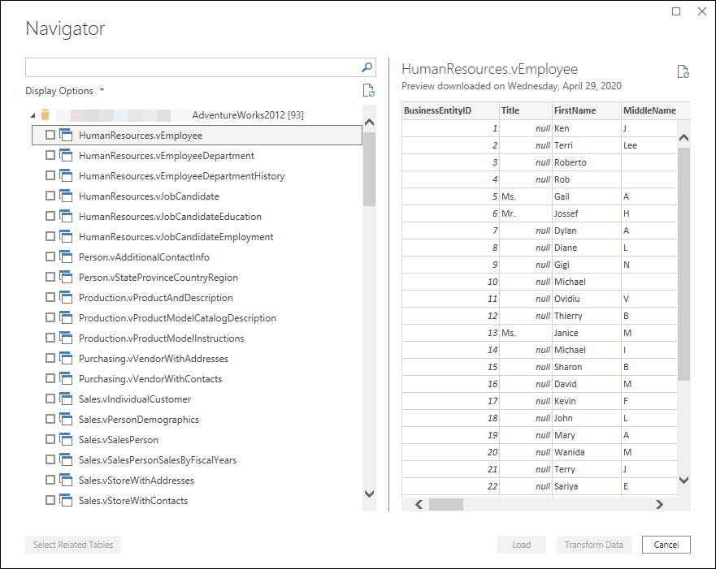

# Best practices when working with Power Query

Lorem

## Use the best connector for your task

Power Query offers a vast number of data connectors ranging from data sources such as TXT, CSV and Excel files, to databases such as Microsoft SQL Server and popular SaaS services such as Microsoft Dynamics 365 and Salesforce. 
If you don't see your data source listed in the *Get Data* window, you can always use the ODBC or OLEDB connector to connect to your data source. 

Using the best connector for the task will provide you with the best experience and performance. For example, using the SQL Server connector instead of the ODBC connector when connecting to a SQL Server database will not only provide you with a much better *Get Data* experience, but the SQL Server connector also offers you features that can improve your experience and performance such as query folding. You can read more about query folding from the article [Power Query query folding](power-query-folding.md).

> [!NOTE]
> You can see the full list of available connector for Power Query from the article [Connectors in Power Query](Connectors/index.md).

Each data connector follows a standard experience as explained in the article on [Getting data](get-data-experience.md). This standardized experience has a stage called **Data Preview** in which you're provided with a user-friendly window to select the data that you want to get from your data source, If the connector allows it, and a simple data preview of that data. You can even select multiple datasets from your datasource through the *Navigation* window as shown in the next image.

## Explore your data

It is highly recommended that you enable the data profiling tools when using Power Query to easily discover information about  your data.

These tools help you better understand your data by providing you with small visualizations that provide you with information on a per column basis such as.
* **Column quality** - Denotes how many values in the column fall under valid, error, or empty values.
* **Column distribution**
* **Column profile** - Provides a more thorough view of your column and the statistics associated to it

You can also interact with these small visualizations to perform transformations on your data.

You can read more about the data profiling tools from the article [Data profiling tools](data-profiling-tools.md).

## Filter as early as you can
    * Explain a little bit about query folding and how powerful it is
    * We already got this article and I’m pretty proud of them (let’s make sure we talk about dynamic filters, e.g. “in the previous N days” and others, which come up very frequently and are not easy to discover)
## Use parameters to drive dynamic and flexible queries
    * Probably use a text parameter when connecting to a database for the servername or something similar
    * This is why I wanted to cover the “Parameters” article first – makes sense. I still get several pings on this blog post as it seems to cover much more than the documentation article that we currently have, particularly around the parameter binding widgets.
## Creating groups to stay organized
## Take a modular approach: reference your queries
Reference queries to decouple transformation phases 
(also cover “Extract Previous” option on Steps)
## Document your work 
Rename or add a description at a step/query/group level to further understanding your work
## Always use the correct data types 
(include “Detect Data Types” shortcut, and the Options to enable/disable type detection locally and globally)
## Make your query resilient to changes
    * Select columns or Remove columns
## Create reusable transformations with Custom Functions
    * Creating functions through the UI

Structure:
*	Headline: Best practice #1
*	The reason why and how
*	A link to a supporting article
