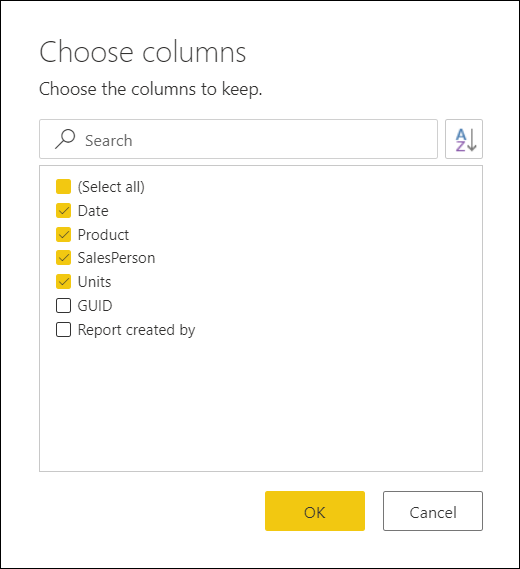

# Choose or Remove columns

The **Choose columns** and **Remove columns** are operations that help you define what columns your table needs to keep and which ones it needs to remove.

This article will showcase how to use the **Choose columns** and **Remove columns** features by using the following sample table for both operations.

The goal of both features is to reach the following desired table.

## Choose columns

The **Choose columns** button can be found inside the Home tab, under the *Manage columns* group.

After clicking this button, a new window called the *Choose columns* window will appear where you can see all the available fields in your table. Within this window, you can select all the fields that you want to keep and by removing the selection from the other fields those fields will be removed from your table. For this example, you want to remove the **GUID** and **Report created** by columns, so you unselect those fields from this window.

After hitting the OK button from the window, you will reach the desired goal.

## Remove columns

The **Remove columns** button provides two options from its dropdown menu:
* **Remove columns** - removes the selected columns.
* **Remove other columns** - removes all columns from the table except the selected ones.

### Remove selected columns

Starting from the sample table, select the **GUID** and the **Report created** columns. Right click on any of the column headers and a new contextual menu will appear where you can select the **Remove columns** option from here.

Alternatively, you can also use the button from the ribbon. The button found in this contextual menu is exactly the same as the one found in the ribbon.

After clicking the **Remove columns** button, you will reach the desired goal.

### Remove other columns

Starting from the sample table, select all the columns from the table except the **GUID** and the **Report created** columns. Click the **Remove other columns** button from the **Remove columns** dropdown menu inside the *Manage columns* group in the *Home* tab.

After clicking the **Remove other columns** button, you will reach the desired goal.

