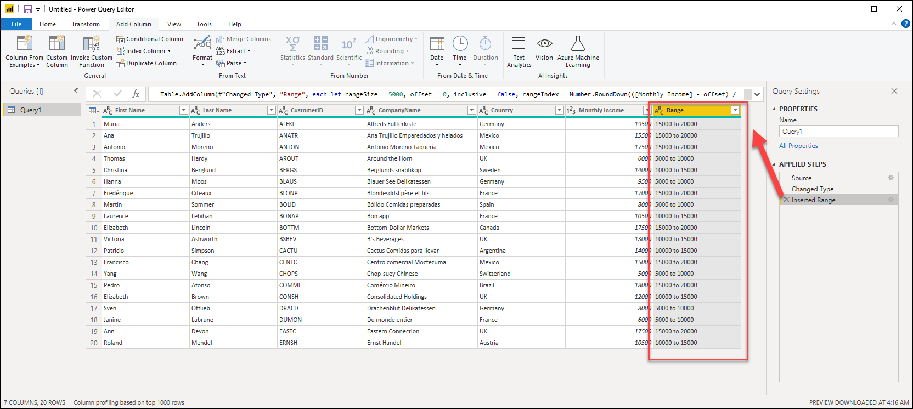
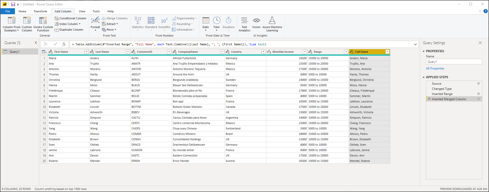

# Add a column from examples

Using *add column from examples* lets you quickly and easily create new columns, and is great for the following situations:

* You know the data you want in your new column, but you're not sure which transformation, or collection of transformations, will get you there.
* You already know which transformations you need, but you're not sure what to select in the UI to make them happen.
* You know all about the transformations you need using a custom column expression in the M language, but one or more of those transformations aren't available in the UI.

Adding a column from examples is easy and straightforward. The button to create a column from examples is located in the **Add Column** tab in the Power Query ribbon, inside the **General** group.

## Add a new column from examples

In this example, you start with the table shown in the following image.

Your goal in this example is to create two new columns:
* **Income Range**&mdash;create buckets for the **Monthly Income** column in specific increments of 5,000.
* **Full Name**&mdash;concatenate the **Last Name** and **First Name** columns to a single column.

### Column from Examples from selected column(s)

One of the options you have when creating your new column is to select which columns will be used in your calculations. For this case, you'll be creating the **Income Range** column from the values inside the **Monthly Income** column.

To do this, select the **Income Range** column, select the **Column from Examples** dropdown menu, and then select **From Selection**.

The preview pane will display a new editable column where you can enter your examples. For the first example, the value from the selected column is 19500. So in your new column, enter the text **15000 to 20000**, which is the bucket where that value falls.

When Power Query finds a matching transformation, it fills the transformation results into the remaining rows using light-colored text. You can also see the M formula text for the transformation above the table preview.

After you select **OK**, you'll see your new column as part of your query. You'll also see a new step added to your query.

### Column from Examples from all columns

The next goal is to create a **Full Name** column using the values from the **First Name** and **Last Name** columns.

To do that, select the **From All Columns** option.

Now you'll input your first **Full Name** example as **Enders, Maria**.

After you select **OK**, you'll see your new column as part of your query. You'll also see a new step added to your query.

Your last step is to remove the **First Name**, **Last Name**, and **Monthly Income** columns. Your final table will look like the one in the following image.

## Tips and Considerations

When providing examples, Power Query offers a helpful list of available fields, values, and suggested transformations for the selected columns. You can view this contextual list by double-clicking on any cell of the new column.

It's important to note that the **Column From Examples** experience works only on the top 100 rows of your data preview. You can apply steps before the **Column From Examples** step to create your own data sample. Once the **Column From Examples** column has been created, you can delete those prior steps and the newly created column won't be affected.

## List of supported transformations
Many, but not all, transformations are available when using **Add Column from Examples**. The following list shows the supported transformations.

**General**

- Conditional Column

**Reference**
  
- Reference to a specific column, including trim, clean, and case transformations

**Text transformations**

- Combine (supports combination of literal strings and entire column values)
- Replace
- Length
- Extract   
  - First Characters
  - Last Characters
  - Range
  - Text before Delimiter
  - Text after Delimiter
  - Text between Delimiters
  - Length
  - Remove Characters
  - Keep Characters

> [!NOTE]
> All *Text* transformations take into account the potential need to trim, clean, or apply a case transformation to the column value.

**Date transformations**

- Day
- Day of Week
- Day of Week Name
- Day of Year
- Month
- Month Name
- Quarter of Year
- Week of Month
- Week of Year
- Year
- Age
- Start of Year
- End of Year
- Start of Month
- End of Month
- Start of Quarter
- Days in Month
- End of Quarter
- Start of Week
- End of Week
- Day of Month
- Start of Day
- End of Day

**Time transformations**

- Hour
- Minute
- Second  
- To Local Time

> [!NOTE]
> All *Date* and *Time* transformations take into account the potential need to convert the column value to *Date*, *Time*, or *DateTime*.

**Number transformations** 

- Absolute Value
- Arccosine
- Arcsine
- Arctangent
- Convert to Number
- Cosine
- Cube
- Divide
- Exponent
- Factorial
- Integer Divide
- Is Even
- Is Odd
- Ln
- Base-10 Logarithm
- Modulo
- Multiply
- Round Down
- Round Up
- Sign
- Sin
- Square Root
- Square
- Subtract
- Sum
- Tangent
- Bucketing/Ranges
