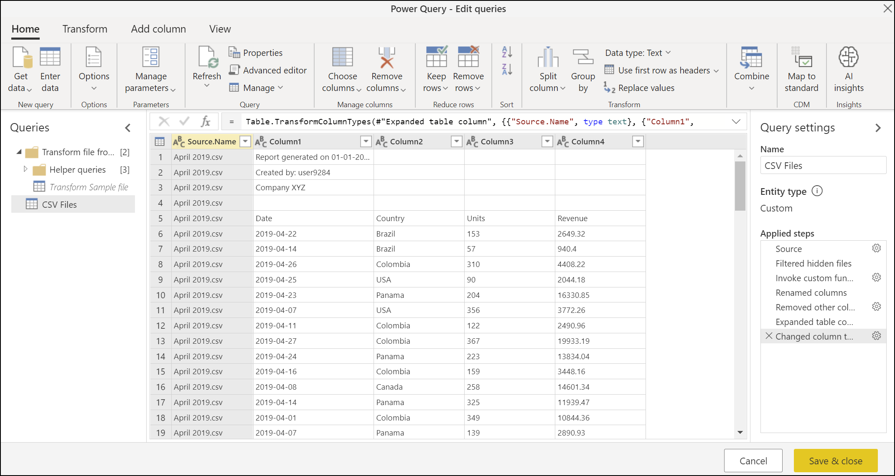
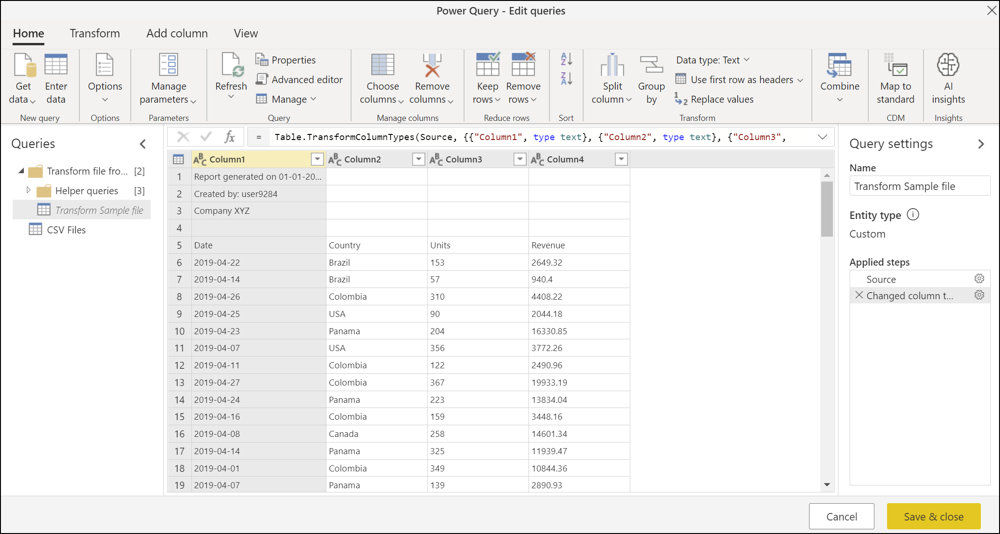
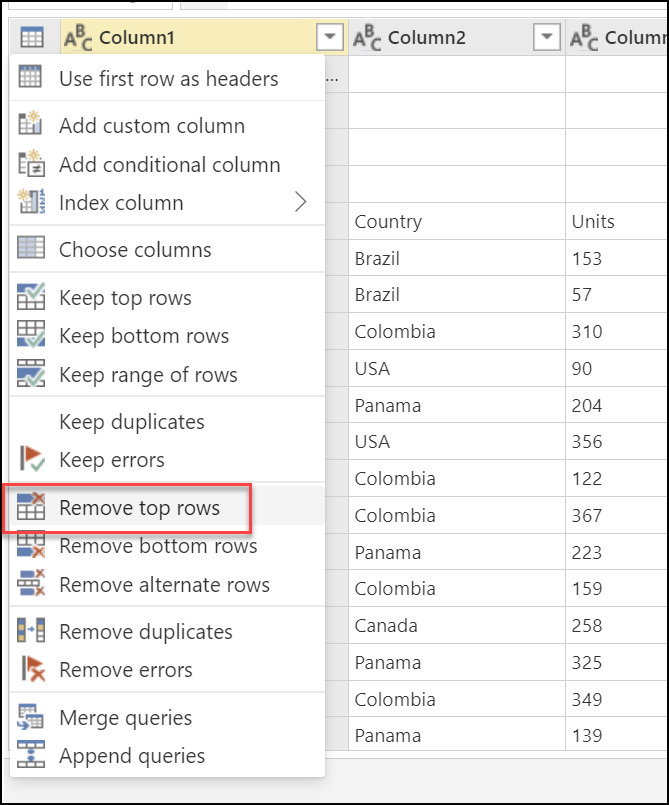
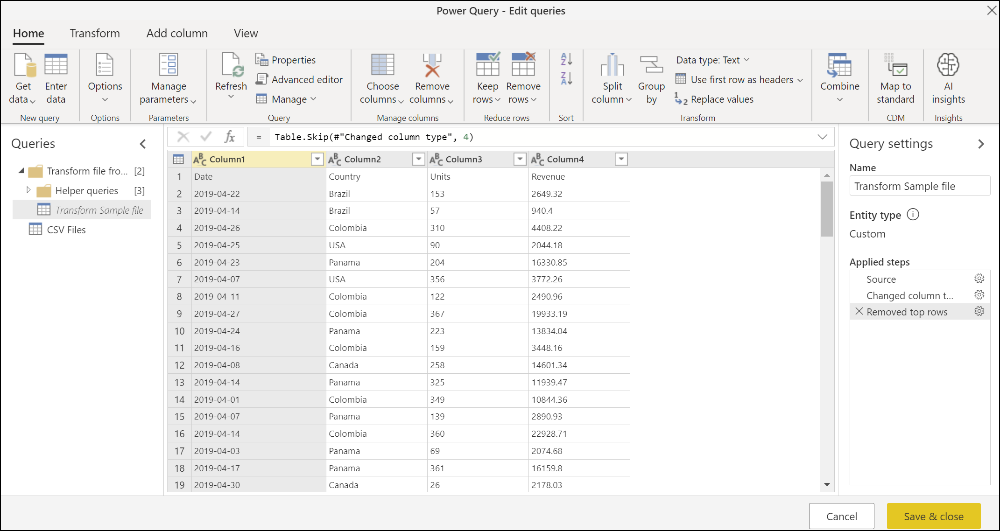
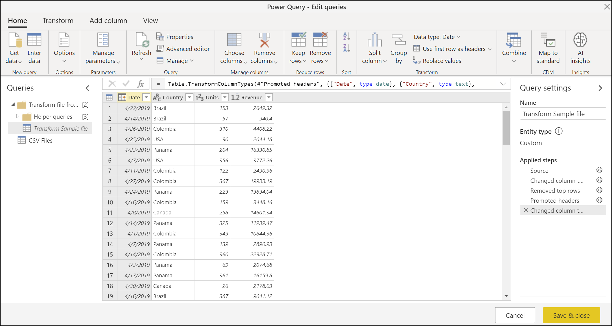
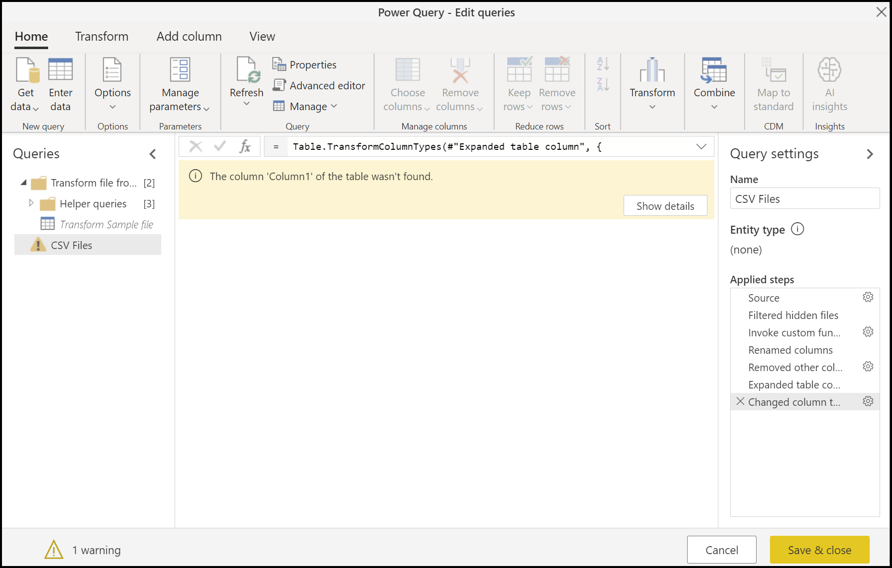
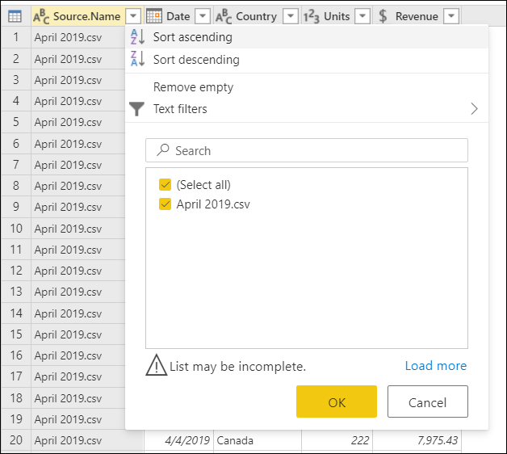
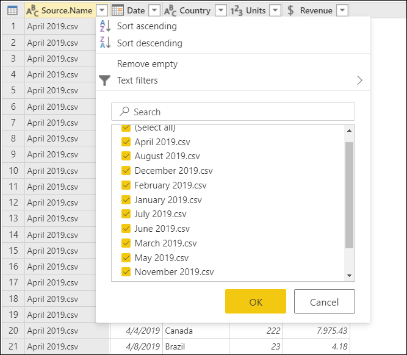

# Combine files: CSV documents

In Power Query you have the *Combine files* experience to combine multtiple files from a given data source. This article will showcase how the experience works when the files that you want to combine are CSV files. You can read an overview of the *Combine files* experience from the article [Combine files: Overview](combine-files-overview.md). 

## About the sample files used

All csv files used in this example have the same structure and same extension (csv). For the combine files experience, it is imperative that all files that you want to combine have the same structure and extension.

For this example, there's a total of twelve CSV files. The following is an image with the first 15 rows of the file for the month of January:


Each file contains sales data for one particular month of the calendar year 2019. The amount of rows varies from file to file, but all files have a header section in the first four rows, then they have the column headers in row 5 and the data for the table starts from row 6 downwards. 

The goal is to combine all twelve files into a single table that shall look as the table in the following image:


You can follow along this example by downloading the sample files used in this article from the following [Download link](csv-files.zip). You can place those files inside the  data source of your choice such as a local folder, SharePoint folder, Blob Storage, Azure Data Lake, or other data source that provides the *File system view*. 

For simplicity, this article will be using the *Folder* connector. You can read more about the Folder connector from the [Folder](Connectors/Folder.md) article.

## Table preview dialog

When connecting to the folder that hosts the files that you want to combine, in this example the name of that folder is **CSV Files**, you will be prompted with the Table preview dialog which shall have your folder path on the top left corner  and in the data preview it will show the *File system view* as shown in the next image:


For this example, click the **Combine** button at the bottom of the window.

>[!Note]
>Depending on your situation, you could also choose to click the **Transform data** button to further filter and transform your data before combining the files. Selecting the **Combine** button is only recommended when you are certain that the folder contains only the files that you want to combine.

## Combine files dialog

After clicking the **Combine** button in the *Table preview dialog*, you will be prompted with the *Combine files* window which will look like the one in the following image:


>[!Note]
Power Query automatically detects what connector to use based on the first file found in the list. You can read more about the CSV connector from the article [Text/CSV](textcsv.md).

You can leave all the default settings such as the *Example file* being the First file, *File origin*, *Delimiter* and *Data type detection*.

You can now click the **Transform data** button at the bottom right of the screen to head to the **Output query**

## Output query

After clicking the **Transform data** button in the *Combine files dialog*, you will be taken back to the Power Query Editor in the query that you initially created from the connection to the local folder. This output query will look like the one in the following image:



However, the data is not in the correct shape. You need to remove the top 4 rows from each file before combining them. To make this change on each file before combining them, and not after the combination, you can go to the *Transform Sample file* query inside the **Queries pane** on the left hand side of your screen.

### Modify the Transform Sample file query

Inside this *Transform Sample file* query you will see that the data shown, as shown in the image below, is for the month of April by looking at the values from the Date column which have the format year-month-day (YYYY-MM-DD). 'April 2019.csv' is indeed the first file that we saw in the *Table preview* dialog.



You now need to apply a new set of transformations to clean the data. This transformation will be automatically converted to a functiotn inside the *Helper queries* group that will be applied to every file in the folder before combining the data from each file.

The transformations that need to be added to the *Transform Sample file* query are:
1. **Remove top rows** - to peform this operation, click the table contextual button on the top left corner of the table and select the *Remove top rows* option from the menu. 



Inside the *Remove top rows* window insert the value 4 and hit the OK button.


After hitting the OK button, your table will no longer have the top 4 rows as shown in the next image:



2. **Use first row as headers** - click the table contextual button again, but this time select the *Use firs row as headers* option.


The result of that operation will promote the first row of the table to be the new column headers as shown in the next image: 



After this operation is completed, Power Query (by default) will try to automatically detect the data types of the columns and add a new "Changed column type" step.

### Revising the Output query

When you go back to the **CSV Files** query, you will notice that the last step is giving you an error that reads ```The column 'Column1' of the table wasn't found```. The reason behind this error is that thte previous state of the query was performing an operation against a column by the name 'Column1', but due to the changes made to the *Transform Sample file* query, this column no longer exists. You can learn more about errors from the article [Working with Errors](working-with-errors.md).



>[!Note]
> If the data preview is still not showing you the correct data preview, you can click the Refresh button in the Home tab inside the Query group to refresh the data preview of your query.
>
>
>

You can remove this last step of the query from the *Applied steps* pane by clicking on the delete icon on the left hand side of the name of the step. After deleting this step, your query will be showing the correct results as shown in the next image:


However, notice that none of the columns derived from the files (Date, Country, Units, Revenue) have a data type assigned to them. Assign the correct data type to each column following the following table:

Column Name | Data type|
------------|----------|
Date| Date
Country | Text
Units| Whole number
Revenue| Currency

After defining the data types for each column, you will have the table ready to be loaded as shown in the next image:


>[!Note]
>You can read more about how to define or change column data types from the article [Data types](data-types.md).

### Verification

To validate that all files have been combined, you can click the filter icon on the **Source.Name** which will display all file names of the files that have been combined. If you get a warning such as *List may be incomplete*, click the **Load more** button or hyperlink at the bottom of the menu to display more available values in the column.



After clicking the Load more link, all available file names will be displayed:


